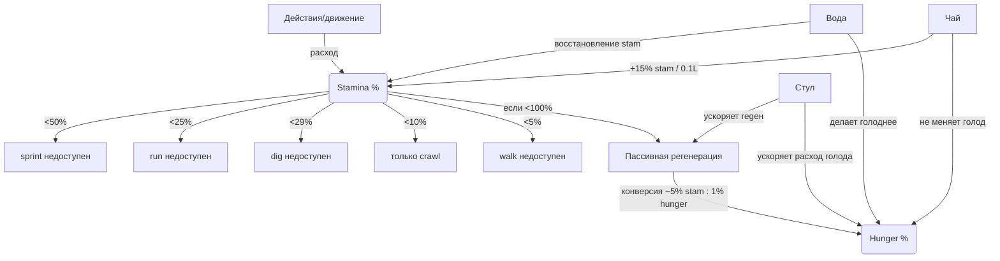

# Legacy‑механики персонажа в Haven and Hearth: стамина, движение, голод/«энергия», HP и SHP

## Исполнительное резюме

Legacy‑ветка использует тесно связанную систему «стамина ↔ голод», где **стамина** — непосредственный ресурс на действия и скорость передвижения, а **голод** (в старой терминологии иногда воспринимаемый как «энергия») — *резерв*, из которого стамина **пассивно восстанавливается**, «съедая» голод. Ключевой численный инвариант, подтверждённый несколькими источниками: **1% голода может заменить 5% стамины** (то есть восстановление 40% стамины «стоит» порядка 8% голода). citeturn6view0turn24search1turn24search5

Передвижение имеет **четыре режима** с фиксированными базовыми скоростями (в тайлах/сек): *crawl 1.5*, *walk 3.0*, *run 4.5*, *sprint 6.0*; быстрее — обычно дороже по стамине. citeturn24search1 При этом **стоимость по стамине зависит от поверхности**: спринт всегда «жжёт» стамину, бег «жжёт» стамину в лесу, ходьба «жжёт» стамину в болотах; некоторые типы террейна запрещают высокие скорости (например, нельзя спринтить в лесу и нельзя бегать в болоте/мелководье). citeturn12view0turn8view6

Голод имеет **пять пороговых уровней**: *Starving 0–49%* (потеря HHP со временем), *Very Hungry 50–79%* (нет регенерации SHP), *Hungry 80–89%* и *Full 90–100%* (SHP регенерирует), *Overstuffed >100%* (движение только ползком). citeturn6view0turn24search1turn12view0 Для практики это означает один главный «боевой» порог: **80%+ голода** — условие для регенерации **SHP**. citeturn6view0turn12view0turn13search3

HP‑система Legacy делится на **SHP/HHP/MHP**. SHP — «мягкие» хиты: при падении до нуля персонаж **теряет сознание примерно на минуту**; SHP регенерируют при голоде выше Very Hungry (по факту — при ≥80%). HHP — «жёсткие» хиты: **не регенерируют естественно**, падают от голодания, лечатся *пиявками* или *бинтом (gauze)*. citeturn30view0turn30view4turn12view0turn12view2 Для пиявок на Ring of Brodgar описан воспроизводимый алгоритм: тик ~раз в минуту, урон SHP = ⌊Q/10⌋, и примерно каждые 10 SHP урона дают +1 HHP. citeturn30view1turn12view2

В доступных публичных источниках **часто отсутствуют точные формулы** для: (а) секундных скоростей пассивной регенерации стамины из голода, (б) точной стоимости стамины/голода на конкретные крафт‑действия, (в) точной «модели террейна» (кроме описанных запретов/обобщений). Эти места ниже помечены как **неуточнённые** вместо предположений. citeturn33view0turn6view0turn10view0

## Источники и методология

Базовая навигация по Legacy‑срезу взята со страницы категории Legacy на Ring of Brodgar (перечень ключевых legacy‑страниц, включая Legacy:Stamina, Legacy:Hunger, Legacy:Hitpoints и др.). citeturn4view0

Приоритет источников соблюдён так:

- «Квази‑официальные» тексты разработчиков и ранние справочные посты на официальном форуме (например, пост про HP от entity["people","Jorb","haven dev"]). citeturn12view2  
- Страницы Ring of Brodgar с префиксом **Legacy:** как «собранная» база знаний, плюс прямые цитаты разработчиков внутри этих страниц (например, Travel Weariness). citeturn6view1turn33view0turn30view1  
- Комьюнити‑руководства и дискуссии (как вторичный слой), *только там, где они подтверждают/раскрывают численные детали или поведенческие эффекты*, и желательно совпадают с RoB/официальным описанием. citeturn24search5turn12view1turn2search19  

Важное ограничение качества: Ring of Brodgar прямо предупреждает, что на вики одновременно размещаются сведения о текущем мире и legacy‑сервере, и часть страниц может быть «не до конца» промаркирована. Поэтому любые числа ниже привязаны к источнику; при расхождениях отмечается версия/эпоха или неопределённость. citeturn6view0turn30view0

Попытка опереться на «первичные» клиентские файлы/документацию исходников через legacy‑портал завершилась ошибкой доступа (HTTP 502), поэтому в отчёте **не используется** прямой анализ исходного кода клиента. Этот пробел обозначен явно, а не закрыт догадками. citeturn17view0

## Стамина

### Определение и единицы

**Стамина** — показатель «усталости» персонажа; падает при действиях и перемещении, особенно на высоких скоростях или на определённом террейне. citeturn33view0turn12view0turn14view0 В интерфейсе она трактуется как **процент** (0–100%), а механически выступает в роли «жёсткого гейта» на скорость и отдельные действия. citeturn33view0turn14view0

Отдельно зафиксировано комьюнити‑согласием на RoB: **увеличить “максимум” стамины нельзя** (сама шкала остаётся одной и той же; меняются лишь способы расхода/восстановления). citeturn2search17

### Пороговые ограничения и капы

Ring of Brodgar (Legacy:Stamina) даёт таблицу ограничений (помечена как неполная), но ключевые пороги устойчиво повторяются в старых руководствах:

- **< 50%** — нельзя использовать 4‑ю скорость (sprint). citeturn33view0turn14view0  
- **< 25%** — нельзя использовать 3‑ю скорость (run). citeturn33view0turn14view0  
- **< 10%** — можно только ползти (crawl). citeturn33view0turn14view0  
- **< 5%** — «нельзя ходить» (в таблице RoB; практический смысл — ходьба как режим недоступна, остаётся crawl). citeturn33view0  
- **< 29%** — нельзя копать (dig), то есть стамина выступает гейтом на часть работ. citeturn33view0  

Официальный текст «Read Me First» подтверждает общий принцип: *по мере падения стамины быстрые режимы становятся недоступны*, хотя не фиксирует точные проценты. citeturn12view0

### Алгоритм естественного восстановления и связка с голодом

Критическая механика Legacy: **стамина со временем восстанавливается, “беря” очки из шкалы голода**, то есть голод выступает «топливом» регенерации стамины. citeturn33view0turn12view0

Численная связь в нескольких независимых источниках совпадает:

- **1% голода может заменить 5% стамины** (эквивалентно: 5% стамины = 1% голода). citeturn6view0turn24search1turn24search5  

Ключевая поведенческая тонкость: голод **не “сгорает сам по себе”**, а убывает прежде всего тогда, когда идёт восстановление стамины (т.е. когда стамина была потрачена). Эту причинность прямо формулируют пользователи форума: «ты теряешь голод потому что восстанавливается стамина; не тратишь стамину — нечему восстанавливаться». citeturn3search21

**Неуточнённый параметр:** в доступных legacy‑источниках нет надёжной формулы «% стамины в секунду» для пассивной регенерации при стоянии/простое. Указаны лишь зависимости и конверсия голод↔стамина. citeturn33view0turn6view0turn3search21

### Модификаторы расхода: скорость и террейн

Официальный справочный пост фиксирует правила расхода стамины от скорости/террейна:

- **Sprint** всегда расходует стамину. citeturn12view0  
- **Run** расходует стамину **в лесах**. citeturn12view0  
- **Walk** расходует стамину **в болотах**. citeturn12view0turn8view6  
- Есть прямые запреты: нельзя sprint в лесу, нельзя run в болоте или мелководье. citeturn12view0turn12view4  

Дополнительно, отдельные террейны «аномально дорогие»: **thicket** (чаща) — при движении быстрее crawl стамина уходит «очень быстро», и даже вспашка thicket сильно просаживает стамину. citeturn10view0  
Для **swamp** (болото) указано, что перемещение возможно только на более низких скоростях и стоит «значительно больше стамины». citeturn8view6

**Неуточнённый параметр:** точные коэффициенты расхода (например, “% стамины за тайл” на конкретной скорости/террейне) не опубликованы в процитированных первичных/legacy‑вики‑источниках. citeturn33view0turn10view0turn8view6

### Восстановление стамины: вода, чай, стул

Ring of Brodgar (Legacy:Stamina) перечисляет «активные» способы восстановления: **стул** (ускоряет восстановление, но делает голоднее), **чай** (восстанавливает без роста голода), **вода** (восстанавливает, но делает голоднее). citeturn33view0

**Чай (Legacy:Tea)** — наиболее “чистый” способ поддерживать стамину, не разрушая порог 80% голода для регена SHP:

- Чай восстанавливает **15% стамины на 0.1 литра**. citeturn29view0  
- Питьё чая **не увеличивает голод** (в отличие от воды). citeturn29view0turn33view0  
- Практическая единица: кружка (mug) вмещает 0.3L, т.е. порядка **45% стамины за кружку** по этой формуле. citeturn29view0  

**Стул (Legacy:Chair)**:

- Сидение на стуле ускоряет восстановление стамины, **но** одновременно ускоряет «генерацию голода» (т.е. уменьшение голода вследствие восстановления стамины), аналогично питью воды. citeturn28view0  
- В обсуждениях отмечается, что качество стула может влиять на связку «скорость восстановления / голод‑дрен» (как подтверждение механики, но без строгой формулы). citeturn2search19  

**Вода и качество воды:** для Legacy нет единственной общепринятой формулы в доступных источниках, но зафиксирован факт зависимости эффективности от качества:

- В Legacy:Quality записано: «вода восстанавливает больше стамины на единицу голода по мере роста качества», но «детали неизвестны»; далее приводятся эмпирические точки: Q10 ≈ “5% стамины на 5% голода”, Q65 ≈ “15–16% стамины на 5% голода”. citeturn14view1  

Эти числа противоречат/не согласуются напрямую с базовой конверсией **1% голода → 5% стамины** (поэтому их следует воспринимать как *описание другой конкретной операции/режима питья*, а не как универсальный закон). Сам RoB помечает это как «Details unknown». citeturn14view1turn6view0turn24search5

### Примеры расчётов

**Пример: сколько голода “съест” восстановление стамины «в фоне».**  
Если у вас 60% стамины и вы восстановились до 100% естественным путём (или через «стояние/покой»), вы вернули 40%. По правилу 1% голода → 5% стамины это стоит: 40 / 5 = **8% голода**. citeturn6view0turn24search5turn33view0  
Если выражать в «юнитах» голода (см. ниже), 8% = **80 единиц**. citeturn6view0

**Пример: чай как “точечная подпитка” под порог sprint.**  
Вы на 42% стамины (sprint недоступен, т.к. <50%). Вам нужно добрать минимум 8%. Чай даёт 15% на 0.1L, значит достаточно ~0.053L. На практике пьётся дискретнее (из кружек/наполнений), но вывод: чай одним небольшим приёмом намного проще возвращает доступ к sprint, не трогая голод. citeturn29view0turn33view0

Ниже приведена диаграмма связки «стамина ↔ голод ↔ ограничения/восстановление». Источники правил указаны в предыдущих подпунктах. citeturn33view0turn6view0turn29view0turn12view0

## Движение

### Режимы скорости и базовые значения

Legacy‑глоссарий на Ring of Brodgar даёт **четыре режима** и их базовые скорости:

- Crawl — **1.5 тайла/сек**  
- Walk — **3 тайла/сек**  
- Run — **4.5 тайла/сек**  
- Sprint — **6 тайлов/сек** citeturn24search1  

Эти скорости — хорошая «метрика для планирования», потому что позволяют оценивать время побега/погони и необходимый запас стамины (особенно с порогом 50% на sprint). citeturn24search1turn33view0

### Как выбирается скорость и что её ограничивает

Официальный справочный пост описывает переключение скоростей (CTRL+R или кликом по иконке) и подчёркивает, что при падении стамины быстрые режимы блокируются. citeturn12view0

Ключевые ограничения скорости в Legacy связаны с тремя осями:

- **Стамина‑пороги** (см. раздел про стамину). citeturn33view0turn14view0  
- **Террейн‑запреты**: нельзя sprint в лесу, нельзя run в болоте или мелководье. citeturn12view0turn12view4  
- **Голод Overstuffed (>100%)**: движение только crawl. citeturn6view0turn12view0  

Дополнительный «предметный» кейс движения: при переноске крупных liftable‑объектов персонаж вынужденно переходит в crawl (описано в раннем мануале). citeturn14view0

### Расход стамины при перемещении и роль покрытия

Официальный текст фиксирует, что:
- sprint всегда расходует стамину;  
- run расходует стамину в лесу;  
- walk расходует стамину в болотах. citeturn12view0

Ring of Brodgar отдельно отмечает инфраструктурный модификатор: **мощение (paving)** снижает расход стамины при run и sprint. citeturn6view2  
Это напрямую делает «плиточную зону» вокруг базы стратегическим ресурсом для логистики и для обороны/побега (в рамках Legacy режимов). citeturn6view2turn12view0

**Thicket** — обратный полюс: движение быстрее crawl «жжёт» стамину *очень быстро*, что превращает thicket в естественную «ловушку» для неподготовленного бегства. citeturn10view0  
**Swamp** также описан как зона с повышенной стоимостью стамины и понижением возможных скоростей. citeturn8view6turn12view0

### Практические следствия для игрока

Если цель — **долгая дорога**, то универсальная стратегия в Legacy следует из правила «run дорог в лесу, walk дорог в болоте»: на открытых участках выбирают режимы, минимизирующие расход стамины, сохраняя пороги 50%/25% на случай экстренного sprint/run. citeturn12view0turn33view0

Если цель — **побег/погоня**, то важно помнить «двойной капкан»:

- упасть ниже **50% стамины** — лишиться sprint;  
- попасть в лес/болото/мелководье — потерять часть скоростей независимо от стамины. citeturn12view0turn33view0turn12view4

## Голод и «энергия» в Legacy

### Терминология и индикаторы

В Legacy Ring of Brodgar описывает шкалу **Hunger** как пятиуровневый индикатор с порогами, а также объясняет, что отображаемое число (в подсказке) связано с внутренними юнитами: **10 единиц голода = 1%**, поэтому еда, восстанавливающая, например, 40 единиц, увеличит «процент в скобках» на 4%. citeturn6view0turn24search1

В ряде обсуждений и более поздней терминологии «энергией» называют именно «резерв для работы», но для Legacy‑механики в RoB ключевой является шкала Hunger как источник восстановления стамины и условие регена SHP. citeturn33view0turn6view0turn12view0  
Чтобы не смешивать с современной системой «Energy» (в Hafen), далее под «энергией (hunger)» подразумевается **legacy‑голод**.

### Пять уровней голода и точные эффекты

Ring of Brodgar даёт прямое определение пяти уровней:

- **Starving (0–49%)** — потеря HHP со временем. citeturn6view0turn30view0  
- **Very Hungry (50–79%)** — **нет регенерации SHP**. citeturn6view0turn30view0  
- **Hungry (80–89%)** — регенерация SHP включена. citeturn6view0turn12view0  
- **Full (90–100%)** — регенерация SHP включена. citeturn6view0turn12view0  
- **Overstuffed (>100%)** — движение только crawl. citeturn6view0turn12view0  

Отдельный «официальный» текст подтверждает смысл крайних состояний: «при Stuffed/Overstuffed замедляет до crawl, при Starving начинаете терять HHP и можете умереть». citeturn12view0

### Алгоритм расхода: почему голод “не уходит”, если ничего не делать

Ключевой эффект Legacy, полезный для понимания «почему я застрял Overstuffed»: голод убывает главным образом *как цена восстановления стамины*. Если стамина не тратится, «нечему» восстанавливаться — и голод почти не двигается. citeturn3search21turn33view0

Отсюда типичный совет из форума при застревании в Overstuffed: **сначала слить стамину работой**, затем дать ей восстановиться (тем самым уменьшая голод), при необходимости ускорить процесс водой. citeturn24search5turn3search21turn33view0

### Действия, усиливающие “расход энергии”

Ring of Brodgar фиксирует как подтверждённый факт: **поднятие/перенос liftable‑предметов заставляет голод уходить быстрее**. citeturn6view0  
В Legacy:Chair также сказано, что сидение на стуле ускоряет восстановление стамины и тем самым ускоряет связанный с этим «хангэр‑дрен». citeturn28view0

**Неуточнённый параметр:** точная формула «на сколько % быстрее» (коэффициенты) для liftables/стула в процитированных источниках отсутствует. citeturn6view0turn28view0

### Числовые примеры

**Пример: перевод “юнитов” еды в проценты Legacy‑голода.**  
Если пища даёт +40 единиц голода, то это +4% (потому что 10 единиц = 1%). citeturn6view0

**Пример: сколько голода нужно на поддержание стамины в длительной работе.**  
Если вы делаете цикл действий и суммарно теряете 25% стамины, а затем восстанавливаете её пассивно, стоимость — примерно 25/5 = 5% голода. Если вам критично держаться ≥80% голода для регена SHP, то такой рабочий цикл «съедает» заметную долю безопасного окна (80–100%). citeturn6view0turn33view0turn30view0

## HP, SHP и HHP

### Термины и базовая логика

Legacy‑описание Ring of Brodgar и ранние официальные пояснения сходятся в том, что у персонажа три числа здоровья:

- **SHP (Soft Hit Points)** — текущие «мягкие» хиты; при падении до 0 персонаж **теряет сознание** (RoB: ~на минуту), после чего обычно уязвим для угроз, пока не восстановится. citeturn30view0turn14view0  
- **HHP (Hard Hit Points)** — «жёсткие» хиты (глубокие травмы); при падении до 0 наступает **перманентная смерть**. citeturn30view0turn14view0turn12view2  
- **MHP (Max Hit Points)** — верхний потолок HHP (а через него и SHP, так как SHP ≤ HHP). citeturn30view1turn14view0turn12view2  

Ring of Brodgar подчёркивает два защитно‑боевых следствия:

- SHP регенерирует (медленно) **только если голод выше Very Hungry** (по порогам — при ≥80%), и только до уровня текущего HHP. citeturn30view0turn6view0turn12view0  
- Пока персонаж в нокауте (SHP=0), «весь урон идёт прямо в HHP», что резко повышает риск смерти. citeturn30view0turn12view2  

### Формулы MHP и модификаторы от убеждений

Ring of Brodgar (Legacy:Hitpoints) даёт явную формулу:

- **MHP = 100 · sqrt(CON / 10)**, затем применяется влияние убеждений Death/Life (до ±20%). citeturn30view1turn31view0  

Также указано, что MHP “нового персонажа” равно 100, а увеличение CON повышает MHP (в т.ч. через бонус/штраф от шкалы Barbarism/Civilization). citeturn30view1turn31view0

На странице убеждений Legacy перечислены крайние эффекты:

- Death/Life: **−20% Max HP** на крайнем Death и **+20% Max HP** на крайнем Life; параллельно меняется «grievous damage (HHP damage)» в противоположную сторону. citeturn31view0  
- Barbarism/Civilization: крайние положения дают до **±30% Constitution** (и Strength/Intelligence/Charisma), что косвенно влияет на MHP через CON. citeturn31view0turn30view1  

**Важно о возможных версиях:** ранний официальный пост (2009) утверждает иную формулу Max HP: **(STR + 2·CON) × модификатор из beliefs**. citeturn12view2  
Такое расхождение почти наверняка означает ребаланс в разные периоды Legacy. В отчёте используются *обе формулы как исторически подтверждённые*, но без приписывания «единственно верной» для всех миров Legacy.

### Регенерация SHP и её связь с голодом и убеждениями

Официальный «Read Me First» прямо фиксирует порог: **SHP медленно регенерируют при Hunger 80+**. citeturn12view0  
Форумные ответы игроков подтверждают тот же порог (80%+). citeturn13search3  
Ring of Brodgar формулирует это через уровень Very Hungry: выше Very Hungry — реген идёт; при Very Hungry он выключен. citeturn30view0turn6view0

Убеждение Night/Day влияет на скорость регена здоровья: либо **3× реген ночью и 1/3× днём**, либо наоборот (в зависимости от положения слайдера). Это потенциально влияет на «скорость возвращения SHP» (как часть health regeneration), но точное применение к SHP отдельно в источнике не формализовано. citeturn31view0

### Восстановление HHP: пиявки и бинт (gauze)

**Пиявки (leeches)** в Legacy описаны детально:

- Получаются при ходьбе по болоту и занимают свободные слоты экипировки. citeturn30view1  
- Наносят урон SHP **примерно раз в минуту**. citeturn30view1  
- Урон за тик: **⌊Q/10⌋** (качество / 10, округление вниз). citeturn30view1  
- **Примерно каждые 10 SHP урона** восстанавливают **1 HHP**. citeturn30view1turn12view2  
- После **трёх “укусов”** пиявка становится bloated. citeturn30view1  
- Предупреждение: на низком SHP пиявки могут уронить вас в нокаут, что в бою/опасной зоне может привести уже к потере HHP. citeturn30view1turn12view2  

Дополнительная «калибровка» качества у RoB: качество пиявки тянется к CON хозяина (на 1 пункт за тик урона), что означает потенциал роста качества при повторном использовании. citeturn30view2

**Бинт (gauze)** (RoB Legacy:Hitpoints):

- Требует First Aid и доступа к wool (через овцу или mouflon + клевер). citeturn30view4  
- Применяется только если **нет надетого головного убора**. citeturn30view4  
- Лечит HHP на **30% от MHP со временем**. citeturn30view4  

Ранний официальный пост согласуется по принципу: gauze «медленно лечит» HHP, а пиявки лечат ценой урона SHP и опасны при отсутствии SHP. citeturn12view2turn30view1

### Бой и обмен ресурсами: стамина/интенсивность/SHP

В Legacy‑боёвке часть приёмов прямо взаимодействует со стаминой и SHP (что важно для «эффекта fighting на стамину»):

- **Push The Advantage**: +1 IP и **−5% Stamina**. citeturn15view0  
- **Fan the Flames**: +5 Intensity и **−20% Stamina**. citeturn15view0  
- **Consume the Flames**: наносит себе **−1%·Intensity SHP** и восстанавливает **+1%·Stamina**, сбрасывая Intensity в 0 — фактически «конвертер» SHP→Stamina в бою. citeturn15view0  

Это создаёт нетривиальные связки: в бою вы можете «сжечь» здоровье (SHP), чтобы вернуть мобильность/стамину, но затем вам понадобится голод ≥80% для регена SHP — иначе вы зафиксируете уязвимое состояние. citeturn15view0turn6view0turn12view0

### Числовые примеры

**Пример: расчёт MHP по формуле RoB.**  
Пусть CON = 40. Тогда MHP = 100·sqrt(40/10) = 100·sqrt(4) = **200**. citeturn30view1  
Если вы в крайнем Life (+20% Max HP), то итоговый максимум ≈ 200·1.2 = **240**. citeturn31view0turn30view1

**Пример: бинт лечит фиксированную долю от MHP.**  
При MHP=200 бинт лечит 30% → **60 HHP** со временем (и только если голова свободна). citeturn30view4

**Пример: скорость лечения пиявкой.**  
Пиявка Q53: урон за тик = ⌊53/10⌋ = **5 SHP** примерно раз в минуту. За 3 укуса это ~15 SHP. По правилу «~10 SHP → +1 HHP» ожидаемое лечение порядка **1 HHP** (с остатком), но ценой 15 SHP и риском нокаута, если SHP был низким. citeturn30view1turn12view2

## Сводная таблица параметров и практические советы

Ниже — компактное сравнение “что важно помнить” по ключевым механикам Legacy. Все числа привязаны к источникам; где формулы отсутствуют — указано «не уточнено». citeturn33view0turn6view0turn30view1turn29view0turn12view0

| Механика | Единицы/шкала | Ключевые пороги/штрафы | Восстановление/снятие | Формулы/алгоритмы (из источников) |
|---|---|---|---|---|
| Стамина | % (0–100) citeturn33view0 | <50 нет sprint; <25 нет run; <29 нельзя dig; <10 только crawl citeturn33view0turn14view0 | Пассивно (за счёт голода), вода (делает голоднее), стул (ускоряет, но делает голоднее), чай (без роста голода) citeturn33view0turn28view0turn29view0 | Конверсия: 1% голода → 5% стамины citeturn6view0turn24search5; скорость пассивного тика по времени не уточнена citeturn33view0 |
| Движение | 4 режима; скорости в тайлах/сек citeturn24search1 | Overstuffed → только crawl citeturn6view0; террейн запрещает скорости (лес/болото/мелководье) citeturn12view0turn12view4 | Управляется выбором скорости и маршрутом; paving снижает расход на run/sprint citeturn6view2 | Скорости: 1.5/3/4.5/6; sprint всегда расходует стамину; run расходует в лесу; walk расходует в болотах citeturn24search1turn12view0 |
| Голод (“энергия” Legacy) | % в подсказке; 10 units = 1% citeturn6view0 | 0–49% Starving → HHP ↓; 50–79% нет SHP regen; ≥80% SHP regen; >100% только crawl citeturn6view0turn12view0 | Еда ↑ голод; голод ↓ главным образом когда восстанавливается стамина (и ускоренно при воде/стуле) citeturn33view0turn3search21turn28view0 | 1% голода может заменить 5% стамины citeturn6view0turn24search5 |
| SHP | число в health‑подсказке citeturn30view0 | SHP=0 → нокаут ~минуту citeturn30view0; нет регена при голоде <80% citeturn6view0turn12view0 | Пассивная регенерация при голоде ≥80% (до HHP) citeturn30view0turn12view0 | Реген‑скорость по секундам не уточнена; зависит от системы “health regen” и условий citeturn31view0turn30view0 |
| HHP | число в health‑подсказке citeturn30view0 | HHP=0 → пермадет citeturn30view0turn12view2; Starving → HHP ↓ со временем citeturn6view0turn30view0 | Gauze: +30% MHP over time (требует без шлема); Leeches: лечат ценой SHP citeturn30view4turn30view1 | Leeches: тик ~1/мин, урон SHP=⌊Q/10⌋, ~10 SHP урона → +1 HHP citeturn30view1turn12view2 |
| MHP | потолок HHP citeturn30view1 | Меняется через CON и beliefs; Death/Life ±20% Max HP citeturn31view0 | Через рост CON (еда/FEP) и beliefs (в т.ч. Barbarism/Civ через CON) citeturn31view0 | RoB‑формула: 100·sqrt(CON/10) × модиф. Death/Life citeturn30view1turn31view0; ранняя альтернативная формула 2009: (STR+2·CON)×модиф. citeturn12view2 |

### Практические советы и «краевые случаи»

**Держите голод ≥80% как “боевой режим безопасности”.** Это одновременно включает регенерацию SHP и снижает риск «залипнуть» на низком SHP после стычки/случайного урона. citeturn6view0turn12view0turn30view0

**Чай — лучший инструмент поддерживать мобильность без порчи голода.** При 15% стамины на 0.1L чай позволяет тонко удерживать стамину над 50% (sprint) и над 25% (run), сохраняя голод для SHP‑регена. citeturn29view0turn33view0turn6view0

**Overstuffed “не лечится ожиданием”, если вы не тратите стамину.** Механика голода завязана на восстановление стамины; практический метод — сначала слить стамину работой/движением, затем восстановить (тем самым опустив голод), ускоряя водой при необходимости. citeturn3search21turn24search5turn33view0

**Маршрут важнее «чистой скорости» в лесу и болотах.** Sprint всегда расходует стамину, а run в лесу и walk в болоте тоже расходуют; плюс есть запреты скоростей по террейну. Планируйте побег/погоню с учётом того, что лес может внезапно «запретить» спринт, а болото — бег. citeturn12view0turn8view6turn12view4

**Thicket — зона риска:** ускорение выше crawl быстро «сжигает» стамину; если вы вынуждены пересекать чащу — лучше закладывать низкую скорость и запас восстановления. citeturn10view0turn33view0

**Пиявки лечат HHP быстро, но требуют дисциплины по SHP.** Если вы лечитесь пиявками, держите SHP достаточно высокими, чтобы не уйти в нокаут; помните, что в нокауте урон начинает попадать в HHP. citeturn30view1turn30view0turn12view2

**Gauze — безопаснее, но имеет условия применения.** Требует First Aid и отсутствия головного убора; лечит долей от MHP, поэтому становится тем полезнее, чем выше ваш MHP по CON/убеждениям. citeturn30view4turn30view1turn31view0

**Боевая конверсия SHP→Stamina существует.** Приёмы уровня Consume the Flames позволяют «купить» стамину ценой SHP, что полезно для удержания мобильности, но опасно без голода ≥80% (иначе восстановить SHP будет нечем). citeturn15view0turn6view0turn12view0