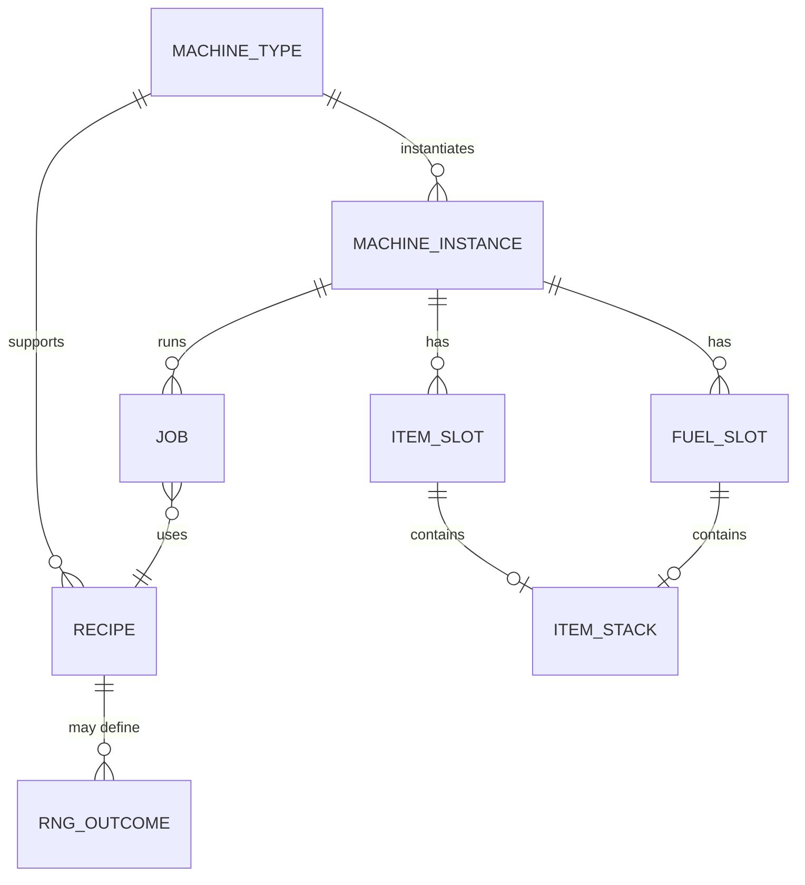

# Детальная механика Kiln и родственных машин Legacy-версии Haven & Hearth и техническая спецификация для клона

## Краткое резюме

Механика **Kiln** в Legacy-сегменте entity["video_game","Haven & Hearth","mmorpg sandbox crafting"] строится вокруг трёх ключевых принципов: (а) **общий «огневой таймер» устройства**, измеряемый «тиками» (tick) как эквивалент времени горения одной ветки; (б) **инвентарь устройства как контейнер обработки** (у Kiln — 5×5 слотов) и (в) **рецепты, заданные длительностью** (в тиках/ветках), где ошибки времени приводят к порче части продуктов (например, выпечка → Ash; в Kiln — Malted Wheat и Charcoal способны «сгореть»), тогда как некоторые продукты устойчивы к передержке (Brick и Raw Glass). citeturn28search0turn8view2turn21search2turn21search3turn17view0

Для реализации «клона» (dev‑clone) наибольшую сложность представляют:  
1) **модель времени и тиков** (особенно различия между устройствами: у Steel Crucible tick длиннее, чем у печей), citeturn8view3turn14view0  
2) **правила качества (Q) как взвешенные формулы** (часть формул на Legacy‑страницах отсутствует/повреждена и требует аккуратной реконструкции по «родственным» страницам и логике), citeturn28search0turn33view0turn29view2turn6view0turn12view3  
3) **баги Legacy**, которые заметно меняют механику времени (например, «General Fuel Glitch» — прогресс без розжига почти до конца), citeturn18view0  
4) **RNG‑выходы** (Finery Forge: Bloom vs Slag в зависимости от Nature/Industry; Ore может дать Stone; Everglowing Ember как редкая замена углю/углю‑замене при обжиге древесины). citeturn6view2turn9search2turn20view1

Для полноты отчёта собраны точные параметры из Legacy‑вики (Ring of Brodgar, Legacy‑страницы), а также выполнено сравнение с системами аналогов (Minecraft furnace‑модель, Valheim kiln/smelter‑очередь, Factorio throughput‑модель, Stardew Valley крафтовая «машина»). citeturn36search0turn35search1turn35search8turn35search2turn35search26

## Источники и методика извлечения

Основной корпус данных — страницы **Legacy:** на Ring of Brodgar (RoB). В отчёте приоритет отдан:  
- странице Legacy:Kiln и её прямым «Required By» объектам/ресурсам (Brick, Charcoal, Raw Glass, Malted Wheat и т. п.), citeturn28search0turn21search2turn15search0turn21search3turn20view3  
- страницам «мета‑механики» времени/топлива/багов (Legacy:Tick, Legacy:Fuel, Legacy:Bugs), citeturn8view2turn8view3turn18view0  
- страницам других «машин» (Legacy:Oven, Legacy:Ore Smelter, Legacy:Finery Forge, Legacy:Steel Crucible/Bar of Steel, Legacy:Cauldron/Clay Cauldron, Legacy:Tanning Tub и др.). citeturn33view0turn6view0turn6view2turn13view0turn14view0turn8view1turn12view3  

Важное ограничение источников: на части Legacy‑страниц вики определённые формулы качества отображаются как пустые места («formula is .» или «Q_product =»). Это явно видно на Legacy:Kiln и Legacy:Oven. citeturn28search0turn33view0 В таких случаях в спецификации отмечено **unspecified**, а также предложены допустимые диапазоны и наиболее вероятные варианты на основе взаимосвязанных страниц (например, формулы для Porcelain Plate / Stoneware Vase, где указано время/ветки, и логика взвешивания качества). citeturn29view2turn29view1turn6view0turn12view3  

Отдельно зафиксирован пробел: **страница Legacy:Mug в RoB на момент извлечения отдаёт HTTP 500** и не поддаётся прямому чтению; данные по Mug восстановлены частично из других страниц (например, Legacy:Tea указывает объём mug 0.3 L). citeturn32view0turn31search4  

Для сравнительного анализа других игр использованы внешние, отдельно цитируемые источники: статьи по smelting/furnace из Minecraft‑вики (Fandom) и официальный материал Minecraft.net про Smoker, страницы Valheim Wiki (Fandom), официальная Factorio Wiki, Stardew Valley Wiki. citeturn36search0turn36search2turn36search8turn35search1turn35search8turn35search2turn35search26  

## Механика Kiln в Legacy

### Роль и строительство

Kiln в Legacy — стационарная печь (размер 3×3), требующая **Pottery** и **45 Clay**, ставится на подготовленную площадку 3×3 (paved/grassland; на странице прямо указано «3×3 paved/grassland area»). citeturn28search0  
Качество Kiln определяется как **среднее качество глины, использованной при постройке**, и отдельно подчёркнуто, что качество Kiln **не softcapped**. citeturn28search0  

Визуальный материал с вики (иконка/спрайт) присутствует как Legacy‑изображение. citeturn16view0  

### Инвентарь, слоты и «стэкинг»

- Внутренний инвентарь Kiln: **до 25 слотов (5×5)** для необожжённых предметов. citeturn28search0  
- Вики формулирует лимит как «hold up to 25 (5×5) unburnt items», то есть по сути — контейнер‑решётка. citeturn28search0  
- Явных правил стака в Kiln‑инвентаре Legacy‑страницы не фиксируют; практическое описание («25 pieces of ore» у smelter, «one hide at a time» у tanning tub) обычно трактуется как **ограничение по слотам**, а не по количеству в стеке. citeturn6view0turn12view3turn28search0  
**Параметр стэкинга внутри kiln‑слотов: unspecified** (рекомендуемые варианты для клона: либо строго 1 предмет на слот как «контейнер‑матрица», либо разрешён стек, но ограничение по слотовому объёму остаётся 25; см. раздел спецификации).

### Топливо, «тик» и единицы времени

#### Определение tick

Legacy:Tick определяет tick как «единицу времени, равную времени горения 1 Branch в Kiln или Oven»: **1 tick = 5 минут 33 секунды реального времени (333 секунды)** и эквивалент 16:39 игрового времени. citeturn8view2turn10search27  

#### Типы топлива и эквиваленты

Для Legacy‑устройств есть несколько пересекающихся источников:

- Legacy:Kiln прямо говорит, что Kiln «fueled by wood» и добавляется через Branch или Block of Wood. citeturn28search0  
- Legacy:Fuel указывает базовые длительности (Branch — 1 tick; Block of Wood — 4 ticks; Coal — 1 tick для smelters/crucibles/finery forge и 2 ticks для остальных). citeturn8view3  
- Legacy:Baking уточняет, что **Board служит как 2 ветки топлива**, а Block of Wood «плох» как топливо, потому что его можно split в 5 веток того же качества (что косвенно согласуется с идеей, что Block of Wood горит меньше, чем эти 5 веток суммарно). citeturn17view0  
- Legacy:Tick содержит таблицу, но в ней присутствует внутренняя нестыковка (вверху «Board: 2 ticks», ниже в таблице для Kiln/Oven/Cauldron стоит «Board 4» и «Block of Wood 2» при том, что Fuel говорит «Block of Wood 4»). citeturn15search3  

В рамках клона это означает: **эквиваленты топлива должны быть параметризуемыми**, а при «режиме точного Legacy» нужно выбрать одно из согласованных подмножеств. В отчёте для основной линии рассуждений принимается:  
- Branch = 1 tick (333 s), citeturn8view2  
- Board = 2 ticks (на основании Baking), citeturn17view0  
- Block of Wood = 4 ticks (на основании Fuel), citeturn8view3  
- Coal/Charcoal как «coal‑тип топлива»: 2 ticks для Kiln/Oven/Cauldron, 1 tick для Smelter/Crucible/Finery Forge. citeturn8view3turn8view2  

Где источники противоречат — помечено **unspecified/conflicting** и вынесено в «Допущения».

### Рецепты Kiln: входы, выходы, длительности

Legacy:Kiln перечисляет классы входов:  
- керамика из Craft → Ceramics (unburnt objects),  
- Block of Wood → Charcoal,  
- Sand → Raw Glass,  
- Raw clay → colored bricks,  
- Germinated Wheat Seeds → Malted Wheat. citeturn28search0  

Критическое правило: **количество предметов в Kiln не влияет на требуемое топливо** — «двух тиков достаточно и на 1, и на полный Kiln bricks». citeturn28search0turn21search2  

Ниже приведена сводная таблица по ключевым legacy‑выходам Kiln. Там, где время дано «в ветках», я конвертирую по tick=333s; там, где вики даёт «примерно N минут», фиксируется как approximate.

| Продукт (Legacy) | Вход | Минимальная длительность (ветки/тики) | Оценка реального времени | Примечания/риски |
|---|---|---:|---:|---|
| Brick | Clay (в т.ч. Bone Clay → белые bricks) | 2 ticks | 11:06 (ожидаемо), но вики даёт «8–10 мин» | Если Kiln уже горит, партия может занять дольше из‑за «использовать предыдущий тик». citeturn21search2 |
| Charcoal | Block of Wood или Board | Boards: 2 ticks; Blocks: 4 ticks | 11:06 / 22:12 | Выход: оба дают 2 Charcoal; Charcoal может «сгореть», если передержать. citeturn15search0turn28search0 |
| Malted Wheat | Germinated Wheat Seeds | 1 tick (≈5–6 мин) | 5:33 (по tick), вики пишет ~5–6 | Может быть дополнительно пережжён в Ash отдельным циклом (2 ветки топлива). citeturn20view3 |
| Raw Glass | Sand | ≥4 ветки | ≥22:12 | Указано «at least four branches required». citeturn21search3 |
| Bone Ash | Bone | 4 ветки | 22:12 | Используется в Bone Clay; также работает как обычная Ash. citeturn20view0turn22view0 |
| Jar | 3 Clay → Unburnt Jar | «4 branches loaded», «~20 min» | conflicting (4 ticks=22:12 vs «~20») | Время на странице округлено. citeturn20view2turn8view2 |
| Pipe | 2 Clay → Unburnt Clay Pipe | ≥4 ветки | ≥22:12 | Явно «minimum of 4 branches as fuel». citeturn23search1 |
| Treeplanter’s Pot | 10 Clay → Unburnt Pot | «4 branches … finished after 20 minutes» | conflicting (см. Jar) | Пот важен в цепочке роста деревьев; отдельный RNG‑этап на Herbalist Table (sprout/die) зависит от Nature/Industry. citeturn23search3turn23search22 |
| Earthenware Platter | 4 Acre Clay → Unburnt | ≥5 веток | ≥27:45; вики пишет «~25 min» | Механика симбела; деградирует при использовании стола. citeturn29view3turn8view2 |
| Stoneware Vase | 5 Gray Clay → Unburnt | ≥8 веток | ≥44:24; вики пишет «~35 min» | Симбел‑предмет; деградация до разрушения при Q=0. citeturn29view1turn8view2 |
| Porcelain Plate | 2 Bone Clay → Unburnt | 7–8 веток | 38:51–44:24 | Вики: «35–40 min». Симбел‑модификаторы по Q приведены примером. citeturn29view2turn8view2 |
| Tea Pot | 4 Clay → Unburnt | unspecified | unspecified | Страница не содержит времени/веток. citeturn26view0 |
| Ash | overcooked baked goods или burn Malted Wheat | зависит от рецепта | зависит | Выпечка в Oven при передержке → Ash; Malted Wheat можно сжечь в Ash отдельным циклом. citeturn22view0turn20view3turn17view0 |
| Everglowing Ember | RNG‑замена при burn boards/blocks | unspecified (вероятность) | unspecified | «Rarely replaces Charcoal when burning blocks and boards inside a kiln.» citeturn20view1 |

**Ключевой вывод для реализации:** длительность «в ветках» — это не «время на предмет», а скорее правило «сколько тиков должно быть доступно/пройдено печью при непрерывном горении», причём для точного контроля рекомендуется загружать предметы до розжига. Это прямо поясняется на Legacy:Tick примером с «3 ticks cooking time». citeturn8view2  

### Порча, сгорание и режимы отказа

Kiln‑страница подчёркивает:  
- Brick и Raw Glass **не повреждаются** при нахождении в печи (не боятся передержки),  
- Malted Wheat и Charcoal **могут «сгореть»/исчезнуть** при передержке (burn away). citeturn28search0turn20view3turn15search0  

Отдельный «режим отказа» — баги Legacy:  
- **General Fuel Glitch:** если предметы лежат в cooking device (oven/smelter/kiln) **без розжига топлива**, они всё равно «накручивают тики» почти до конца (останется 1 tick), после чего достаточно 1 единицы топлива, чтобы завершить. citeturn18view0  
Это влияет на дизайн клона: баг должен либо быть опцией «LegacyBugMode», либо строго имитироваться по умолчанию в режиме «аутентичный Legacy».

### UI‑взаимодействия и управление

По Legacy:Kiln:  
- топливо добавляется: **left‑click Branch в инвентаре → right‑click Kiln**, Shift помогает быстро добавлять. citeturn28search0turn23search3  
- right‑click «без ветки» открывает инвентарь Kiln и индикатор топлива (fuel bar справа). citeturn28search0turn15search8  

При этом существует конфликт источников по **действию розжига**:  
- некоторые legacy‑страницы/инструкции говорят о кнопке/пункте «Fire» (например Treeplanter’s Pot: «Right‑click kiln, click “Fire”»), citeturn23search3  
- форумный опыт указывает, что в части интерфейсов розжиг может требовать **Firebrand из меню Adventure** и применения к Kiln; при этом упоминается, что «Fire menu was in Legacy iirc» (то есть мог существовать в Legacy‑клиенте). citeturn23search8  

**Вывод для клона:** UI‑слой следует проектировать с абстракцией «Ignite action», которая может быть реализована как кнопка (Light/Fire) и/или как применение предмета‑источника огня.

### Анимации и звук

Legacy‑страницы почти не фиксируют звуки/анимации как спецификацию. Достоверно по источникам можно утверждать только наличие **визуальной индикации горения/прогресса** через «fuel indicator bar» в UI. citeturn28search0turn33view0  

Параметры:  
- **Animation state:** unspecified (предложение для клона: статусы idle / burning с дымом/жаром, прогресс‑оверлей).  
- **Sound cues:** unspecified (рекомендации в спецификации: отдельные звуки для ignite/complete/overburn/empty fuel).  

### RNG в Kiln‑цепочке

Единственный прямой RNG‑элемент, привязанный к Kiln на Legacy‑страницах: **Everglowing Ember**, который «иногда заменяет Coal при сжигании дерева» и «редко заменяет Charcoal при burning blocks/boards внутри kiln». citeturn20view1  
**Вероятность выпадения: unspecified** (в legacy‑тексте нет числа). Это должно быть параметром в data‑модели.

image_group{"layout":"carousel","aspect_ratio":"1:1","query":["Haven and Hearth legacy kiln 5x5 inventory fuel bar","Ring of Brodgar Legacy kiln icon Legacy-Kiln.png","Haven and Hearth legacy oven interface 2x2 slots fuel bar","Haven and Hearth finery forge legacy"],"num_per_query":1}

## Другие Legacy‑машины и их механика

Ниже перечислены «машины» Legacy‑вики с сопоставимой глубиной механики (время/топливо/инвентарь/качество/сбои). Для лаконичности они сгруппированы по типу: **топливные печи/горны**, **нагреватели‑станции**, **временные контейнеры**, **станки качества**.

### Топливные печи и горны

**Oven**  
- Размер 3×3, строится из 45 Brick, требует Baking. citeturn33view0turn17view0  
- Инвентарь: **4 слота** для изделий (dough). citeturn33view0  
- Топливо: Branch и «other fuel»; вики утверждает, что Blocks of Wood, Boards и Charcoal «эквивалентны 2 веткам». citeturn33view0  
- Тайминг: длительности рецептов приведены на Legacy:Baking как «N branches». citeturn17view0  
- Отказ/порча: передержка → Ash; также указан «dough storage bug» (если dough лежал слишком долго до розжига, требуется меньше веток, и можно сжечь даже «правильным» количеством). citeturn33view0turn22view0  
- Формула качества на странице не отображается (пустое место). citeturn33view0 **Quality formula: unspecified.**  

**Ore Smelter**  
- Размер 3×3, строится из Brick ×45, требует Mining и Metal Working. citeturn6view0turn9search1  
- Вместимость: **до 25 ore**. citeturn6view0turn9search1  
- Топливо: минимум **4 Charcoal**; добавление — «left‑click charcoal → right‑click smelter», затем «Light». citeturn9search1  
- Время: «20 minutes to smelt a single load». citeturn9search1  
- RNG/вариативность выхода: Ore «иногда smelts into Stone», и это связано с Nature/Industry. citeturn9search2  
- Качество результата: формула (World 4+ в рамках legacy‑описания): **((O*2)+S+F)/4**, где O — ore Q, S — smelter Q, F — avg fuel Q. citeturn9search1  
- Сбой: упоминается «exploitable bug associated with structures that require fuel». citeturn9search1turn18view0  

**Finery Forge**  
- Размер 1×2, строится из Brick ×20 и Bar of Cast Iron, требует Steelmaking. citeturn6view2  
- Входы: до **9 Bars of Cast Iron** (внутренний лимит). citeturn6view2  
- Топливо: минимум **2 charcoal** (или equivalent coal), затем «Light». citeturn6view2  
- Время: **~10 minutes**. citeturn6view2  
- RNG‑выход: Bloom *или* Slag; вероятность зависит от Nature/Industry («почти всегда slag при full Industry, почти всегда blooms при full Nature»). citeturn6view2  
- Дополнительная механика: может напрямую конвертировать «coins made from cast iron to wrought iron», что указывает на поддержку «стэка» определённых предметов в UI/контейнере (не только 1×1 слоты). citeturn6view2  
- Quality formula: на странице не задана; **unspecified**.

**Steel Crucible и процесс Steelmaking**  
- Steel Crucible: размер 1×1, строится из Bar of Cast Iron и Brick ×10, требует Steelmaking. citeturn13view0  
- Процесс производства Bar of Steel:  
  - кладётся до 2 Bars of Wrought Iron + равное количество Charcoal, citeturn14view0turn11search28  
  - далее Crucible заправляется fuel (branches/boards/blocks/charcoal) и разжигается, citeturn14view0  
  - «полный fuel meter» горит **12 часов реального времени**, citeturn14view0turn10search1  
  - для получения steel требуется **56 часов непрерывного горения**, citeturn14view0turn10search1  
  - если crucible гаснет или если весь coal вынут, прогресс **reset**. citeturn14view0turn10search1  
- Tick‑исключение: Legacy:Fuel и Bar of Steel прямо указывают, что **1 tick = 40 минут** для steel crucible. citeturn8view3turn14view0  
- Топливо до full meter: 9 charcoal (или 18 branches, или 3 blocks + 3 branches) на 12 часов; полный цикл требует 42 charcoal / 84 branches / 16.8 blocks. citeturn14view0  
- Качество steel: «directly equal to quality of wrought iron», с softcap формулой (на странице формула не раскрыта полностью). citeturn14view0 **Softcap: unspecified.**

### Нагреватели‑станции

**Cauldron**  
- Страница Legacy:Cauldron описывает: нужно water и branches; максимумы: **30 L water**, **15 branches** или **3 Block of Wood**. citeturn8view0  
- Как fuel‑объект он участвует в таблицах tick и в Fuel‑системе. citeturn8view2turn8view3  
- «Рабочий режим»: «only need to stay lit as long as you are working with it» (со страницы Fuel для cauldrons/crucible‑типа). citeturn8view3  
- Баг: lifting cauldron может привести к исчезновению wood и остановке кипячения. citeturn18view0  
- Quality formulas по рецептам каульдрона (чай/клей/и т. п.) на страницах разрознены; **в этом отчёте считаются unspecified** (рекомендуется data‑driven таблица рецептов).

**Clay Cauldron**  
- Требует water и branches; может держать **30 L water** и **15 branches** или **3 blocks of wood**. citeturn8view1  
- Отличия от обычного Cauldron:  
  - *halves the quality of the water inside*, citeturn8view1  
  - требует 1 tick (5:33) «разогрева» до состояния «достаточно горячо для использования». citeturn8view1turn8view2  

**Alloying Crucible**  
- Legacy‑страница содержит главным образом условия строительства (discover Bricks + Charcoal, ставится на 1×1 area) и не фиксирует детально время/топливо/инвентарь. citeturn10search10  
- Fuel‑семантика: относится к «crucible» группе, которые по Legacy:Fuel требуют гореть лишь пока пользователь «работает». citeturn8view3  
**Подробности UI/слотов/времени: unspecified** (в спецификации предложен унифицированный «StationWhileLit» режим).

### Временные контейнеры без топлива

**Tanning Tub**  
- Размер 1×1, делается из Board ×3, переносимый. citeturn12view3  
- Процесс: dried hide → leather. Тайминги: 8 часов на сушку (в drying frame) и 8 часов на дубление в tub. citeturn12view3turn12view4  
- Вода: «нужно 6 buckets воды для готовности», при этом максимальная ёмкость — 100 L (10 buckets или 1 barrel). citeturn12view3  
- Bark: 1 кусок tree bark. citeturn12view3  
- Лимит: «каждый tub хранит только 1 hide». citeturn12view3  
- Баги:  
  - прогресс может «застрять на 92%» (указано и на странице, и в Legacy:Bugs с развёрнутыми условиями unload/хранения), citeturn12view3turn18view0  
  - разрушение tub уничтожает leather внутри (не падает на землю). citeturn12view3  
- Формула качества leather: **qLeather = (3*qHide + qBark + qWater + qTub)/6**. citeturn12view3  

**Drying Frame**  
- Размер 1×3, требует Hunting, строится из Branch ×7; не переносится. citeturn12view4  
- Назначение: сушка hides и обработка Wild Windsown Weeds; сушит медленнее, чем Herbalist Table. citeturn12view4  
- Разрушение/decay: «уничтожается за два decay hits», нельзя строить внутри, рекомендуется pave; краснеет → риск уничтожения; чинится веткой. citeturn12view4  
- Влияние качества: «Drying rack quality does not affect skins/WWWs dried upon it.» citeturn12view4  
- Время сушки конкретных hide‑типов на основной странице не задано, но в обсуждениях отмечаются длительные тайминги для некоторых hides (bear / troll). citeturn10search6turn10search12  

**Herbalist Table**  
- Используется как «временная станция» для множества процессов (деревья через Treeplanter’s Pot; seeds из WWW; hatch silkworms; germinate для beer; cure hemp; dry tobacco; ferment tea; и т. д.). citeturn12view1  
- Временная характеристика для tree‑sprouting дана на Legacy:Tree: pot на table, через ~1:20 (real) дерево «sprout or die» в зависимости от Nature/Industry, плюс окно времени для посадки. citeturn23search22  
**Ключевой вывод:** Herbalist Table — универсальная «time‑gate» машина без топлива, но с RNG‑исходами (sprout/die).

### Станки качества без времени

**Quern**  
- 1×1, создаётся из Large Stone или Stone Boulder (ресурс расходуется), «querns have no quality». citeturn12view2  
- Функция: перемалывание (wheat seeds → flour; malted wheat → grist; dried pepper drupes → pepper). citeturn12view2  
UI/анимации/время: unspecified в legacy‑описании.

**Spinning Wheel и Loom**  
- Описываются как инструменты, влияющие на качество, с явно указанными формулами Q (Spinning Wheel) и заметками о влиянии Q на продукт (Loom). citeturn11search3turn12view5  
- Время обработки как «таймер» не задано (скорее крафтовые станции).

### Сравнительная таблица Legacy‑машин

| Машина | Размер | Топливо | Контейнер/слоты | Время обработки | RNG | Отказы/баги |
|---|---:|---|---|---|---|---|
| Kiln | 3×3 | wood/coal‑тип (conflicting) citeturn28search0turn8view3 | 5×5 | «ветки/тики», предметы могут сгореть citeturn28search0turn21search2 | Ember rare replace citeturn20view1 | General Fuel Glitch citeturn18view0 |
| Oven | 3×3 | Branch + эквиваленты citeturn33view0turn17view0 | 2×2 | по Baking durations citeturn17view0 | нет явного | dough storage bug citeturn33view0 |
| Ore Smelter | 3×3 | Charcoal ≥4 citeturn9search1 | 25 ore | 20 мин/партия citeturn9search1 | ore→stone иногда citeturn9search2 | fuel‑эксплойт + общий glitch citeturn9search1turn18view0 |
| Finery Forge | 1×2 | Charcoal ≥2 citeturn6view2 | до 9 bars | ~10 мин citeturn6view2 | bloom vs slag citeturn6view2 | — |
| Steel Crucible | 1×1 | tick=40 мин citeturn8view3turn14view0 | 2×(iron+coal) citeturn11search28 | 56 часов, reset citeturn14view0 | нет явного | reset on out/coal removed citeturn14view0 |
| Cauldron | 1×1 (unspecified here) | wood/coal | вода+топливо | «пока работаешь» citeturn8view3 | зависит от рецепта | lifting bug citeturn18view0 |
| Clay Cauldron | 1×1 | wood/coal | water 30L | warm‑up 1 tick citeturn8view1 | зависит | water Q halved citeturn8view1 |
| Tanning Tub | 1×1 | нет | 1 hide + вода + bark | 8h drying + 8h tanning citeturn12view3turn12view4 | нет явного | stuck 92% + destroy destroys output citeturn18view0turn12view3 |
| Herbalist Table | 1×? | нет | станция | 1:20 tree sprout/die citeturn23search22 | sprout/die RNG | — |

## Сравнение Kiln‑модели с похожими системами в других играх

Сравнение полезно для проектирования «клона»: какие решения типичны, где Legacy‑Kiln отличается, и какие UX‑эффекты ожидаемы игроками.

### Minecraft: блок‑сущность с тремя слотами и пошаговым топливом

В entity["video_game","Minecraft","sandbox game"] модели smelting используется сущность печи с интерфейсом: **input слот, fuel слот, output слот**, с визуальными индикаторами «пламя» (сгорание топлива) и «стрелка» (прогресс). citeturn36search0turn36search2  
Ключевые свойства:  
- smelt‑скорость базовой furnace: **1 предмет за 200 тиков = 10 секунд**, citeturn36search2turn36search0  
- топливо горит «по одному предмету топлива» и может «тратиться впустую», если вход закончился, поскольку печь продолжает гореть визуально, даже не перерабатывая вход. citeturn36search0turn36search2  
- остановочные условия явно перечислены (нет топлива, нет input, output заблокирован, печь сломана; при поломке теряется текущий «горящий» fuel item). citeturn36search0turn36search2  

**Отличие от Legacy‑Kiln:** Legacy‑Kiln — контейнер 5×5 и рецепты «по тикам/веткам», где чаще важен общий «таймер печи» и риск передержки конкретных item‑типов, плюс есть (legacy‑специфичный) баг «прогресс без розжига». citeturn28search0turn18view0  

### Valheim: очередь конверсии и фиксированные интервалы

В entity["video_game","Valheim","survival sandbox"] Charcoal Kiln конвертирует wood→coal **по 1 единице каждые 16 секунд**, вместимость **25 wood**. citeturn35search1  
Smelter в Valheim потребляет ~**1 coal каждые 15 секунд**, производит **1 bar за 30 секунд**, вместимости: **20 coal и 10 ores**. citeturn35search8  

**Отличие от Legacy‑Kiln:**  
- Valheim реализует понятную «очередь» с постоянным шагом и отдельными лимитами на input и fuel.  
- Legacy‑Kiln требует «время‑по‑рецепту», причём партия зависит от минимального требуемого времени, а не от количества предметов (полный kiln bricks всё равно нужен 2 ticks). citeturn28search0turn21search2  

### Factorio: throughput‑машина как функция speed/energy

В entity["video_game","Factorio","automation game"] базовый Stone furnace — объект 2×2 с энергопотреблением и crafting speed; официальная вики фиксирует параметры: **Energy consumption 90 kW**, **crafting speed 1** (на нормальном качестве). citeturn35search2  
Electric furnace — 3×3, speed выше, и работает от электричества (убирая «fuel belt»). citeturn35search9  

**Отличие от Legacy‑Kiln:**  
- Factorio ориентирован на непрерывный поток и предсказуемую производительность в единицах/сек.  
- Legacy‑Kiln вшивает в экономику «качество материалов» и ручной контроль тайминга (включая риск порчи), что ближе к «ремеслу», чем к «конвейеру». citeturn28search0turn9search1turn12view3  

### Stardew Valley: «машина» с фиксированным рецептом и временем

В entity["video_game","Stardew Valley","farming sim"] Charcoal Kiln превращает **10 Wood → 1 Coal** за **30 игровых минут (~23 секунды реального времени)**. citeturn35search26  

**Отличие от Legacy‑Kiln:**  
- Stardew — детерминированная, простая машина: один рецепт, фиксированное время, нет «передержки» как риска.  
- Legacy‑Kiln поддерживает много рецептов, качество и риск для отдельных продуктов. citeturn28search0turn20view1  

## Техническая спецификация для клона механик

Цель: воспроизвести Legacy‑поведение, но спроектировать систему так, чтобы она оставалась масштабируемой (добавление новых машин/рецептов, настройка баланса, переключаемость баг‑совместимости, предсказуемое тестирование).

### Данные и модель мира

#### Сущности и параметры

**MachineType (статическое описание, data‑driven)**  
- `id` (например `kiln_legacy`)  
- `footprint` (w,h)  
- `inventoryGrid` (cols, rows) или `slotLayout` (для специализированных слотов)  
- `fuelModel`:
  - `fuelSlots` или `fuelMeterCapacity`
  - `tickDurationSeconds` (например 333 для kiln/oven; 2400 для steel crucible) citeturn8view2turn14view0  
  - `fuelItems` (список допустимых типов + эквивалент в тиках + правила качества топлива) — **параметризуемо из‑за противоречий источников** citeturn8view3turn15search3turn17view0  
- `recipes[]` (см. ниже)  
- `uiProfile` (какой UI рисовать)  
- `legacyBugFlags` (поддержка «General Fuel Glitch», «dough storage bug», etc.) citeturn18view0turn33view0  

**MachineInstance (состояние в мире)**  
- `id`, `typeId`, `position`, `orientation`  
- `quality` (Q of machine) — например Kiln Q = avg clay Q; Oven Q = avg brick Q; Tanning Tub Q влияет на output Q. citeturn28search0turn33view0turn12view3  
- `inventory[slot] -> ItemStack`  
- `fuelInventory[slot] -> ItemStack` или `fuelMeter`  
- `isLit`  
- `lastUpdateTimestamp` (server time)  
- `activeJobs[]` (по слотам или по batch)  
- `rngSeed` (для воспроизводимого RNG при тестах)  

**Recipe (универсальный формат)**  
- `id`, `machineTypeId`, `inputPredicate` (item type/metadata)  
- `output` (item type/quantity; или `outputByInput` для конверсий)  
- `requiredTicks` или `requiredSeconds` (например Brick: 2 ticks) citeturn21search2  
- `overcookBehavior`:
  - `none` (Brick, Raw Glass) citeturn28search0turn21search3  
  - `toAsh` (oven baked goods) citeturn17view0turn22view0  
  - `destroy`/`burnAway` (Malted Wheat, Charcoal) citeturn28search0turn15search0turn20view3  
- `qualityFormula` (выражение/AST или ссылка на формулу)  
- `rngOutcome` (опционально): outcomes + probabilities/fns (например Ember replace, Bloom vs Slag). citeturn20view1turn6view2  

#### Mermaid‑диаграмма связей сущностей



### Алгоритмы симуляции

#### Основной цикл обновления (server‑authoritative)

Основная идея: обновлять состояние по событию (взаимодействие игрока) и/или по таймеру, используя `lastUpdateTimestamp` для «догоняющего» расчёта.

**Псевдологика:**  
1) `dt = now - lastUpdateTimestamp`  
2) обновить `fuelState`:
   - если `isLit` и есть топливо → списывать топливо по модели (тики/секунды)  
   - если топливо кончилось → `isLit=false`  
3) обновить `jobs`:
   - если `isLit` → `progress += dt`  
   - если `!isLit` и включён legacy‑bug `GeneralFuelGlitch` → `progress += dt`, но `progress <= required - tickDuration` citeturn18view0  
4) проверить завершение:
   - если `progress >= required` → конвертировать вход в выход по рецепту  
   - если `progress > required + overcookWindow` → применить overcookBehavior  
5) обновить `lastUpdateTimestamp = now`

#### Особые правила для Legacy‑совместимости

**General Fuel Glitch (Legacy:Bugs)**  
- Включаемый флаг: `legacy.glitch.progressWithoutIgnition=true`.  
- Правило: «накручивать тики к завершению пока не останется 1 тик». citeturn18view0  
- Реализация: `progress = min(progress + dt, requiredSeconds - tickDurationSeconds)` при `!isLit`.  

**Oven dough storage bug**  
- В источнике описано поведение («если dough слишком долго лежал до розжига — нужно меньше веток»), но без формулы. citeturn33view0  
- Практическая реализация для клона:  
  - вариант A (минималистичный): трактовать как частный случай General Fuel Glitch, но только для oven‑recipes;  
  - вариант B (ближе к тексту): вводить «preheatDebt» или «staleFactor», который уменьшает требуемые ticks пропорционально времени простоя, но повышает риск overcook даже при «правильном» топливе.  
**Точные коэффициенты: unspecified**; разумный диапазон параметра уменьшения: 0–(requiredTicks−1) ticks в пределе.

**Steel Crucible reset semantics**  
- Условия reset: если `isLit` становится false до достижения 56h, или если `coalInput` вынули полностью. citeturn14view0turn10search1  
- Это «жёсткий reset», а не pause.  

**Finery Forge probability curve**  
- Источник даёт качественное описание («почти всегда …»), но без чисел. citeturn6view2  
- Рекомендуемая модель: logistic по `industry`:
  - `pBloom = clamp(0.02 + 0.96*(1-industry)^k, 0,1)`, где `k` в диапазоне 2–6 для резкости.  
- `industry` — нормированное значение belief slider. **k: unspecified**, подбирается тестами/балансом.

### UI/UX‑прототипы

#### Общие принципы

- Любая машина с «горением» показывает:
  - решётку/слоты,
  - **fuel bar**,
  - состояние `Unlit/Lit`,
  - действие `Light/Fire` (кнопка) + альтернативно «применить fire source». citeturn28search0turn33view0turn23search8  
- Для рецептов «по веткам» UI должен помогать не сжечь предмет:
  - показывать «требуемые ticks» для предмета в слотах,
  - показывать «сколько тиков уже прошло» и «сколько осталось до burn».  

#### Wireframe: Kiln

```text
+------------------ Kiln (Q: 57) ------------------+
| Inventory (5x5)                    Fuel           |
| [ ][ ][ ][ ][ ]                   ███████░░░ 72%  |
| [ ][ ][ ][ ][ ]                   Tick: 5:33      |
| [ ][ ][ ][ ][ ]                   Burning: YES    |
| [ ][ ][ ][ ][ ]                                    |
| [ ][ ][ ][ ][ ]   Selected slot: Unburnt Jar      |
|                    Needs: 4 ticks  Progress: 2.6   |
| Actions: [Ignite] [Extinguish]* [Take all]         |
+---------------------------------------------------+
* Extinguish: optional, not in sources; can be dev-only.
```

#### Wireframe: Oven

```text
+------------------- Oven (Q: 33) ------------------+
| Inventory (2x2)                    Fuel           |
| [Dough][     ]                    ███░░░░░░ 30%   |
| [     ][     ]                    Planned: 3 ticks|
| Actions: [Light]                                   |
| Warning: Mixing durations may burn to Ash          |
+---------------------------------------------------+
```

### Крайние случаи и баланс

#### Крайние случаи

1) **Смешивание рецептов разной длительности в одном устройстве.**  
   - Oven: прямо предупреждает о превращении в Ash. citeturn33view0turn17view0  
   - Kiln: часть продуктов может burn away, часть нет. citeturn28search0turn15search0turn20view3  

2) **Добавление предметов после розжига.**  
   - Legacy:Tick объясняет, что для точного «N ticks» тесто должно быть внутри с начала; иначе надо «watch directly». citeturn8view2  

3) **Запуск партии, когда устройство уже горит.**  
   - Brick‑страница прямо отмечает, что burn может занять дольше из‑за «предыдущего тика». citeturn21search2  
   Для клона это означает: прогресс рецептов должен быть привязан к реальному времени горения, а не пересчитываться «с нуля» при добавлении топлива.

4) **Разрушение/перенос устройства с незавершённым прогрессом.**  
   - Tanning Tub: уничтожение уничтожает output. citeturn12view3  
   - Tanning bug при unload/хранении в транспорте/в доме без наблюдения — фиксирован. citeturn18view0  
   Для клона: нужен выбор — «симулировать unload‑баг» или нет.

5) **Конфликтные данные по топливной эквивалентности.**  
   - Fuel vs Tick vs Oven/Baking противоречат друг другу. citeturn8view3turn15search3turn33view0turn17view0  
   Для клона: обязателен config‑слой.

#### Баланс‑рекомендации (ориентир на будущее)

- Ввести режимы:
  - `legacy_strict` (старая баг‑совместимость + «неудобные» UX‑особенности),
  - `legacy_plus` (исправленные баги, но те же рецепты/формулы),
  - `modernized` (улучшенная читаемость UI, подсказки времени, но параметры сохранены).  
- Все «числовые» вещи должны быть источником‑данными: tickDuration, requiredTicks, burnBehavior, probability curves. Это позволит быстро адаптировать баланс без переписывания кода.

### Тест‑кейсы

Ниже — минимальный, но покрывающий риски набор тестов (unit + integration). Везде подразумевается детерминированный RNG (`rngSeed`) и фиксированный `tickDurationSeconds`.

**Kiln / Brick**  
- Загружено 25 Clay → Brick, топливо 2 ticks, старт из `Unlit`. После ровно 2 ticks: все слоты становятся Brick; при ожидании +N ticks: Brick остаётся (no overcook). citeturn28search0turn21search2  

**Kiln / Charcoal burn‑away**  
- Положить Boards для Charcoal, дать 2 ticks, подтвердить появление Charcoal. Затем держать kiln ещё X ticks: Charcoal должен исчезнуть или перейти в burnAway‑состояние согласно конфигу. Источник лишь говорит «may burn away», конкретный X — **unspecified**; тест должен проверять сам факт механики, а X брать из конфигурации. citeturn28search0turn15search0  

**Legacy Fuel Glitch**  
- Положить item в kiln/oven без розжига, подождать `requiredTicks*333s - 333s`, затем разжечь с 1 tick топлива → завершение. citeturn18view0turn8view2  

**Oven / Ash**  
- Положить dough с требованием 3 ветки, заправить 4 ветки, разжечь, не вынимать → в конце должна быть Ash. citeturn17view0turn22view0  

**Ore Smelter batch**  
- Заполнить 25 ore, дать ≥4 charcoal, разжечь, через 20 минут получить bars/nuggets; если включён модуль «ore→stone RNG», убедиться, что stone возможен и реагирует на slider. citeturn9search1turn9search2  

**Finery Forge RNG**  
- При `industry=1.0` результат ≈ всегда slag; при `industry=0.0` ≈ всегда bloom; при 0.5 — смешанное. Проверка не на «точное число», а на монотонность и границы. citeturn6view2  

**Steel Crucible reset**  
- Запустить steelmaking, дать прогресс 20h, погасить → прогресс reset; повторить, но вынуть весь coal input → reset. citeturn14view0turn10search1  

**Tanning 92% unload bug** (если включён)  
- Ввести прогресс до 50%, выгрузить область/переместить tub в storage → прогресс фиксируется на 92% (или 0% как первичный баг с workaround) и после «наблюдения» продолжается. citeturn18view0  

## Приоритетные источники и список неизвестных параметров

### Приоритетные источники

Высший приоритет (прямые Legacy‑страницы механик):  
- Legacy:Kiln (основа по слотам, входам/выходам, рискам burn‑away). citeturn28search0  
- Legacy:Tick (определение tick=333s и семантика «оставаться в печи N тиков»). citeturn8view2turn10search27  
- Legacy:Fuel (модель длительностей топлива и исключение Steel Crucible tick=40min). citeturn8view3  
- Legacy:Bugs (General Fuel Glitch, tanning unload 92%, cauldron lifting bug). citeturn18view0  
- Legacy:Brick / Charcoal / Raw Glass / Malted Wheat / Bone Ash / Everglowing Ember (точечные рецепты/времена/RNG). citeturn21search2turn15search0turn21search3turn20view3turn20view0turn20view1  
- Legacy:Oven и Legacy:Baking (слоты/топливо/тайминги/ash и dough bug). citeturn33view0turn17view0  
- Legacy:Ore Smelter / Legacy:Finery Forge / Legacy:Bar of Steel (батч‑таймер, RNG‑выходы, reset‑условия). citeturn9search1turn6view2turn14view0  
- Legacy:Tanning Tub / Legacy:Drying Frame / Legacy:Herbalist Table / Legacy:Tree (временные цепочки и RNG sprout/die). citeturn12view3turn12view4turn12view1turn23search22  

Средний приоритет (официальные/внешние сравнения):  
- Smelting/Furnace/Smoker материалы по entity["video_game","Minecraft","sandbox game"] (Fandom + официальный minecraft.net). citeturn36search0turn36search2turn36search8  
- Valheim Charcoal kiln/Smelter (Fandom). citeturn35search1turn35search8  
- Factorio Stone furnace / Electric furnace (официальная wiki). citeturn35search2turn35search9  
- Stardew Valley Charcoal Kiln (официальная wiki). citeturn35search26  

### Неуточнённые или проблемные детали (помечать как unspecified)

Ниже — список параметров, для которых источники либо отсутствуют, либо конфликтуют, либо недоступны технически. Для каждого предлагаются разумные диапазоны/варианты.

- **Legacy:Mug страница недоступна (HTTP 500)** → рецепты Mug (сколько clay, сколько ticks в kiln) **unspecified**. Доступно косвенно: Mug держит **0.3 L** жидкости. citeturn32view0turn31search4  
  - Рекомендуемый диапазон длительности в kiln: 4–8 ticks (по аналогии с Jar/Treeplanter pot/прочей керамикой), но только как параметр в конфиге.

- **Формула качества для Kiln‑продуктов на Legacy:Kiln не отображается** (пустое «Q_product =»). citeturn28search0  
  - Рекомендуемый вариант формулы (как параметр, не как факт): `ProductQ = UnburntQ/2 + FuelQ/4 + KilnQ/4`, так как точно такая структура просматривается в «родственных» kiln‑продуктах, но для Legacy‑страниц прямого полного выражения нет. citeturn29view2turn29view1  

- **Формула качества выпечки на Legacy:Oven отсутствует** (пустое место). citeturn33view0  
  - Варианты для конфигурации:
    - A: `BakedQ = DoughQ/2 + FuelQ/4 + OvenQ/4` (аналог kiln‑взвешивания),
    - B: `BakedQ = (DoughQ + FuelQ + OvenQ)/3`,
    - C: специализированные формулы по типам теста.  

- **Эквиваленты топлива конфликтуют (Fuel vs Tick vs Oven/Baking).** citeturn8view3turn15search3turn33view0turn17view0  
  - Для «legacy_strict» рекомендуется выбрать *одну* таблицу (например Fuel как «authority» для длительности Block of Wood и coal‑тиков, Baking как «authority» для board=2 ветки) и зафиксировать это в конфиге.

- **Порог «когда именно burn away» для Charcoal/Malted Wheat** не определён численно. citeturn28search0turn15search0turn20view3  
  - Рекомендуемые варианты:  
    - burnAway начинается после `required + 1 tick`,  
    - либо после `required + 0.5 tick` (более «строго»),  
    - либо «сгорает при достижении следующего рецепта» (например malted wheat → ash при +2 ticks).  

- **Вероятность Everglowing Ember** в Legacy‑печи не указана (есть только «rarely»). citeturn20view1  
  - Рекомендуемый диапазон параметра `pEmber`: 0.001%–0.5% на «выход charcoal‑единицы» или на «операцию burn wood». Запускать через seed‑RNG, чтобы тестировать воспроизводимо.

- **Анимации/звуки Legacy‑устройств** не специфицированы в источниках.  
  - Для клона рекомендуется принять «UX‑договор»: отдельные звуки на ignite/complete/overcook/fuelEmpty, анимация «дым/жар» при `isLit=true`. Эти эффекты не должны влиять на баланс и могут быть включаемыми.

- **Alloying Crucible детали эксплуатации** (слоты/время/расход) на Legacy‑странице практически отсутствуют. citeturn10search10turn8view3  
  - Рекомендуемая реализация: «станция, требующая горения» без длительного batch‑таймера (работает пока горит), как прямо следует из Legacy:Fuel. citeturn8view3  

- **Точное поведение «если печь уже горит, партия длится дольше из‑за предыдущего тика»** описано для Brick, но не формализовано. citeturn21search2  
  - Рекомендуемое формальное правило: рецепты измеряются в *полных* тиках «огня», поэтому если вставить предмет в середине тика, до завершения потребуется дождаться остатка текущего тика + N полных тиков (или, альтернативно, N полных тиков от момента вставки, что требует отдельного «счётчика по слоту»). В Legacy‑описаниях сильнее поддерживается ожидание «полных тиков» и совет «класть до розжига». citeturn8view2turn21search2