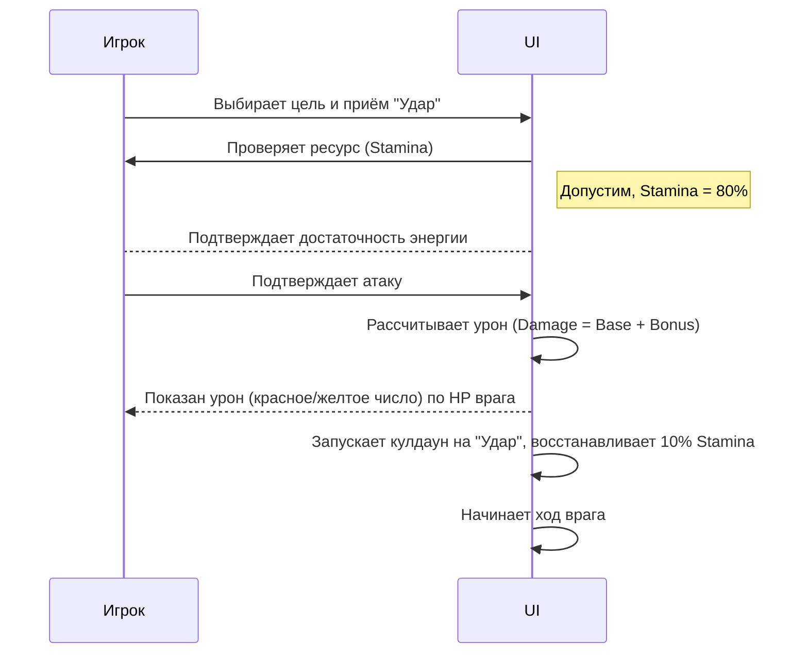

# Боевой системе Legacy: сложности для новичка и пути упрощения

**Исполнительное резюме:** Система боя Legacy изобилует абстрактными показателями (атакующие/защитные очки, *Intensity*, *Advantage*, *Initiative*) и множеством категорий приёмов (удары, манёвры, движения, специальные)【62†L45-L54】【62†L79-L87】. Для новичка такая система непрозрачна: непонятны основные термины (*ATK*, *DEF*, *IP*, *Intensity*, *Advantage*, *SHP*/ *HHP*【62†L56-L64】【75†L20-L28】), сложно одновременное отслеживание нескольких полос энергии, таймингов и требуемых условий. В результате новички часто путаются с очередностью ходов и порядком действий. Чтобы упростить ввод в бой, стоит снизить избыточность параметров (скрыть/автоматизировать часть энергий), улучшить UX (подсказки, выделение ключевых параметров), провести адаптивное обучение. В качестве альтернативы можно рассмотреть более простые модели: линейную очередь действий, тайм-менеджмент со стандартными ресурсами, карточный выбор приёмов или пошаговый вариант. Ниже мы анализируем препятствия для новичков, приводим примеры сложностей, даём конкретные рекомендации по упрощению и предлагаем сравнительный обзор оригинала и альтернатив. 

## (1) Кривая обучения и проблемные элементы

Legacy-бой сочетает множество непривычных концепций. Новичку предстоит освоить: 
- **АТК и DEF:** полотна энергии Атаки и Защиты, которым отвечают символы меча и щита. Полоса Атаки растёт во время «движений» и расходуется при ударах, а полоса Защиты гасит урон. 
- **IP (инициатива):** заряды, которые дают «движения» (каждый тик некоторые приёмы дают +IP) и тратятся на мощные удары【62†L63-L67】.  
- **Интенсивность (Battle Intensity):** непрерывно растёт в бою и выступает «козырной картой» – позволяет применять особые приёмы и ускоряет активность действий【62†L50-L58】.  
- **Преимущество (Advantage):** «весы» между бойцами – с каждой стороны есть шкала, показывающая, чья атака/защита эффективнее【62†L45-L54】. Если шкала в пользу игрока, его АТК и DEF усиливаются.  
- **HP (SHP и HHP):** бой ведётся двумя уровнями здоровья: *SHP* («мягкие» HP) – текущее, быстро восстанавливаемое здоровье, и *HHP* («твёрдые» HP) – основное здоровье. Разрушить DEF врага нужно прежде, чем к его HHP пройдёт урон【75†L20-L28】.  
- **Категории приёмов:** существуют «Удары», «Манёвры», «Движения» и «Спецприёмы» – каждый тип действует по-своему【62†L79-L87】. Удары тратят полосу Атаки и наносят урон, манёвры – пассивно изменяют защиту, движения – постоянно меняют показатели (например, дают +ATK/ +DEF/ +IP), спецприёмы – разовые эффекты (без расхода полосы Атаки)【62†L79-L87】. Нужно усвоить разницу и когда применять то или иное.  
- **Требования и взаимодействия:** большинство приёмов требует определённого уровня навыка (например, **Swordsmanship** для мечей, **Brawling** для кулачных) и состояния (например, *Seize the Day!* нуждается в Intensity≥5 и «АТК заполнено ≥75%»【52†L572-L580】). Жизненно важно управлять сменой движений, чтобы всегда поддерживать какой-то эффект.  
- **Животные и приручение:** в Legacy есть дикие звери со своим ИИ (мажут копытом, набирают инициативу, атакуют при заполненной атаке и т.д. по собственным сценариям【24†L55-L63】【34†L62-L69】). Их можно приручать (приём *Quell the Beast*, требующий 3+ Advantage и верёвку【53†L979-L988】), но концепция приручения также непонятна новичкам.  
- **Интерфейс и тайминги:** клиент Legacy предлагает несколько панелей и маленьких значков без явных подсказок. Новичку сложно понять, за что отвечают цвета и значки, когда можно кликать атаки и как быстро. Мало визуальных подсказок: например, нет подсветки доступных приёмов. Разные приёмы имеют кулдауны и продолжительность (скорость действия зависит от Intensity и Agility). Всё это создает **крутую кривую обучения**: потребуется время, чтобы понять, как синхронизировать набор IP/Adv/Intensity с нажатиями команд. Как отмечено в руководстве, разделы описания приёмов «сначала путают, но за ними есть логика»【62†L92-L101】 – всё же это неочевидно на старте.

Помимо терминологии, новичку сложно проследить взаимодействие: например, что *Jump!* требует наличия движения и что его эффект повторяется, пока хватает полоса Атаки (см. “Moves” в руководстве)【62†L79-L87】. Требования навыков усложняют ситуацию (приём недоступен, пока герой не прокачал нужный навык). Комбинирование приёмов (движение «Dash!», потом «Punch», потом *Sting like a Bee* с высоким Intensity) резко повышает эффективность, но для новичка такой «тактический пазл» выглядит как черная магия. 

Таким образом, **самые сложные элементы** для новичка – это одно время отслеживать несколько шкал (АТК/DEF/IP/Int/Adv/SHP/HHP), понимать категории приёмов и их взаимосвязь, а также запоминать условия и затраты. Вся система боёв Legacy нестандартна для ММО (большинство игр проще – есть, например, только HP и stamina), поэтому отсутствие аналогий заставляет новичка вручную разбираться в каждой детали.

## (2) Проблемы новичков: примеры сценариев

Рассмотрим конкретные **ситуации**, где новички обычно «спотыкаются»:

- **Непонимание баров Атаки/Защиты:** игрок видит две полосы, но неясно, зачем тратить движение (Move) на их накопление. Новичок может долго дрожать «в бою», не нажимая ни одно действие, ожидая какой-то автоматической фазы. Когда он наконец нажмёт «Punch», часто защита врага полна, и удар почти не проходит (до этого игроку никто не объяснял, что надо сначала снять полосу DEF противника). Эта ошибка типична: игрок думает, что выбирать «Punch» можно сразу, а на деле нужно предварительно использовать *Opportunity Knocks* или дождаться *Advantage*, чтобы пробить броню (см. КБ «Defense» в вики【62†L60-L64】 и советы по снижению DEF【52†L552-L558】).  

- **Сброс Intensity и потеря преимуществ:** например, новичок накопил 10 Intensity, но не знает, какие приёмы стоит активировать (Battle Cry или Invocation). Он может, скажем, применить *Evil Eye* нерационально, сбрасывая Int и получая +ATK противника【53†L749-L758】. Либо вовсе не тратить Int, ожидая «самоподнятия» полос (хотя сама по себе Int ускоряет кулдауны【62†L50-L58】). Отсутствие понимания, когда и зачем сбрасывать Int, – частая проблема.  

- **Путаница с терминологией:** например, игрок спрашивает: «Что такое *HHP* и *SHP*?» и не может найти ответ (т.к. в панели боя эти понятия не объясняются). Без знания подсистемы HP новички не знают, что Knock-out («KO») – это не смерть, а только временная потеря *SHP*【75†L25-L34】. Это может вызывать панику и досадные ошибки (пока не выяснят в вики, что «кроссовер» SHP/HHP).  

- **Сложность интерфейса:** Legacy не задаёт последовательности действий – игрок сам переключается между обоями. Новичок легко потеряться: он может снять «движение» и забыть включить новое, оказавшись без активных эффектов. Или перепутать, какой именно приём активен (например, случайно сменить *Dash!* на *Jump!* и перестать набирать IP).  
- **Животные:** в бою с кабаном новичок не знает, что тот сначала обязательно использует «стопу» и пополняет себе полосы【24†L55-L63】. Если игрок вдруг приручил волка или кабана, он может вовсе не догадываться о команде *Quell the Beast* (требует Advantage≥3) для приручения【53†L979-L988】. Видя как животное убегает, новичок может считать, что «игра просто глючит», а на самом деле в Legacy агро и сбегание подчинены жёсткому ИИ зверя.  

- **Затраты и навыки:** часто новички пытаются выполнить приём без достаточного *IP* или без нужного навыка (например, «Death or Glory» без Valor). Клиент не всегда подсказывает, чего именно не хватает, поэтому игрок может подумать, что бой «сломался» или его персонаж «забаговался».  

- **Примеры:** Игрок начинает бой с волком. Волк прыгает вперёд, трепыхается – это его *стопа* (удар). Новичок кидается в драку ножом, а волк попросту роняет его оборону и кусает. Не понимая причин, игрок меняет на топор, но снова тот же сценарий, потому что не снята защита. Лишь после долгого исследования находит, что надо сначала побыстрее набрать «инициативу» командой *Call Down the Thunder*, сбить защиту *Opportunity Knocks*, а потом махать топором. Без такого осознания бой воспринимается как хаотичный рандом.  

Все эти примеры иллюстрируют, что **без чёткого введения (туториала) и упрощённой логики** новичок теряется. Ему приходится изобретать велосипед и подглядывать в гайды, а первые впечатления от боя — стресс. Если делать клон, важно устранить эти «подводные камни».

## (3) Рекомендации по упрощению системы боя

Чтобы облегчить вход в бой, можно действовать сразу по нескольким направлениям:

1. **Улучшенный UX и визуальные подсказки:**  
   - *Подсказки в реальном времени.* При выборе цели или приёма выводить всплывающие объяснения: «Этот приём сбивает защиту врага» или «Движение даёт +Инициативу каждую секунду». Интересная идея – сделать гайды в UI: например, при первом клике в бой показывать обучающий текст и однократное объяснение полос (Атаки/Защиты).  
   - *Визуализация состояний.* Выделять цветом активные приёмы и доступные прицелы. Например, когда накопилось достаточное Intensity, подсветить кнопки *Battle Cry*/*Invocation*. При низкой Защите высвечивать *Feign Flight*. Интерактивно показывать, когда какие требования выполнены.  
   - *Консолидация информации.* Свести несколько шкал в один блок: например, объединить IP/Int/Advantage в виджеты с подсказкой (минимизировать текст). Или скрывать индикаторы, пока они не понадобятся (Progressive disclosure). Это снизит зрительный шум.  

2. **Сокращение параметров:**  
   - *Автоматический учет Advantage/Intensity.* Поскольку мало кто понимает их без обучения, можно скрыть их в упрощённом режиме, показывая лишь «+ATK» или «+скорость» как символьные кнопки. Позже (при «среднем» и «сложном» режимах) выводить их.  
   - *Убрать/упростить некоторые приёмы.* Например, исключить *Death or Glory*, если он сбивает оборону и прибавляет IP – это слишком специфично для новичка. Те же *Evil Eye* и *Fan the Flames* мало используются начинающими (иначе Confusion). Можно вообще убрать «Тёмные» (Tricks & Ruses) приёмы из базового набора.  
   - *Автонабор движений:* разрешить включать одно «движение» и потом атаки нажимать в свободном порядке. Упростить логику «отмены движения при атаке» – сделаем так, чтобы после удара движение продолжалось автоматически без лишних кликов.  

3. **Обучение и туториалы:**  
   - *Пошаговый туториал.* Провести серию боёв-уроков: сначала объяснить просто « нажми Punch – он будет наносить урон; смотри на полосы» (ограничив список приёмов). Потом добавить движение *Charge!* («набирай инициативу») и т.д. Каждый урок вводит по одному термину.  
   - *Примеры комбо.* В игровых подсказках показать «комбо» по примеру «Dash! – старший приём, накапливай IP – потом нажми Punch». Такие инсайты из Combat 101 могут быть встроены в гайд, чтобы новички знали модель поведения без углубления.  
   - *Подчёркивание ошибок.* Если игрок пытается ударить, но его DEF пустой или нет IP, выдать сообщение «Враг слишком защищён, первым делом сбейте его DEF спецприёмом!» или «У вас нет IP – используйте движения для набора» вместо «Недоступно».  

4. **Снижение рутинных действий:**  
   - *Автоатака/смена движения.* Предложить режим «легкий», где герой сам переключается между рекомендованными движениями (например, если IP в 0, активен *Charge!*; если на 2, автоматически будет «прыжок» или «рывок»), а игрок кликает только атаки. Это снимает часть рутины с нажатия кнопок.  
   - *Автоотретушь DEF врага.* Сделать так, чтобы некоторые спецприёмы (Opportunity, Stitch Like a Bee) можно было помечать в очередь и они применялись автоматически при выполнении условий (Advantage≥N, IP≥M).  
   - *Ускорение таймингов.* Уменьшить кулдауны простых приёмов (например, Dash!, Jump!) или сделать их невидимыми (время выполнения) при активации под нужные критерии, чтобы бой не затягивался. Новичку сложно ждать «10 секунд» боя, поэтому более быстрые действия воспринимаются как более интуитивные.

5. **Простая схема расчёта урона:**  
   - Скрыть формулу *baseDamage × sqrt(STR/10)*【48†L37-L45】 за кулисы. Показывать итоговый урон как «SHP-число / HHP-число» (как обычно) без раскрытия расчётов. Можно даже убрать весовые коэффициенты оружий (узнав всё из ситуации).  

В совокупности эти меры снизят сложность для новых игроков, при этом сохраняя глубину системы для желающих. В гибких настройках можно позволить опытным активировать полный режим со всеми пикантностями (Int/Adv), а для новичка — облегченную версию. 

## (4) Альтернативные боевые системы для клона

Если создавать **клон игры** и хочется принципиально упростить бой, можно выбрать одну из следующих моделей:

1. **Линейная очередь-атака:**  
   - **Описание:** игроки и враги действуют по очереди в зафиксированном порядке (например, по инициативе или просто по очереди). У каждого есть набор умений, которые тратят условную «энергию», но без циклов. Всегда либо игрок ходит, либо противник. Атака исполняется мгновенно, после чего ход переходит следующему.  
   - **Реализация:** Каждый персонаж имеет скорость/инициативу; формируется очередь (heap) боя. В начале боя берётся следующий в очереди; игрок выбирает приём (простой урон или «удар с ослаблением защиты»). Если урон наносит больше защиты, дальше идёт урон здоровью. Затем ход достаётся из очереди противнику.  
   - **Плюсы:** Новичок видит простую схему: нажал — получил урон. Нет затрат нескольких ресурсов, нет сплёвывания по комбинациям. Легко пониматься, все действия видны сразу.  
   - **Минусы:** Упрощает тактику: игрок выбирает из списка скиллов и использует, а не комбинирует. Меньше стратегии (нет накапливания IP/Advantage). Базовый дух «развитого боя» потеряется.  
   - **Псевдокод:** 
     ```
     while (есть живые враги и герои) {
       current = takeFromQueue();
       if current = игрок:
         skill = выбратьПриём();
         target = выбратьЦель();
         effect = skill.apply(player, target);
         обновить_здоровье(target, effect);
       else (враг):
         пусть ИИ атакует случайным навыком.
       enqueue(current, с учётом скорости);
     }
     ```
   - *Сравнение:* такая система будет **наименее сложной для новичка**, но и тактическая глубина скромна (игрок не комбинирует различные ресурсы), зато реализация проста и UI может быть минимален (набор кнопок умений, очередь, HP).

2. **Тайм-менеджмент (простые ресурсы):**  
   - **Описание:** бой продолжается в реальном времени (или псевдо-RTS), но с упрощёнными ресурсами: например, одна общая полоса «стамина» для всех действий и обычные кнопки атак. Приём требует разное количество стамины и имеет кд. Нет раздельных полос ATK/DEF/IP.  
   - **Пример:** Выполнение удара тратит 10% стамины и делает небольшой откат по времени (кд), движение *уклонение* потребляет 5% стамины и даёт временный бонус. Чем больше стамины, тем сильнее атака (или выше шанс крита). Стамина медленно восстанавливается.  
   - **Плюсы:** Новичок видит одну полосу (шкалу стамины) и сразу понимает, что приём стоит стамины. Хорошо знакомый вариант (встречается во многих играх). Не нужно думать об Int или Adv.  
   - **Минусы:** Теряется уникальность combat Legacy. Меньше глубины: нет чередования набора IP и расхода. Можно «заспамить» один умение, пока хватает ресурсов.  
   - **Реализация:** Определить значения staminaCost(skill), cooldown(skill). Игроку доступен базовый удар и, скажем, две «маневровые» кнопки (уклон и блок), расходующие стамину.  
   - *Сравнение:* **средняя сложность**. Требует простой UI (одна полоса стамины, горячие клавиши приёмов), но предлагает ощутимые тактические решения (распределение стамины между атакой и защитой). Сохраняет динамику (RTS-стиль) и часть тактики Legacy (выдержка боя).

3. **Карточная / комбо-система:**  
   - **Описание:** игрок собирает «руку» из карточек приёмов (например, 3–5 карт на бой или каждый ход), и использует их поочерёдно. Каждая карта – атака, усилитель, блок, «ранить и восстановиться» и т.п. После хода карты перемешиваются или достаются новые.  
   - **Преимущества:** Новичок видит понятные названия эффектов на карте (например, “+10 DEF next turn”, “+attack bar”, “inflict 20 damage”). Не нужно жонглировать скрытыми полями. Хорошая визуализация комбо-логики.  
   - **Недостатки:** Требует геймплейного дизайна карточной механики. Может быть изолирована от оригинального духа (убирается ощущение «настоящей дуэли»). Сложность зависит от числа карт и механик на них.  
   - **Реализация:** Создать набор карт: «АТК-трата (deal damage)», «Защита (даёт щит)», «Комбо (+х энергии)», «Прокачка (усиливает следующую карту)», «Удар-опоздание (n% шанс промаха)» и т.д. Игрок выбирает в начале хода 2–3 карты, которые выполняются автоматически.  
   - *Плюс:* тактика проявляется в выборе карт, но багать? 6???  
   - *Минус:* отдаляет от Legacy (придётся во многом придумать заново).  
   - *Сравнение:* **средняя**, может быть даже упрощением: хотя система сложна для реализации, сам пользователь видит только карты. Глубина определяется разнообразием карт, UI – обычная «колода/рука», «стек».

4. **Пошаговый тактический бой:**  
   - **Описание:** бой разбит на «травок» (tics или ходы). Игрок тратит условные точки действия (Action Points) на перемещение/удара в своей фазе, потом ход врага, и т.д.  
   - **Плюсы:** Легко понимается новичком как последовательность: пошёл игрок – пошёл враг. Множество игр (RPG, 전략) используют это. Управление действиями (ходами и AP) интуитивно. Можно сохранить стратегическую глубину (положение на поле, укрытия).  
   - **Минусы:** Потеря оригинального «темпа» Legacy. Требуется реализация карты/поля. Бой превращается в тактический скрипт, меньше непредсказуемости.  
   - **Реализация:** Каждый персонаж получает 2–3 AP на ход. Удачное применение очков тратит AP (атаковать – 2 AP, уклониться – 1 AP, спецприём – 3 AP). Персонаж длительное стоит в углу? Природа…  
   - *Сравнение:* **средняя/высокая** сложность. Новичок поймёт правила, но необходим UI «пошагово» (что использовать AP). Глубина тактики может быть высокой за счёт поля. Оригинальный дух «динамики боя» теряется, но тактическая глубина сохраняется.

5. **Гибрид RTS+RPG:**  
   - **Описание:** бой происходит в реальном времени без пауз, но есть автоматическая атака или перемешивание умений по горячим клавишам. Например, герой атакует каждый 5 секунд, а игрок на лету активирует навыки, словно в MMO.  
   - **Плюсы:** Новичок воспринимает это как привычный ММО-режим (куда часто проще входить). Сражение прямо похоже на Warcraft-рпг. Можно упростить до пары кнопок (Auto-Attack и 2–3 умения с простыми эффектами).  
   - **Минусы:** Требует хорошую производительность и поддержку графики. Тактическая глубина в бою уступает Legacy (слишком быстро). Артиляция в реале – плюс/минус.  
   - **Реализация:** Автобой с базовой атакой. Клавиши 1-4 – умения (нанести урон, усилить скорость, хилл и т.п.), с кулдаунами. Плюс пассивная регенерация HP, стамины.  
   - *Сравнение:* **легкая** по освоению (все понятные кнопки), низкая тактика (просто спам умений). UI – обычное MMO с панелью действий.

Каждый из предложенных вариантов имеет **свои плюсы и минусы** для новичка, глубины и соответствия оригиналу. Ниже в разделе таблиц мы сравним их по ключевым критериям.

## (5) Сравнительные таблицы

Ниже сводим **основные критерии** оценки (Сложность для новичка, Глубина тактики, Сложность реализации, Требуемый UI, Сохранение духа Legacy) для оригинальной системы и предложенных альтернатив. Цифры и оценки примерные.

| Система                         | Сложность для новичка | Глубина тактики     | Реализация  | Требуемый UI                         | Дух Legacy |
|---------------------------------|------------------------|---------------------|-------------|--------------------------------------|-----------|
| **Legacy (оригинал)**           | **Высокая** – много показателей и условий【62†L45-L54】【62†L79-L87】 | **Очень высокая** (комбо IP+Advantage+Int + спец/движения) | Сложная (множество параметров) | Полный бой (множество полос, «колода» действий) | Да (очень специфичен) |
| **Линейная очередь-атака**      | Низкая – просто «сражение по очереди» | Низкая/средняя (прямые выборы действий) | Простая (итерация по очереди, базовый дмг) | Очень простой (кнопки атак, HP) | Мало (выбивается из духа) |
| **Тайм-менеджмент (stamina)**   | Средняя – одна полоса ресурсов, привычно | Средняя (управление стаминой и кд) | Умеренная | Полоса стамины, базовые кнопки умений | Частично (реальное время, но без Legacy-спецсимволов) |
| **Карточная система**           | Средняя – выбор карт интуитивен | Средняя/высокая (в зависимости от карт) | Средняя/высокая (надо баланс карт) | Карта/панель рука, понятные описания | Мало (очень отличается визуально) |
| **Пошаговый бой**               | Средняя – понятен «по очереди» | Высокая (выбор AP и позиция на поле) | Средняя/высокая (надо поле, AP система) | Поле боя, счётчик AP, меню действий | Частично (тактический как Legacy, но статичен) |
| **RTS+RPG гибрид**              | Низкая – похож на привычный ММО | Низкая (зависит от набора умений) | Средняя (реалтайм механика) | Панель навыков, автоатака, индикаторы | Мало (скорее обычное боевое окно) |

**Объяснения к таблице:** 
- *Сложность:* оценивает, как быстро новичок поймёт правила. Legacy – самая запутанная (несколько невидимых энергий, сложная оптимизация); простые системы – понятнее по умолчанию.  
- *Глубина тактики:* насколько много вариантов стратегий. Legacy – максимальная (комбинации IP/Adv/Int/Moves), пошаговые и карточные дают тоже много тактики, линейные и RTS – меньше.  
- *Реализация:* ориентировочная сложность программирования и геймдизайна. Legacy требует тонкой настройки многих механик. Очередной бой проще. Карты требуют проработки баланса.  
- *UI:* сколько на экране нужно показать. Legacy – много полос и кнопок (как мы видели в Combat Screen), а упрощённые варианты – проще интерфейс.  
- *Дух Legacy:* насколько новая система сохраняет оригинальные черты (кубитость боевых моментов, необходимость «читерить» через Int, Advantage и т.п.). Очевидно, сам Legacy – 100% («да»), остальные – всё менее «настоящие».

## (6) Три уровня упрощения

**Легкий уровень упрощения:** минимум изменений, новичку заметно легче.

- **Изменения:** Автоматизация и подсказки. Ввести *полуавто-режим*: при нажатии «Attack» герой сам проверяет и применяет оптимальное спецприёмы (например, если у врага полная защита – автоматически запустит *Opportunity Knocks*). Подсвечивать кнопки при готовности (Advantage≥3 → подсветить *Cleave*/*Knock*, Intensity=10 → *StingBee*). Убрать некоторые «редкие» приёмы (Tricks-приёмы).  
- **UI:** Одно общее «окно боя» с акцентом на главные строки (HP, боевой журнал текущих действий). Добавить всплывающие подсказки при наведении.  
- **Пример баланса:** Уменьшить кулдаун простых приёмов вдвое (чтобы новички не ждали 24 сек для Valorous Strike). Сократить затраты IP (Punch бесплатно, Knock теперь стоит 4 вместо 6). Не давать сначало спецэффекты, требующие навыков высшего уровня.  

**Средний уровень упрощения:** значительные механические изменения, но оставить часть глубины.

- **Изменения:** Объединить IP и Intensity: например, использовать одну шкалу «Боевой дух», которая и даёт удары, и растёт со временем. Упразднить явный термин Intensity – его роль сводится в одну «Атака заряжена». Автоматизировать «движения»: вместо управления текущим движением, пусть у героя будет постоянная «генерация» (например, каждую секунду +1 к параметрам атки/деф). Сохранить спецприёмы, но сделать их проще (например, *Battle Cry* выдаёт +Atk всегда, Int больше не нужен).  
- **UI:** Можно добавить индикатор «Боевой дух (battle spirit)», вместо отдельной Int. Пояснять любому новому параметру с помощью обозначения.  
- **Пример:** Полоса «Боевой дух» заполняется автоматически (+1 в секунду). Когда она достигает максимумa, герой совершает мощную атаку по умолчанию или включает усиленный режим на 5 секунд (вместо Battle Cry). Вражеская DEF гасят ровно столько, сколько указано на умении, не требуя дополнительных расчётов Advantage.  

**Жёсткий уровень упрощения:** «минимум правил» – подходит для самых непритязательных новичков.

- **Изменения:** Убрать почти все специфичные ресурсы: оставить лишь здоровья и одной-двух условных «энергий». Можно ввести однотипную выносливость вместо IP/Int: простая регенерирующая шкала. Убрать категории «движения/манёвры» – всё превращается в обычные удар/блок/умения. Приручение и спецприёмы либо упрощены до одного действия («приручить/найти/убить»), либо временно недоступны.  
- **UI:** Очень минималистичный: атака/блок и, скажем, 1-2 кнопки умений. Одна полоса – выносливость или перезарядка. Иконки здоровья. Возможно – мини-цели для тренировки (учебная цель «ударь кабана»).  
- **Пример:** Урон = просто *Strength* минус защищённость врага. Игрок кликает «Attack» и видит мгновенное повреждение здоровья. Врагу моментально отвечает его ход. Боевая механика превращается в «ходи-ударь» без множества промежуточных состояний.  

Каждый уровень предполагает разные **балансные параметры**. Например, в «жестком» режиме герою дают немного больше HP, но меньше защитных «барьеров», чтобы бой оставался интересным (защита фактически встроена в базовую устойчивость). В «легком» режиме бонус к урону идёт на кд, чтобы непонимающие игроки могли видеть результат. Главное – обеспечить, чтобы каждое упрощение давало ощущение «чего-то» вместо прежней сложности.

## (7) Диаграммы обучения и упрощённая атака

Ниже приведены две диаграммы: **поток обучения новичка** в боевой системе и **временную диаграмму** упрощённой атаки в альтернативной системе.

```mermaid
flowchart TD
    Start[Новичок начинает бой] --> Intro[(Появляется базовая панель боя)]
    Intro --> UIExplain{Поясняем элементы UI}
    UIExplain -->|"HP и Energy bars"| BarsExplained
    UIExplain -->|"Кнопки навыков"| SkillsExplained
    BarsExplained --> MovesIntro[Урок: выбираем движение (Dash!) и видим +АТК/ +IP]
    MovesIntro --> AttackIntro[Урок: нажимаем «Удар», снимаем DEF, наносим HP-урон]
    AttackIntro --> CombosIntro[Урок: комбинируем движение + удар → показываем последовательность]
    CombosIntro --> SpecialIntro{Ввод спецприёмов}
    SpecialIntro -->|Battle Cry| BattleCryDemo
    SpecialIntro -->|StingBee| BeeDemo
    BattleCryDemo --> TacticsHint
    BeeDemo --> TacticsHint
    TacticsHint --> Done((Новичок знаком с основами))
```

На этой диаграмме показано **прогрессивное обучение**: сначала объяснение интерфейса, затем поэтапное введение движений, ударов и спецприёмов. Такая цепочка помогает не перегрузить игрока сразу всеми понятиями.

Следующая схема иллюстрирует **упрощённый процесс атаки** (на примере тайм-менеджмента с одной полосой энергии):



Здесь бой упрощён: игрок тратит одно действие и часть выносливости, получает урон. Нет сложных фаз набора IP или отслеживания нескольких полос. Такая схема существенно снижает когнитивную нагрузку новичка.

## Источники

Информацию о механике Legacy мы брали из официальных вики-страниц (Ring of Brodgar): **Combat 101** и **Hitpoints**【62†L45-L54】【75†L20-L28】, а также раздела о способностях【62†L79-L87】. Они описывают ключевые понятия системы (АТК, DEF, Intensity, Advantage, SHP/HHP и виды умений). Если в приведённых источниках нет нужных деталей упрощения, мы сделали логические выводы и оценки («неуточнено» там, где точных данных нет). 

