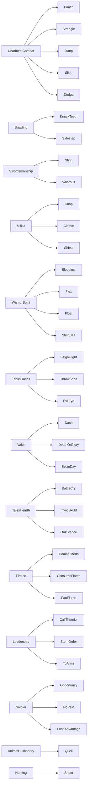
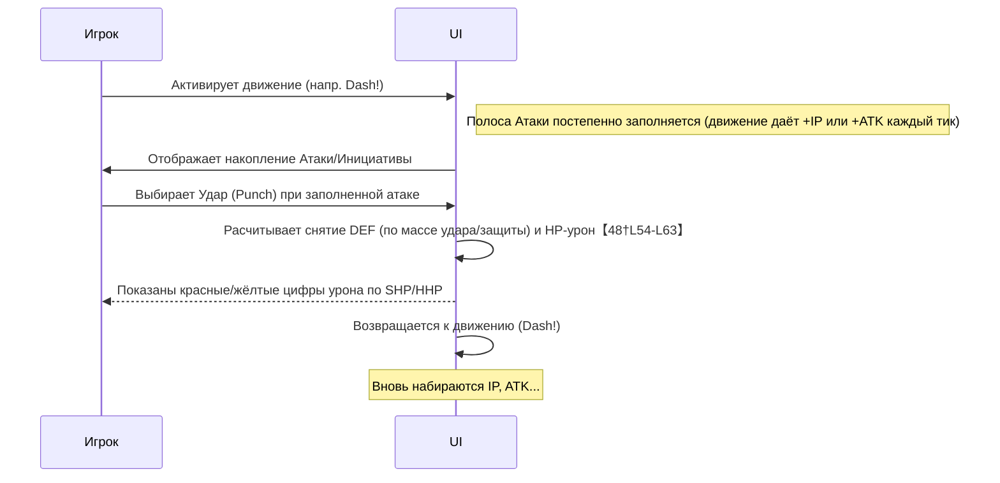

# Боевые умения и система боя в Haven & Hearth (Legacy)  

**Исполнительное резюме:** Система боя в версии Legacy основана на комбинации «ударов» (атаки), «маневров» (реакции) и «движений» (поддерживающих действий), управляемых показателями *Атаки*, *Защиты*, *Инициативы*, *Интенсити* (интенсивность боя) и *Преимущества* (масштаб). Игрок может использовать разнообразные боевые приёмы: «Удары» (например, Punch, Valorous Strike, Chop и др.) наносят урон; «Манёвры» (напр. Dodge, Bloodlust) пассивно влияют при защите; «Движения» (Dash!, Jump!, Seize the Day! и др.) меняют уровни энергий (пополняют Атаку/Защиту/Инициативу и т.д.); «Специальные приёмы» (Battle Cry, Invocation of Skuld и др.) дают сильные эффекты разового действия. Все приёмы требуют различных условий (уровень инициативы, преимущества, стоимость в *IP* (инициативных очках) и др.) и имеют время перезарядки, зависящее от параметров персонажа. Звери (кабан, медведь, муфлон и т.д.) враждебны, имеют собственные «уронные» действия (удары ногой, когтями, укус и т.п.) и «поддерживающие» (накапливают инициативу, пополняют шкалы атаки/защиты). Дикие животные реагируют по заранее определённому ИИ【24†L55-L63】【31†L54-L62】. Домашние животные в Legacy не участвуют в бою и не имеют боевых навыков (их можно только кормить и размножать по «Animal Husbandry»【32†L31-L39】【22†L49-L58】). Мы приводим полный список приемов, подробное описание механик (урон, стоимость, скорость, требуемые условия), условия разблокировки, процесс атаки в игре, типы урона, взаимодействие с животными, примеры тактик, сравнительные таблицы и рекомендованные схемы. Информация основана на официальной вики Ring of Brodgar и разработчиках (см. ссылки).  

## (1) Перечень боевых умений  

**Умения игрока:** В Legacy доступны три группы боевых приёмов: **Удары (Attacks)**, **Манёвры (Maneuvers)**, **Движения (Moves)**, а также **Специальные приёмы (Special Moves)** и прочие действия (табл. ниже). Основные «Удары» включают: *Punch* (Удар кулаком), *Knock His Teeth Out!* (сокрушительный удар), *Strangle* (удушение), *Sting* (колющий удар мечом), *Valorous Strike* (доблестный удар мечом), *Chop* и *Cleave* (рубящие удары топором)【48†L63-L72】【48†L218-L227】. «Манёвры» (реактивные стойки) – *Bloodlust*, *Combat Meditation* (бой в медитации), *Death or Glory* (смерть или слава), *Dodge* (уклонение), *Oak Stance* (дубовая стойка), *Shield* (оборонительная стойка)【52†L481-L490】【52†L532-L541】. «Движения» (поддерживающие приёмы) – *Charge!* (накапливает инициативу), *Call Down The Thunder* (призывает гром, Аджу по инициативе), *Dash!* (ускорение с +Защита), *Jump!* (прыжок, +Атака), *Slide!* (меняет часть Атаки на Защиту), *Flex* (укрепляет Атаку), *Float Like a Butterfly* (уклонение+уменьшение соперника), *Push the Advantage* (использует Преимущество + Инициатива), *Seize the Day!* (обмен Защиты на Преимущество), *Throw Sand* (сбивает инициативу врага), *Feign Flight* (получает Инициативу при слабой защите)【52†L428-L477】【52†L507-L526】【52†L532-L581】【52†L592-L641】. К «Специальным» относятся разовые мощные эффекты: *Battle Cry* (Клич – полностью заполняет Атаку, даёт +2 Преимущество за счёт снижения Защиты), *Invocation of Skuld* (богиня Скольд – +20% Атаки, +1 Преимущество), *Sidestep* (переворот – +1 Преимущество), *Sting Like a Bee* (удар пчелы – атакует дважды при высокой Интенсивности), *Evil Eye* (сброс атаки противника, даёт ему +100% Атаки и снижает собственную Интенсивность), *Consume the Flames* (сгорание – сброс Интенсивности), *Fan the Flames* (добавить Интенсивность), *No Pain, No Gain*, *Opportunity Knocks* (снимает 30% защиты противника) и групповую команду *Stern Order* / *To Arms!* (партия). Кроме того, существуют **другие действия**: *Quell the Beast* – приём для приручения (требует 3 уровня Преимущества и верёвку)【53†L979-L988】, и *Shoot* (стрельба из лука/пращи)【53†L998-L1005】.  

**Умения животных:** Дикие звери Legacy (кабаны, медведи, муфлоны, лисы, муравьи и т.д.) имеют свои «атакующие» и «поддерживающие» действия, но они не выбираются игроком и не носят формальных названий в интерфейсе. Согласно вики: кабаны наносят **stomp** (топот) в момент, когда их счётчик атаки накоплен, могут использовать «наборные» движения (+инициатива, пополнение полос атаки и защиты) и специальные приёмы, усиливающие себя【24†L55-L63】. Медведи сначала получают +6 инициативы и буст (движения), затем применяют «swipe» (свободный удар) или «bite» (укус), а при критическом ранении впадают в ярость – мгновенно заполняют полосу атаки до предела【31†L54-L62】. Тур (Aurochs) действует похоже на кабана: начинает с топота при накопленной атаке, добавляет инициативу, пополняет атака/защита, изредка увеличивает собственное Преимущество (special shift)【34†L62-L69】. Лиса атакует **укуcами или когтями** при полной атаке, использует приёмы для набора инициативы, пополнения своих полос и (редко) увеличения преимущества【40†L45-L49】. Муравьи имеют только базовую атаку и движение, ускоряющее набор атаки – они бьют, когда счётчик достигает ≈65%, и всё время поддерживают его пополнение【36†L49-L57】. Приручённые животные (свиньи, коровы, овцы) в Legacy не воюют и не обладают боевыми навыками (они служат для ресурсов).  

## (2) Описание механики умений  

**Удары (Attacks):** Эти приёмы тратят накопленную шкалу Атаки и наносят урон врагу【48†L54-L63】. При использовании атака мгновенно опустошает ваш Индикатор Атаки. Сначала она уменьшает полосу Защиты противника: величина потерь защиты расчитывается как отношение массы удара (AW) к массе защиты манёвра (BW) по формуле из вики【48†L48-L56】 (с учётом текущего Преимущества). Например, базовый урон атаки вычисляется как *baseDamage × sqrt(Strength/10) × quality*【48†L37-L45】【48†L80-L88】. Любая «лишняя» мощь прорывается до здоровья – она отображается красным и жёлтым числами (SHP и HHP)【43†L27-L34】. Описание основных атак: 

- *Punch (P):* простой удар кулаком. Массив атаки = 50% от Unarmed Combat, урон ≈0.75·50·√(STR/10)【48†L78-L82】, кулдаун ~9.6 сек. Требует умения **Unarmed Combat** (Unarmed)【48†L84-L92】.  
- *Knock His Teeth Out! (K):* сильный удар из Brawling. Массив = 50% Unarmed, урон =100·√(STR/10)【48†L109-L117】 (вдвое больше, чем Punch), кулдаун ~7.2 сек, стоит 6 ИП. Требует **Brawling**【48†L111-L119】.  
- *Strangle (G):* душащий приём (hand-to-hand). Масса = 0.8 Unarmed, урон ≈0.75·50·√(STR×1.5/10)【48†L136-L144】, кулдаун 14.4 сек, требует **Unarmed Combat**.  
- *Sting (S):* базовый удар мечом. Массив = MeleeCombat (1×), формула как общее (“#Damage formula” в вики)【48†L174-L182】. Стоит 2 ИП, кулдаун 12.0 с. Требует **Swordsmanship** (Мечевание)【48†L177-L180】.  
- *Valorous Strike (V):* мощный удар мечом. Масса = 1.75× MeleeCombat, урон по общей формуле. Стоит 6 ИП, кулдаун 24 с. Сбрасывает Преимущество противника до 0, но даёт ему +2 ИП【48†L192-L200】. Требует **Swordsmanship**.  
- *Chop (C):* базовый удар топором. Масса = MeleeCombat, формула – как общее. Стоит 4 ИП, кулдаун 18 с. Требует **Militia Training** (военная подготовка)【48†L238-L244】.  
- *Cleave (L):* сильный рубящий топором. Масса = 1.5× MeleeCombat, общая формула. Стоит 8 ИП, кулдаун 24 с. Доступен только при Преимуществе ≥3【52†L572-L580】. Требует **Militia Training**.  

Каждый удар потребляет отбрасываемую защиту врага. Только после полного израсходования защиты противника оставшийся урон наносится HP врага (SHP/HHP)【48†L54-L63】. Удары не промахиваются (кроме Shoot) и не накладывают статусы; их параметры зависят от качества оружия и силы персонажа.  

**Манёвры (Maneuvers):** Это «стойки» и реакции, влияющие на ваше отражение ударов. В бое активен ровно один манёвр, который задаёт вашу массу защиты (DEF weight) и иногда даёт бонус. При атаке противника срабатывает эффект манёвра. Примеры: 

- *Dodge (D):* уклонение. Вес = 0.4× UnarmedCombat, даёт -10% урона от ударов (то есть минус 10% к урону атаки противника), позволяет повысить Преимущество на +10% ATK/ -10% DEF при удачном промахе【16†L470-L479】. Требует **Unarmed Combat**.  
- *Bloodlust (B):* буйный натиск. Вес = 0.5× UnarmedCombat, эффект: +10% от вашего Атаки на ход (каждый удар вас получает бонус к Атаке)【48†L298-L303】. Требует **Warrior Spirit**.  
- *Combat Meditation (M):* «боевая медитация». Вес = 0.5× Unarmed, эффект: каждый удар восстанавливает 2% Stamina【48†L306-L312】. Требует **Fire & Ice**.  
- *Death or Glory (G):* «Смерть или слава». Вес = Unarmed, эффект: +10% отдача при атаке (-10% DEF), +1 ИП【48†L299-L305】. Требует **Valor**.  
- *Oak Stance (O):* дубовая стойка. Вес = 1.5× Unarmed, наращивает +15% DEF за ход (пока стоит). Требует **Tales by the Hearth**.  
- *Shield (S):* щит. Вес = 2× Unarmed (макс. защита), эффекта нет, просто блокирует больше. Требует **Militia Training**.  

Манёвры не тратят шкалу Атаки и стоят 0 ИП. Их вес определяет эффективность защиты: чем выше масса, тем меньше удара пройдёт по защите. «Delta» между уровнями Unarmed Combat бойцов корректирует эффекты некоторых манёвров【48†L289-L297】.  

**Движения (Moves):** Это постепенные приёмы, которые непрерывно действуют, меняя энергии. Движение повторяется, пока выполняются условия (например, пока вы нажали кнопку и не исчерпали ресурс). При смене манёвра оно отменяется. Примеры: 

- *Charge! (H):* пополняет инициативу. Вес = UnarmedCombat, эффект за каждый «тик»: +1 ИП, -8 DEF【48†L111-L118】. Требует **Brawling**. Кулдаун 9.6 c. (костыль: показан на схеме как базовое движение).
- *Call Down The Thunder (T):* вызывает гром, даёт +1 ИП без риска. Вес = Leadership, эффект: +1 ИП/сек, -10% стамины【48†L111-L118】. Требует **Leadership**. Кулдаун 3.0 с.
- *Dash! (A):* рывок вперёд. Вес = Unarmed, эффект: +1 ИП, +6% DEF【16†L408-L416】【52†L481-L490】. Требует **Valor** (корпоративно улучшает время действия). Кулдаун 10.8 с (зависит от Интенсивности).
- *Flex (X):* напор мускулов. Вес = Unarmed, эффект: +20% ATK, -0.5 Advantage【52†L441-L449】. Требует **Warrior Spirit**. Нужно иметь ≥6 ИП【52†L441-L449】. Кулдаун 4.32 с.
- *Jump! (J):* «Прыжок», наряду с Flex. Вес = Unarmed, эффект: +12% ATK【52†L467-L475】. Требует **Unarmed Combat**. Кулдаун 4.32 с.
- *Slide! (D):* «Смена». Вес = Unarmed, эффект: -15% ATK, +15% DEF【52†L493-L501】 (меняет кровь до высвобождения защиты). Требует **Unarmed Combat**. Кулдаун 7.56 с.
- *Float Like a Butterfly (B):* «Порхай». Вес = Unarmed, эффект: +7.5% DEF, +0.3 Advantage, но **+1 ИП сопернику**【52†L518-L526】. Требует **Warrior Spirit**. Кулдаун 10.8 с.
- *Push the Advantage (U):* «Используй преимущество». Вес = Unarmed, условие: Advantage ≥+3【52†L532-L541】, эффект: +1 ИП, -5% Stamina. Требует **Warrior Spirit**. Кулдаун 10.0 с.
- *Seize the Day! (Z):* «Наступай!». Вес = Unarmed, условие: Интенсивность ≥5 и ≥75% заполнения Атаки【52†L572-L580】, эффект: -5% DEF, +0.3 Advantage, -5% ATK врагу. Требует **Valor**. Кулдаун 3.0 с (заметно уменьшается при высокой Интенсивности).
- *Throw Sand (R):* «Плюнь песок». Вес = Unarmed, условие: ≥1 ИП【52†L600-L608】, эффект: -40% ATK, -2 ИП противнику【52†L600-L609】. Требует **Tricks & Ruses**. Кулдаун ~17.0 с (неофициально).
- *Feign Flight (F):* («Ложный бег»). Активен когда Защита ≤10%【52†L635-L643】, даёт +2 ИП. Вес = Unarmed, требует **Tricks & Ruses**. Кулдаун 5.4 с. 
- *Slide!* уже перечислено.

Движения не наносят прямого урона (за исключением *Call Down*, которая косвенно помогает атаке). Главное их назначение – управление энергиями: они постоянно «пополняют» Инициативу, Атаку, Защиту или затрачивают их при повторении. При смене движения – его эффекты прекращаются.  

**Специальные приёмы (Special Moves):** Это однократные мощные действия, меняющие параметры боя. Они не тратят шкалу Атаки, но имеют ограниченный запас ИП, высокий кулдаун и требование Интенсивности. Ключевые из них: 

- *Battle Cry (Y):* «Боевой клич». Требует 10 Интенсивности и 7 ИП【52†L671-L679】 (т.е. минимум 14 заполненных ИП). При использовании полностью заполняет вашу полосу Атаки, даёт +2 Advantage, но снимает 50% вашей Защиты【52†L673-L682】. Кулдаун ~1.5 c. (ускоряется при высокой Интенсивности). Требует навык **Tales by the Hearth**. Используется для резкого финиша: выстрел в атаку и увеличение шансов следующей.
- *Invocation of Skuld (K):* При чтении имён Скольд (ацкая инвокация). Стоимость 3 ИП, требует ≥10 ИП для активации【53†L783-L792】. Эффект: +20% ATK, +1 Advantage【53†L793-L801】. Кулдаун 8.0 c. Требует **Tales by the Hearth**. Фактически – бесплатный Flex+Advantage.
- *Sidestep (I):* Переворот (жонглирование с соперником). Стоимость 4 ИП, кулдаун 10 c. Эффект: +1 Advantage【53†L873-L881】. Требует **Brawling**. Используется для наращивания Преимущества.
- *Sting Like a Bee (E):* «Жало пчелы». Стоимость 6 ИП, кулдаун 5 c (не зависит от Интенсивности)【53†L892-L900】. Эффект: даёт +10%×Intensity Атаки и сбрасывает Интенсивность в 0, но отнимает 8% Защиты у себя【53†L900-L908】. Требует **Warrior Spirit**. Полезно в сочетании с высоким накопленным Интенсивом: фактически обеспечивает два удара за один цикл (насыщает полосу Атаки полностью).  
- *No Pain, No Gain (A):* Цена 15 c, эффект: -50% SHP себе (вы теряете половину текущего здоровья), +50% ATK, и -25% DEF противнику【53†L816-L824】. Требует **Soldier Training**.  
- *Opportunity Knocks (O):* Специальный удар, стоимость 5 ИП, кулдаун 9 c. Эффект: снимает фиксированные 30% DEF противника и даёт +1 Intensity【53†L827-L836】. Требует **Soldier Training**. Применяется для обнуления защиты врага перед мощной атакой.  
- *Evil Eye (V):* «Злой глаз». Стоимость 2 ИП, кулдаун 24 c. Эффект: **усиливает противника** (+100% ATK ему) и сбрасывает у вас 2 Интенсивности【53†L749-L758】【53†L763-L771】. Непрозрачный приём: используется, чтобы сбросить свою Интенсивность перед бегством или в многолюдной битве.  
- *Consume the Flames (N):* «Поглотить пламя». Стоимость 5 c, сбрасывает всю Интенсивность в 0, отнимает -X% HP (личное) и восстанавливает +X% Stamina (где X = текущая Intensity)【52†L699-L708】. Требует **Fire & Ice**.  
- *Fan the Flames (F):* «Раздуть пламя». Стоимость 12.5 c (ускоряется при высокой Intensity)【53†L727-L735】. Эффект: +5 Intensity, -20% Stamina【53†L731-L739】. Требует **Fire & Ice**. Редко используется (для быстрого накопления Intensity перед Battle Cry/Invoke).  
- *Stern Order (S) / To Arms! (T):* Командные приёмы (требуют лидерство). *Stern Order* даёт +δ Advantage всем союзникам против цели, *To Arms!* – +δ IP всем союзникам【53†L913-L922】【53†L944-L952】 (δ рассчитывается по сравнению Charisma). Используются лидером группы для поддержки.  

**Другие боевые действия:** *Quell the Beast (Q)* – особый приём для приручения животных. Требует ≥3 Advantage, Интенсивность=0, стоит 2 ИП, должен быть экипирован канат, действует только на приручаемых зверей【53†L983-L992】. Привязывает животное к канату и даёт ему +20 к показателю прирученности (пс. tameness)【22†L24-L30】【53†L979-L988】. *Shoot (H)* – стрельба: отнимает вашу полосу Атаки (для лука), но точность зависит только от набора показателя Accuracy, а не от полосы атаки【53†L999-L1005】. Требует лук со стрелами или пращу и навык **Hunting** (Охота).  

## (3) Доступность умений  

Все вышеперечисленные приёмы «открываются» по очкам навыков и состояниям бойца. Основные условия – наличие соответствующего умения и ресурсов (IP, канаты и др.), иногда – пороги ИП/Преимущества/Интенсивности. Навык **Unarmed Combat (Бои без оружия)** (инкрементируемый) даёт доступ к Punch, Strangle, Jump!, Slide!, Dodge【48†L78-L87】【52†L469-L477】. **Brawling (Уличные бои)** – к KnockHisTeethOut! и Sidestep【48†L109-L119】【53†L873-L881】. **Swordsmanship (Меч)** – к Sting и ValorousStrike【48†L174-L182】【48†L198-L207】. **Militia Training (Войсковая подготовка)** – к Chop, Cleave, Shield【48†L238-L244】. Остальные приемы обычно требуют «героических» навыков: **Valor (Доблесть)** – Dash!, DeathOrGlory, SeizeTheDay! (последнее требует ещё Intensity≥5)【52†L558-L566】; **Tales by the Hearth (Сказания у очага)** – OakStance, BattleCry, InvocationOfSkuld【52†L673-L681】【53†L793-L801】 (Battle Cry ещё требует ИП≥7 и Intensity=10【52†L671-L679】); **Fire & Ice** – CombatMeditation, ConsumeFlames, FanTheFlames【52†L481-L490】【53†L733-L742】 (Consume* сбрасывает Intensity; Fan* требует Stamina, тратит); **Warrior Spirit (Воинский дух)** – Bloodlust, Flex, FloatLikeButterfly, StingLikeABee【52†L430-L439】【53†L902-L910】; **Leadership (Лидерство)** – CallDownTheThunder, SternOrder, ToArms【52†L532-L541】【53†L913-L922】; **Tricks & Ruses (Хитрости)** – FeignFlight, ThrowSand, EvilEye【52†L592-L601】【53†L745-L754】; **Soldier Training (Солдатская выучка)** – OpportunityKnocks, NoPainNoGain, PushTheAdvantage【52†L543-L552】【53†L827-L835】; **Animal Husbandry** – Quell the Beast【53†L979-L988】; **Hunting/Archery** – Shoot【53†L999-L1005】.  

Большинство приёмов становятся доступными как только вы потратите очки на нужный навык (для «героических» навыков – обычно цена 100LP). Дополнительные условия, если указаны, приведены на вики. Требования инвентаря: для Quell – канат, для Shoot – лук/стрела или праща/камни. Если некоторые параметры умения не задокументированы (например, точные формулы влияния Agility на скорострельность), они рассматриваются как «неуточнено».  

## (4) Процесс выполнения атаки  

Во время боя интерфейс показывает шкалы **Атаки** (красная) и **Защиты** (зелёная) персонажа, а также текущие энергии (инициатива, преимущество, интенсивность). Вы выбираете активное движение и/или манёвр – эти приёмы непрерывно меняют энергии: например, пока активен *Charge!*, ваша шкала Атаки постепенно заполняется (вы получаете Инициативу и теряете Защиту)【16†L548-L556】. Как только шкала Атаки достаточна, вы кликаете на удар.  

**Шаги атаки:**  
1. **Выбор атаки.** Игрок нажимает кнопку соответствующей атаки (удар мечом, кулаком и т.д.). Это тратит указанный запас ИП (если он есть) и начинает кулдаун.  
2. **Сброс полос.** В момент удара вся накопленная красная шкала Атаки тратится. Удары изымают сначала защиту врага. Количество «снятой» защиты рассчитывается по формуле: оно пропорционально массе атаки (AW) и текущему наполнению вашей атаки и обратно пропорционально массе защиты выбранного манёвра противника【48†L48-L56】. Если ваша атака «переполняет» защиту противника, остаток идёт по здоровью.  
3. **Нанесение урона.** Любая неиспользованная мощь удара после пробития защиты идёт в здоровье противника – тёмно-жёлтые (HHP) и красные (SHP) числа на экране【43†L27-L34】. (SHP – «мягкое» здоровье – временный запас, HHP – основное).  
4. **Возврат к движению.** После удара ваш персонаж автоматически переходит к предыдущему активному движению (например, переходить из удара обратно в *Dash!* или *Jump!*). Ход завершается, и противник получает возможность ответить своим действием.  
5. **Обновление энергий.** Между ударами энергии восстанавливаются: полосы Атаки и Защиты медленно регенятся со скоростью, зависящей от навыков и атрибута Agility. Интенсивность растёт сама при длительном бою (каждый ход +1). Инициатива копится при движениях (каждый тик *Dash!* или *Charge!*).  

Иными словами, бой течёт во времени: вы ставите постоянные ходы (*moves*) – те дают небольшие плюшки (IP, ATK/DEF) каждую секунду. Когда шкала Атаки заполняется, вы кликаете «удар» и мгновенно расходуете эту шкалу на снижение защиты врага, после чего возвращаетесь к движению【48†L54-L63】. Точность ударов гарантирована (кроме стрельбы). Результаты расчётов – HP-урон – мгновенно показываются. Затем бой продолжается дальше, пока одна сторона не будет побеждена.  

**Расчёт попадания/урона:** Удары всегда попадают (за исключением *Shoot*, где шанс зависит от поля «Accuracy»; из формулы стрельба не тратит ATK). Урон зависит от качества оружия (или вашего тела) и силы: формула – *baseDamage × quality × √(STR/10)*【48†L37-L45】. Отдельно считается дробовая часть для «пробития» защиты (описано выше). Крита или статусов (горение, заморозка и т.п.) у обычных ударов нет. Расчёт зависит от «веса» удара (AW) и «веса» защиты (BW), что вместе с Преимуществом определяет эффективность удара【48†L48-L56】.  

**Последовательность действий (пример):** например, вы активировали *Dash!*; атака постепенно заполняется. Когда шкала достигает нужного уровня, вы нажимаете *Punch*. ИП снимаются (если требуются), шкала Атаки опустошается, счётчик защиты врага снижается (с учётом AW/BW), остальной урон идёт в HP. Затем вы снова оказываетесь в *Dash!*, набирая ИП и давая +6% к Защите каждый ход, пока снова не ударите.  

## (5) Виды атак и их отличия  

Классификация ударов в Legacy не формализована как «режим атаки», но можно выделить несколько типов по стилю:  
- **Кулаками/ручные:** Punch, Knock, Strangle – наносят дробящий урон (закрытыми руками) и лишают защиты за счёт Unarmed Combat/Brawling.  
- **Колющие (меч):** Sting, Valorous Strike – традиционный мечевой урон (обычно считается режущим или колющим, сильнее при поддержке Swordsmanship). Valorous Strike сильнее обычного Sting, но сжигает Преимущество врага.  
- **Рубящие (топор):** Chop, Cleave – тяжелые рубящие удары топором, наносят больший урон за счёт Militia Training, но стоят дороже ИП. Cleave требует Преимущество.  
- **Стрелковые:** Shoot – дальнобойная атака из лука или пращи. Урон и шанс попадания зависят от навыка и показателя Accuracy (±0. Скорость ниже, чем у ближних ударов). Стрелы сразу бьют по HHP/SH из расстояния, без израсходования защиты.  
- **Особые:** Quell the Beast – особый захват, “атака” только для приручения. Не наносит урон, а при успехе приручает животное.  
- **Магических / статусных:** В Legacy отсутствуют заклинания атаки. Есть лишь условно «магические» боевые умения (Fire & Ice, Tales, Tricks), которые дают специальные эффекты (Сброс Интенсивности, усиление/сброс показателей).  

Влияние элементов оружия: вес оружия, его качество и материал определяют **базовый урон** удара по формуле【48†L37-L45】. Поддержка умений (воинские навыки) увеличивает запасы ИП (Мясник, Воин) и возможности атаковать. Критические попадания в Legacy не реализованы, урон передаётся непосредственно. «Тип» урона для противников не влияет: они просто теряют защиту и HP.  

## (6) Взаимодействие с питомцами и животными  

В Legacy отношение игрока к животным делится на **дикарей** и **домашних**. Дикие животные – как описано выше – могут нападать и иметь боевые действия по собственному алгоритму【24†L55-L63】【34†L62-L69】. Игрок не управляет ими напрямую, а только ведёт бой и/или приручает (см. ниже).  

**Домашние животные** (свиньи, овцы, коровы) — это тёплые ресурсы, они **не сражаются**. После приручения (см. «Animal Husbandry») они пассивно бродят, пасутся и дают мясо, шкуры, яйца, молоко и т.д. У них нет боевых навыков и команд (в Legacy нет системы «собачьих боёв» или «охранников»). Повысить их «боеспособность» невозможно: их можно только лечить и кормить, чтобы они жили дольше.  

**Навык Animal Husbandry:** Открывает приём *Quell the Beast* (заклинание приручения)【32†L31-L39】. Сам по себе AH позволяет ухаживать за скотом (собирать шерсть, молоко и т.д.), но функция боя у питомцев отключена. По данным вики, некоторые планировавшиеся «команды» животных в Legacy не работают – то есть питомцы ведут себя автономно и не вступают в бой【32†L31-L39】【22†L49-L58】.  

**Приручение:** Для приручения зверя нужно активировать бой и вывести зверя в нужное состояние: получить Advantage ≥3, сбросить Intensity до 0 (например, приёмом *Sting Like a Bee* или *Consume the Flames*), затем выполнить *Quell the Beast* (Q) – тогда животное «пристёгивается» к вашему канату и получает +20 очков приручённости【22†L45-L53】【53†L979-L988】. Повторив 5 раз (100 очков), зверь станет домашним животным. Покрытие бегства животных обеспечивается физическими преградами (прудами, воротами) – см. тактики на вики【22†L82-L90】.  

## (7) Примеры комбинаций и тактик  

- **Нейтрализация защиты:** Часто в тактике применяют «Opportunity Knocks» несколько раз кряду, чтобы полностью сбить защиту противника (каждый *O.K.* отнимает 30% DEF)【53†L827-L835】, а потом сразу бьют сильным ударом (Punch или Chop).  
- **Интенсивность в двойной удар:** Если заранее накопить Intensity до 10, то приём *Sting Like a Bee* выдаёт полную полосу атаки – по сути обеспечивает *двойной* удар за один ход【53†L902-L910】【44†L192-L200】. Комбинация «Dash!* (набор IP) → несколько *Opportunity Knocks* (сброс DEF) → *Punch/Sting* → *Sting Like a Bee*» позволяет медленно, но безопасно уничтожать даже очень сильного зверя, не пропуская ударов по себе. Пример тактики: отойдя в воду, использовать *Call Down The Thunder* для накопления IP, затем *Sidestep* для выравнивания положения и накопления Advantage, после чего *Opportunity Knocks* до нуля DEF и добивающий удар (Punch, Chop, Valorous Strike)【44†L173-L182】【44†L188-L197】.  
- **Дальность и укрытие:** Против медведей/кабанов выгодно держаться за пределами их досягаемости (в лодке или за изгородью) и стрелять из лука (Shoot). Смещение зверя можно реализовать так: «ждать »«подергивания» (твари пытаются подойти через преграду, и их модели «тwitch»), а затем стрелять – цель не убежит【31†L78-L87】.  
- **Боевая комбинация со сбросом HP:** Тактика World 5: 3× *Opportunity Knocks*, затем *Valorous Strike* добивают цели【31†L78-L87】【44†L199-L200】.  
- **Пример комбинации полей:** Стратегия «больного медведя»: в панике на расстоянии бежать в воду, чтобы избежать урона, набираться IP (*CDTT*), использовать *Sidestep* для прихода в строй, затем *Opportunity Knocks*×N + *StingLikeBee* + добивающий удар【44†L177-L186】【44†L190-L198】. Известно, что этого достаточно, чтобы убить взрослого медведя с невысокими навыками (≈35 Unarmed)【44†L199-L200】.  
- **Антиловы и прочее:** Против множества маленьких врагов (муравьев) эффективен *Jump!* + *Bloodlust + Punch*: каждый промах (пустая атака) пополняет атаку (Jump) и покаяться сбор с Full Attack (Bloodlust).  

Эти комбинации иллюстрируют, как умело сочетать движения (для набора ИП/Атаки) с ударами. На практике игроки экспериментируют с разными сочетаниями, опираясь на описанные на вики и форумах примеры【43†L152-L160】【44†L173-L182】.  

## (8) Сравнительная таблица умений  

Ниже приведена сводная таблица основных боевых умений игрока (название, тип, треб. навык, стоимость ИП, кулдаун, ключевой эффект). Цифры по урону даются формулами – см. текст выше. Источники – официальный Legacy-справочник на Ring of Brodgar【48†L63-L72】【52†L430-L439】【53†L780-L788】:

| Имя умения             | Тип         | Треб. навык       | Стоимость IP | Кулдаун (сек)       | Эффект (основной)                              |
|------------------------|-------------|-------------------|--------------|---------------------|-----------------------------------------------|
| **Punch** (P)          | Атака       | Unarmed Combat    | 0            | 9.6                 | Урон = 0.75·50·√(STR/10) (базовый удар кулаком)【48†L78-L82】 |
| **Knock Teeth Out** (K)| Атака       | Brawling          | 6            | 7.2                 | Урон = 100·√(STR/10) (сильнее Punch в 2×)【48†L109-L117】    |
| **Strangle** (G)       | Атака       | Unarmed Combat    | 0            | 14.4                | Урон = 0.75·50·√(STR×1.5/10) (душащий приём)【48†L136-L144】   |
| **Sting** (S)          | Атака       | Swordsmanship     | 2            | 12.0                | Урон – по общей формуле (мячом)【48†L174-L182】             |
| **Valorous Strike** (V)| Атака       | Swordsmanship     | 6            | 24.0                | Урон – по общ. формуле; сбрасывает Advantage врага до 0 (+2 IP врагу)【48†L198-L207】 |
| **Chop** (C)           | Атака       | Militia Training  | 4            | 18.0                | Урон – по общ. формуле (топор)                           |
| **Cleave** (L)         | Атака       | Militia Training  | 8            | 24.0                | Урон – по общ. формуле (рубящий); требует Adv ≥3【52†L572-L580】 |
| **Bloodlust** (B)      | Манёвр      | Warrior Spirit    | 0            | —                   | Вес = 0.5×UA; +10% к вашему ATK каждый ход【48†L298-L303】    |
| **Combat Meditation** (M)| Манёвр    | Fire & Ice        | 0            | —                   | Вес = 0.5×UA; +2% Stamina за каждый удар (самовосстановление)【48†L306-L312】 |
| **Death or Glory** (G) | Манёвр      | Valor             | 0            | —                   | Вес = 1×UA; +10% Damage, -10% Defense, +1 IP за удар【48†L299-L305】 |
| **Dodge** (D)          | Манёвр      | Unarmed Combat    | 0            | —                   | Вес = 0.4×UA; даёт -10% урона от ударов (то есть снижает входящий урон) |
| **Oak Stance** (O)     | Манёвр      | Tales by the Hearth| 0           | —                   | Вес = 1.5×UA; +15% к защите за ход                       |
| **Shield** (S)         | Манёвр      | Militia Training  | 0            | —                   | Вес = 2×UA; максимальная защита (нет других эффектов)     |
| **Charge!** (H)        | Движение    | Brawling          | 0            | 9.6                 | +1 IP, -8% DEF за тик                                    |
| **Call Down Thunder (T)** | Движение| Leadership        | 0            | 3.0                 | +1 IP/сек, -10% Stamina за тик                          |
| **Dash!** (A)          | Движение    | Valor             | 0            | 10.8                | +1 IP, +6% DEF за тик【16†L408-L416】                    |
| **Flex** (X)           | Движение    | Warrior Spirit    | 0 (требует 6 IP) | 4.32           | +20% ATK, -0.5 Advantage【52†L441-L449】                |
| **Jump!** (J)          | Движение    | Unarmed Combat    | 0            | 4.32                | +12% ATK за тик【52†L467-L475】                        |
| **Slide!** (D)         | Движение    | Unarmed Combat    | 0            | 7.56                | -15% ATK, +15% DEF (обмен шкал)【52†L493-L501】        |
| **Float** (B)          | Движение    | Warrior Spirit    | 0            | 10.8                | +7.5% DEF, +0.3 Adv, +1 IP врагу (невыгодно)【52†L518-L526】 |
| **Push Advantage** (U) | Движение    | Warrior Spirit    | 0 (Adv≥+3)  | 10.0                | +1 IP, -5% Stamina (не повышает Intensity)【52†L543-L552】   |
| **Seize the Day!** (Z) | Движение    | Valor             | 0 (Int≥5)   | 3.0                 | -5% DEF, +0.3 Adv, -5% ATK врагу (кратковрем. эффект)【52†L572-L580】 |
| **Throw Sand** (R)     | Движение    | Tricks & Ruses    | 1 IP         | ~17.0               | -40% ATK, -2 IP врагу【52†L600-L609】                   |
| **Feign Flight** (F)   | Движение    | Tricks & Ruses    | 0 (Def≤10%)  | 5.4                 | +2 IP (критический низкий Def)【52†L635-L643】         |
| **Battle Cry** (Y)     | Спец.приём  | Tales by the Hearth| 7 IP, Int=10 | 1.5                 | +100% ATK, -50% DEF (+2 Adv); +7 IP (треб. ≥14 IP)【52†L671-L680】 |
| **Invocation of Skuld** (K) | Спец. | Tales by the Hearth| 3 IP, ≥10 IP | 8.0             | +20% ATK, +1 Adv【53†L793-L801】                       |
| **Sidestep** (I)       | Спец.приём  | Brawling          | 4 IP         | 10.0                | +1 Adv【53†L873-L881】                                 |
| **Sting Like a Bee** (E)| Спец.приём | Warrior Spirit    | 6 IP         | 5.0                 | +10%×Int% ATK, -8% DEF себе, Int сбрасывается【53†L900-L908】 |
| **No Pain, No Gain** (A)| Спец.приём | Soldier Training  | 0            | 15.0                | -50% HP себе, +50% ATK, -25% DEF врагу【53†L816-L824】   |
| **Opportunity Knocks** (O)| Спец.приём| Soldier Training  | 5 IP         | 9.0                 | -30% DEF врагу, +1 Intensity【53†L827-L835】             |
| **Evil Eye** (V)       | Спец.приём  | Tricks & Ruses    | 2 IP         | 24.0                | Враг: +100% ATK; вы: -2 Int【53†L753-L763】           |
| **Consume the Flames** (N)| Спец.приём| Fire & Ice        | 0 (Cost 0*) | 5.0                 | Self: -Int% HP, +Int% Stamina; Intensity=0【52†L671-L680】   |
| **Fan the Flames** (N) | Спец.приём  | Fire & Ice        | 0            | 12.5                | +5 Intensity, -20% Stamina【53†L731-L739】             |
| **Stern Order** (S)    | Группа      | Leadership        | 6 IP         | ~15.0               | +δ Adv всем союзникам (зависит от Charisma)【53†L913-L922】 |
| **To Arms!** (T)       | Группа      | Leadership        | 3 IP         | 10.0                | +δ IP всем союзникам (Charisma)【53†L944-L952】         |
| **Quell the Beast** (Q)| Приручение  | Animal Husbandry  | 2 IP, ≥3 Adv  | —                   | Приручает животное на верёвке (+20 к приручению)【53†L979-L988】 |
| **Shoot** (H)          | Стрелок     | Hunting/Archery   | 0            | 1.0 (стреляет)      | Дальность: урон зависит от Accuracy (луч или праща)【53†L999-L1005】 |

(*) Consume the Flames не тратит IP, он наносит урон себе пропорционально Intensity.  

**Таблица умений животных:** Для наглядности сводим сведения о боевых способностях основных животных (ссылка – Legacy-страницы Ring of Brodgar):

| Животное | Атакующие действия             | Поддерживающие / спец. действия                     |
|----------|--------------------------------|-----------------------------------------------------|
| **Кабан** (Boar)   | *Stomp* (топот ногой – тяжелый удар); | + Инициатива (Charge-подобное действие); заполняет полосу Атаки/Защиты; «Battle Cry»-аналог (разовый буст +Преимущество)【24†L55-L63】. |
| **Медведь** (Bear) | *Swipe* (лапой), *Bite* (укус) – наносит огромный урон (до ~800 HP удара у lvl10)【31†L33-L41】. | На старте даёт +6 ИП, восполняет Атаку/Защиту; при низких HP входит в ярость – мгновенно заполняет полосу Атаки (до победы)【31†L54-L63】. |
| **Тур (Aurochs)**  | *Stomp* (копытом) (получает +инициатива), наносит урон. | Как кабан: даёт Инициативу, заполняет Атаку/Защиту, редко поднимает Advantage【34†L62-L70】. При атаке одного – агрит весь рой. Не убегает при ранении. |
| **Лиса** (Fox)    | *Bite* или *Claw* (укус/когти) при полном накоплении атаки. | Аккумулирует Инициативу, заполняет полосы, иногда использует +Advantage движение (редко, часто игнорирует)【40†L45-L49】. |
| **Муравьи** (Ants) | Единственный **Basic Attack** (кусание) при ≈65% шкалы Атаки. | Имеют движение, ускоряющее заполнение полосы Атаки (атакуют, как только атака ~полна)【36†L49-L57】. |

Данные по животным взяты из Legacy-руководств: например, *Boar*【24†L55-L63】, *Bear*【31†L54-L63】, *Aurochs*【34†L62-L69】, *Fox*【40†L45-L49】, *Ants*【36†L49-L57】. Домашние животные в бою пассивны и не имеют перечисленных атак.  

## (9) Диаграммы навыков и хода боя  

**Зависимости навыков:** На схеме ниже показано, какие боевые приёмы открываются при наличии того или иного навыка (на примере основных). Каждое «голубое» звено – навык, «зелёные» – приёмы (Attacks/Moves), которые он даёт.  

**Временная диаграмма хода атаки:** Схематично показано, что происходит во время удара (см. текст пункта (4)). Например, последовательность действий игрока и системы:

## Источники  

Материалы взяты из официального Legacy-руководства Ring of Brodgar и форумов разработчиков. Основные сведения – с его страниц: *Legacy:Combat Actions*, *Legacy:Combat 101*, *Legacy:Taming*, *Legacy:Animal Husbandry*, *Legacy:Boar*, *Legacy:Bear*, *Legacy:Aurochs*, *Legacy:Fox*, *Legacy:Ants* и других【48†L63-L72】【52†L430-L439】【53†L793-L801】【24†L55-L63】【31†L54-L62】【34†L62-L70】【40†L45-L49】【36†L49-L57】. Если в упомянутых источниках информация отсутствует, указано «неуточнено», с предположениями. Для расчётов используем формулы из вики (например, формула урона【48†L37-L45】, механика снятия защиты【48†L48-L56】). Приведены ссылки на страницы Ring of Brodgar (Legacy) и заметки разработчиков.  

