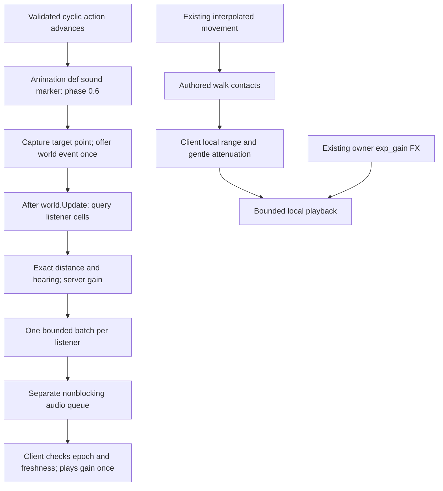

# PRD: World sounds and client local audio

Status: implemented by `add-world-and-local-sound`; validation evidence is in
[validation.md](../../openspec/changes/add-world-and-local-sound/validation.md).
This replaces the former visibility-based sound flow and end-cycle chop timing.

## Product rules

Every sound has a canonical profile in `data/sounds/`:

- `mode: world`: the server selects listeners by distance, even when neither the
  performer nor the source object is visible or present on the receiving client.
- `mode: local`: the client generates playback from existing presentation/feedback
  state. Footsteps create no server sound events, propagation work or packets.
- `loudness` is the reference audibility radius in world coordinates at hearing 1.
  `volume` balances the sample; user volume settings never change audibility.

A listener hears a source when `d² < R²`, where `R = loudness * hearing`.
Hearing comes from one server accessor, initially `game.audio.base_hearing = 1`.
World entry refreshes hearing and the configured freshness window on reconnect
and transfer. There is no hearing component, persisted field or database migration.

| Profile | Mode | Loudness | Sample volume | Priority | Voices / source |
| --- | --- | ---: | ---: | ---: | ---: |
| chop | world | 1000 | 0.90 | 10 | 16 / 4 |
| tree_fall | world | 1400 | 0.95 | 30 | 8 / 2 |
| footstep | local | 120 | 0.35 | 0 | 12 / 2 |
| exp_gain | local | 80 | 0.40 | 20 | 2 / 1 |

The world profiles exceed the current 600-unit vision radius. These authored
values are initial balancing defaults, not a throughput or perceptual guarantee.
No occlusion, cross-layer sound, sound-travel delay or stereo positioning is added.

## Active flow

`data/action_animations/tree.json` owns the `tree_chop` cue: unique ID,
`phase: 0.6`, `sound_key: chop`, `source: target`. Both hand variants share it.
The server emits on the first tick reaching the marker: tick 12/20 or 8/13.
Validation still precedes playback; effects, stamina and finished/progress messages
retain their completion timing. Each installed action/cycle retains its prepared
binding and cursor. Duplicate progress or a stale start cannot re-arm it.
Cancellation before contact prevents the cue; cancellation after contact cannot
retract a sound that already happened. Repeating a cycle resets its cue cursor.

Terminal `tree_fall` remains successful completion feedback. Capture the target
point before the effect, then emit only on success, including when the tree was
despawned. There is no second chop at completion. Context and menu cycles use the
same cue helper. Network animation sampling on the client never emits world cues.
Standalone animation preview remains available; audio inspection is local only.

Discovery audio follows only the existing owner `S2C_Fx(fx_key=exp_gain)` trigger.
Positive LP messages from crafting or administration do not trigger it. The
server give-item path retains reward/FX messages and sends no extra sound packet.

## Server routing and lifecycle

`SoundEventService` belongs to the shard; it is not a registered ECS system.
Its sparse 256-unit grid contains attached listeners, using generational handles,
client ID and stream epoch. Floor-based coordinates support negative positions;
swap removal and empty-cell deletion keep updates bounded. Same-cell movement
does not reinsert a listener. No query traverses all players or world objects.

All membership changes run under the shard world lock:

- Attach/reconnect and transfer rollback install the current position and epoch.
- Disconnect, transfer-source detach and final removal delete membership.
- Attached in-world observer sessions retain environmental hearing.
- The existing transform system updates membership after collision-adjusted
  coordinates are committed, before the visibility guard.
- Immediate world-object relocation updates the same index, including observer
  positions that move with relocated objects.

`Shard.Update` flushes immediately after `world.Update`, using committed listener
positions. World events retain a point and creation time, independent of source
lifetime. Stable descending priority and creation order choose admitted events;
cell and slot iteration is deterministic for the current index. Radius rejection
uses squared distance before the square root. The service retains a maximum
hearing accessor so future individual modifiers can maintain the search bound
without scanning players per event.

For eligible listeners, `t = d/R` and `gain = 1 - 3*t² + 2*t³`. The implementation
uses equivalent `(1-t)²*(1+2*t)` to avoid negative rounding near the boundary.
There is no recipient at `d >= R`. Client playback is
`gain * profile.volume * masterVolume * sfxVolume`, with no second attenuation.

## Limits and observability

All server values are validated under `game.audio`; invalid profiles, references,
hearing/radius combinations and source-less target cues fail activation. Server
metadata loading does not require mounted client media files.

| Setting | Default | Scope |
| --- | ---: | --- |
| base_hearing | 1 | shared player hearing |
| listener_cell_size | 256 | sparse grid cell width |
| max_effective_radius | 4096 | accepted profile/hearing radius |
| max_events_per_tick | 1024 | retained world events per shard tick |
| max_cells_per_tick | 65536 | cell lookups per shard tick |
| max_candidates_per_tick | 65536 | listener checks per shard tick |
| max_entries_per_tick | 16384 | admitted recipient entries per shard tick |
| max_entries_per_batch | 64 | entries per listener |
| max_batch_bytes | 16384 | complete encoded ServerMessage bytes per listener |
| freshness_ms | 500 | client event expiry window |
| queue_capacity | 1 | pending audio batches per connection |

Stop work before exceeding any global budget, even if batches are already full.
A bounded priority heap retains higher-priority fall events over chop noise.
Discard remaining events at cutoff without scanning skipped recipients merely
to count them. No service backlog, retry or waiting for audio is permitted.

Metrics:

- `world_sound_work_total{layer,operation}`: events, cells, candidates, recipients,
  admitted entries, messages and bytes accepted by transport.
- `world_sound_drops_total{layer,reason}`: event budget, invalid/stale events,
  per-recipient entry/byte drops, unprocessed events due to work cutoff, the
  specific cell/candidate/global-entry cutoff, truncated queries, disconnected
  listeners and rejected audio admission. Cutoff counters count queries; work
  drops count remaining events, not estimated recipients.
- `world_sound_processing_seconds{layer,operation}`: propagation and encoding.

Metrics distinguish queue acceptance from delivery; successful socket reception
or audible playback is not inferred from accepted byte counts. Tune cell size
from measured candidate/cell work, and tune caps from measured budgets and drops.
See the recorded workloads instead of treating these defaults as an SLA.

## Protocol and transport

Existing `S2C_Sound` fields/tags remain unchanged. New fields are:

| Message | Field | Tag | Contract |
| --- | --- | ---: | --- |
| S2C_Sound | optional float distance_gain | 5 | explicit zero is present silence |
| S2C_SoundBatch | repeated S2C_Sound sounds | 1 | independently validated entries |
| S2C_SoundBatch | uint32 stream_epoch | 2 | current world stream identity |
| S2C_SoundBatch | int64 server_time_ms | 3 | server tick wall-clock anchor |
| ServerMessage | sound_batch | 51 | all new server world audio, including one entry |
| S2C_PlayerEnterWorld | audio | 11 | hearing and freshness bootstrap |
| S2C_AudioParameters | hearing / freshness_ms | 1 / 2 | double / uint32 |

A batch example at half chop radius has key `chop`, radius `1000` and present
`distance_gain: 0.5`. A present `0` stays silent; an absent gain in a batch is
invalid. Only legacy single world messages may omit gain and use the former
client smoothstep distance calculation. New clients ignore server packets for
local profiles, avoiding duplicate migrated discovery feedback.

The client checks stream epoch and timestamp against its server-time estimate,
validates each entry independently and rechecks expiry/stream/user settings after
asynchronous loading and native playback start. Bad siblings do not suppress
valid entries. World reset invalidates pending playback.

`Client.SendAudio` uses a separate nonblocking queue and returns accepted, full
or closed. The writer drains gameplay, rechecks it after an audio wakeup and
writes at most one audio batch between gameplay drains. Audio cannot fill the
critical gameplay queue or close a connection by consuming its slots. The shared
socket can still stall; byte limits and client expiry bound the audio cost.
Each enqueued packet owns its bytes, so service scratch reuse cannot alter it.
See [network audio contract](../../internal/network/audio.md).

## Local playback

Only already-known characters produce local steps. The controller consumes
existing interpolated displacement and manifest stride; it requests no new
movement updates. Contact timing is independent of model rendering/culling.
Walk and carry-walk contacts are authored at `22/48` and `46/48`; the reviewed
clip/stride evidence is in [locomotion definitions](../../data/locomotion_audio/README.md).
The four step samples are original project-authored WAVs with a reproducible
[generator and provenance](../../web_new/public/assets/game/sound/steps/SOURCES.md).

For another character inside the radius, use
`q = log1p(shape*d/R) / log1p(shape)` and
`gain = near_gain + (far_gain-near_gain)*q`.
Footstep defaults are near `0.50`, far `0`, shape `4`. Own gain is `1`; other
gains are `0.50` at zero distance, approximately `0.284662` at quarter radius,
`0.158697` at half radius and `0.069323` at three-quarter radius. Gain approaches
zero continuously at the radius; reject at `d >= R`. The earlier `0.90`→`0.80`
settings were replaced after playtesting: other footsteps were barely quieter
than own footsteps, and the nonzero far gain caused an abrupt cutoff.

Rebase contacts without catch-up after stop/restart, correction snap, teleport,
loading, visibility/radius entry, gait change, world reset or a presentation gap
over 250 ms. Accepted local action cycles similarly skip passed markers on late
entry/loading and retain consumed markers across backward corrections. Only a
new accepted cycle re-arms them.

Profiles/sample lists and Howl objects are cached/preloaded. Gain is per playback
ID, including a reapplication after HTML5 native play starts, so shared samples
cannot overwrite another voice. User sound settings remain effective. Global
voices are capped at 32 in `web_new/src/game/audioConfig.ts`, with profile/source
limits in canonical profiles; full budgets drop new playback. Local requests also expire after 250 ms if the native audio backend delays
starting them; expired pending requests release their voice reservation. Verbose
diagnostics are disabled by default. Browser measurements and synthetic load results are in
the validation report; final artistic listening remains a human judgment.

## Deployment and rollback

Deploy matching server binary, generated protocol bindings, canonical definitions
and client build/catalog together. Old clients do not support sound batches;
there is no mixed-version negotiation. Retained single-message fallback helps
new clients interpret old world packets, but does not make a mixed rollout the
supported release path.

Publish sound, action and locomotion projections through
`tools/assets publish-action-animations`; catalog references switch together only
after validation. Keep old immutable assets for existing sessions. On rollback,
restore the whole matching unit and previous catalog references; reconnect
clients to the corresponding server. No database migration is needed.

The existing shard registers 25 ECS systems before and after this change. Audio
adds no system, background propagation goroutine or dedicated hearing component.
