# Y-junction review

Blue: deep water. Cyan: shallow water. All reported passages use the configured square deep-tile footprint, not runtime boat physics. No database writes. The user approved the delivered junction shapes and initial density on 2026-09-30; see ../../verification.md.

## Seed 1564262119, chance 0 (6400x6400)

- Generation: 12.502339917s
- Go HeapAlloc: 1163 MiB; HeapSys: 1463 MiB (snapshot, not peak RSS; shared process retains previous allocations)
- Connected lakes: 101/200; water components containing main routes: 28
- Final configured deep footprint and lake land validation: passed
- Statistics: `map[lake_large_count:16 lake_large_placed_islands:13 lake_large_rejected_islands:4 lake_large_requested_islands:17 lake_large_selected:10 lake_medium_count:52 lake_medium_placed_islands:1 lake_medium_rejected_islands:7 lake_medium_requested_islands:8 lake_medium_selected:8 lake_peninsulas:332 lake_shape_fallbacks:3 lake_small_count:132 lake_small_placed_islands:0 lake_small_rejected_islands:17 lake_small_requested_islands:17 lake_small_selected:17 main:62 rejected_tributary_candidates:194 tributaries:37 tributary_budget:37]`

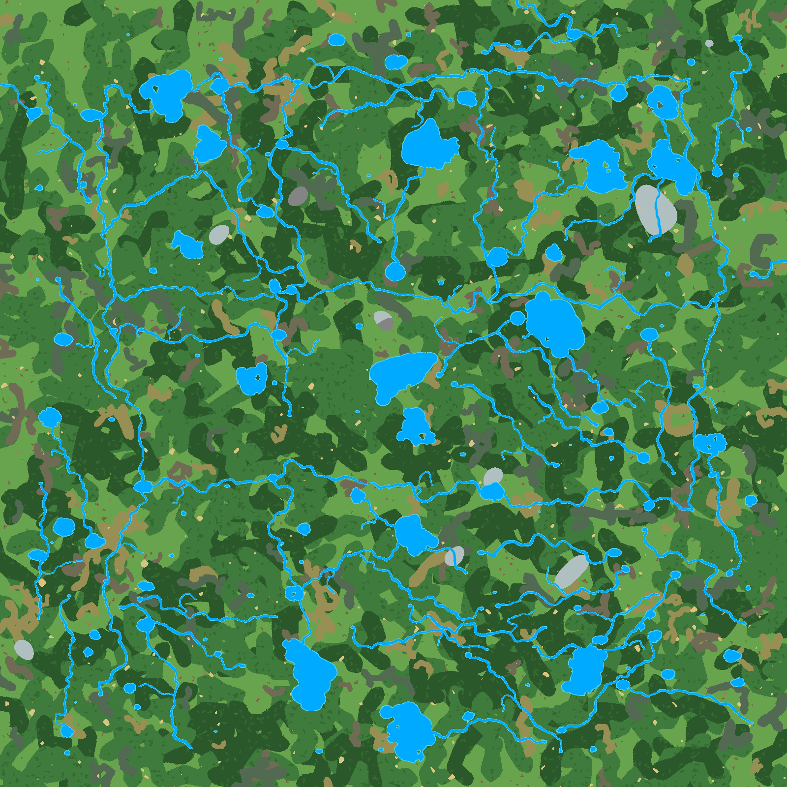

## Seed 1564262119, chance 0.25 (6400x6400)

- Generation: 12.626544291s
- Go HeapAlloc: 1125 MiB; HeapSys: 1866 MiB (snapshot, not peak RSS; shared process retains previous allocations)
- Connected lakes: 109/200; water components containing main routes: 27
- Final configured deep footprint and lake land validation: passed
- Statistics: `map[junction_attempts:197 junction_eligible:104 junction_fallbacks:14 junction_index_entries:14112 junction_placed:8 junction_rejected_foreign_contact:105 junction_rejected_other_lake:67 junction_rejected_parent_crossing:11 junction_rejected_self_contact:6 junction_selected:22 lake_large_count:16 lake_large_placed_islands:13 lake_large_rejected_islands:4 lake_large_requested_islands:17 lake_large_selected:10 lake_medium_count:52 lake_medium_placed_islands:1 lake_medium_rejected_islands:7 lake_medium_requested_islands:8 lake_medium_selected:8 lake_peninsulas:331 lake_shape_fallbacks:3 lake_small_count:132 lake_small_placed_islands:0 lake_small_rejected_islands:17 lake_small_requested_islands:17 lake_small_selected:17 main:70 rejected_tributary_candidates:399 tributaries:42 tributary_budget:42]`

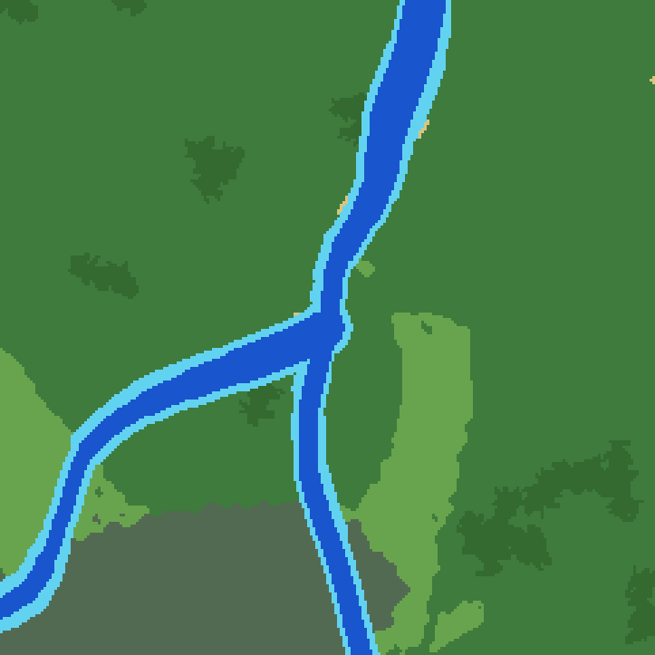

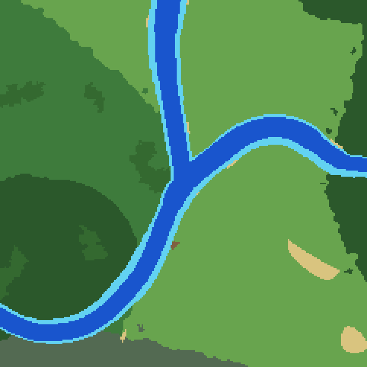

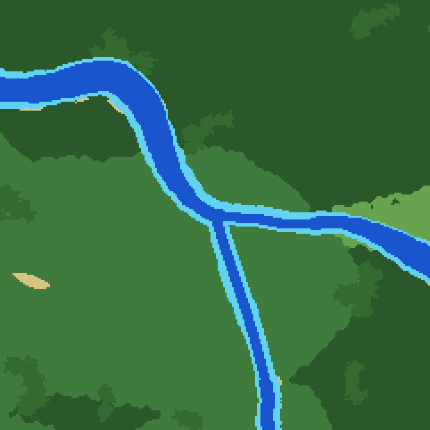

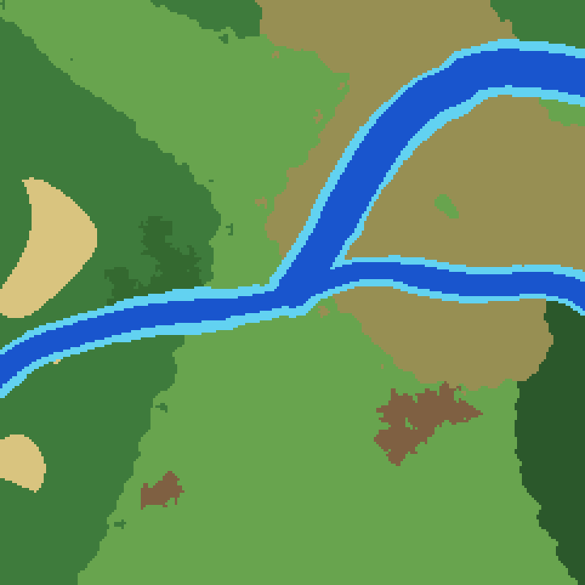

## Seed 1564262119, chance 1 (6400x6400)

- Generation: 13.726277625s
- Go HeapAlloc: 1126 MiB; HeapSys: 1866 MiB (snapshot, not peak RSS; shared process retains previous allocations)
- Connected lakes: 110/200; water components containing main routes: 22
- Final configured deep footprint and lake land validation: passed
- Statistics: `map[junction_attempts:995 junction_eligible:104 junction_fallbacks:77 junction_index_entries:14680 junction_placed:27 junction_rejected_border:1 junction_rejected_foreign_contact:571 junction_rejected_other_lake:312 junction_rejected_parent_crossing:42 junction_rejected_self_contact:39 junction_rejected_source_reentry:3 junction_selected:104 lake_large_count:16 lake_large_placed_islands:13 lake_large_rejected_islands:4 lake_large_requested_islands:17 lake_large_selected:10 lake_medium_count:52 lake_medium_placed_islands:1 lake_medium_rejected_islands:7 lake_medium_requested_islands:8 lake_medium_selected:8 lake_peninsulas:330 lake_shape_fallbacks:3 lake_small_count:132 lake_small_placed_islands:0 lake_small_rejected_islands:17 lake_small_requested_islands:17 lake_small_selected:17 main:80 rejected_tributary_candidates:716 tributaries:48 tributary_budget:48]`

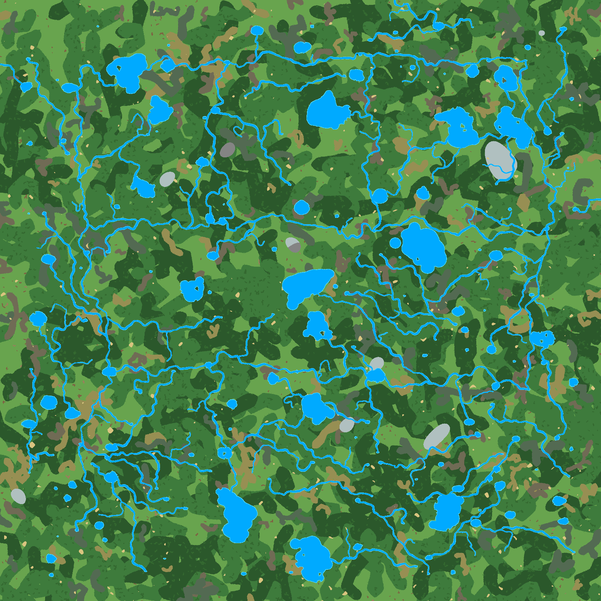

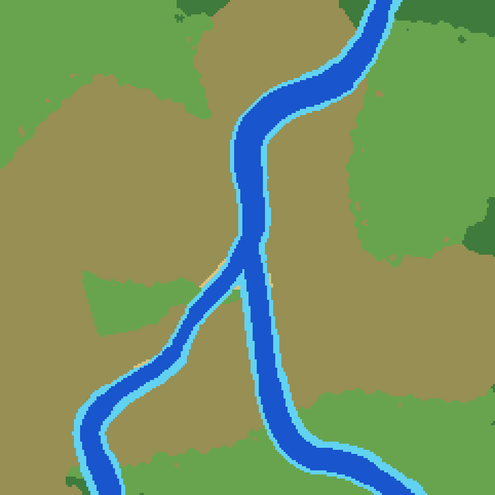

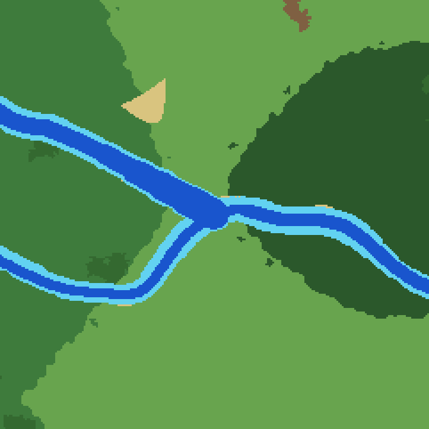

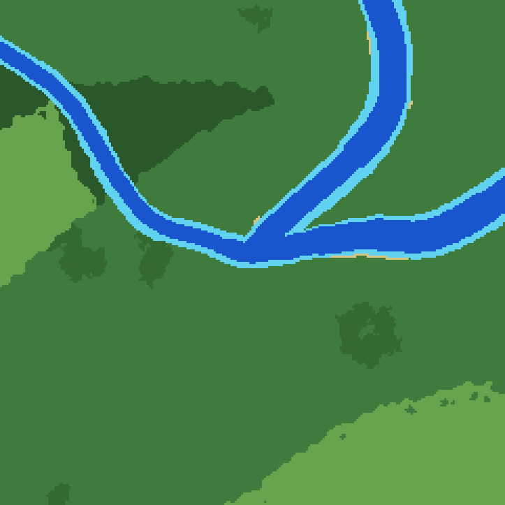

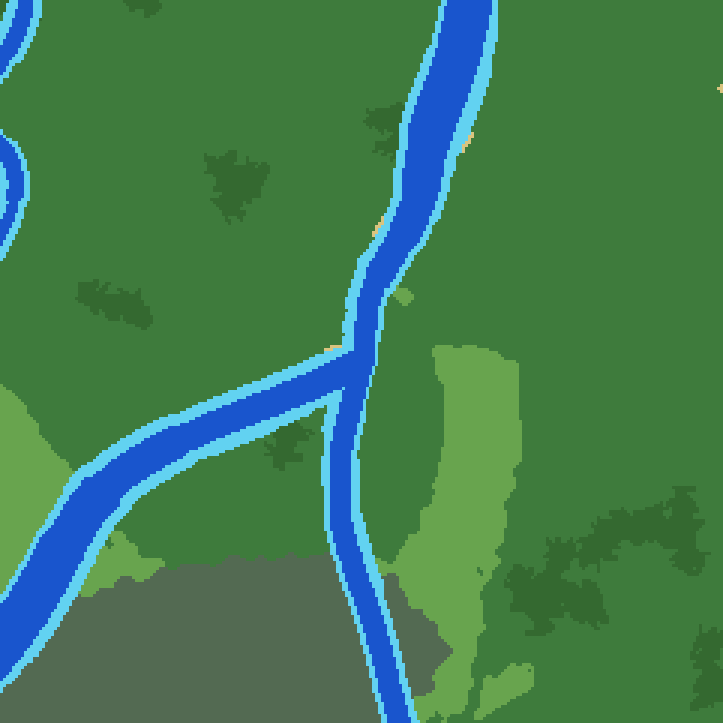

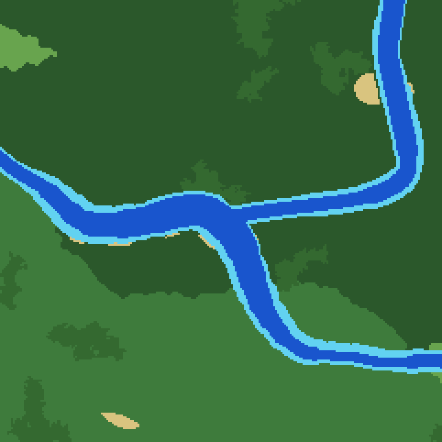

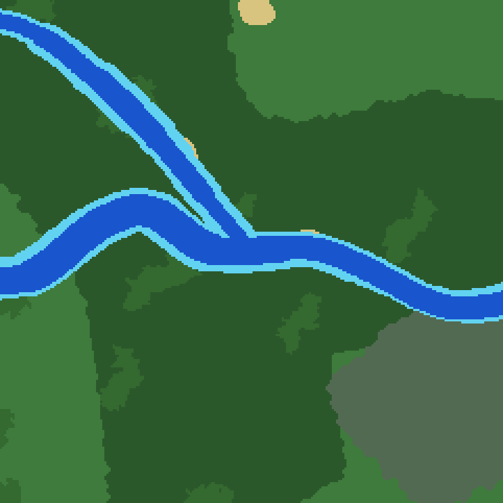

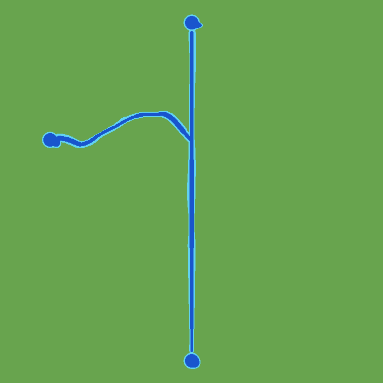

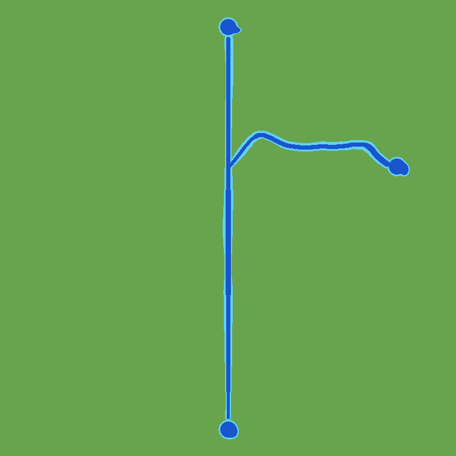

## Dense-water rejection fixture

No unsafe Y was carved next to foreign corridors. Statistics: `map[junction_attempts:12 junction_eligible:1 junction_fallbacks:1 junction_index_entries:243 junction_placed:0 junction_rejected_foreign_contact:12 junction_selected:1 main:0 rejected_tributary_candidates:0 tributaries:0 tributary_budget:0]`

