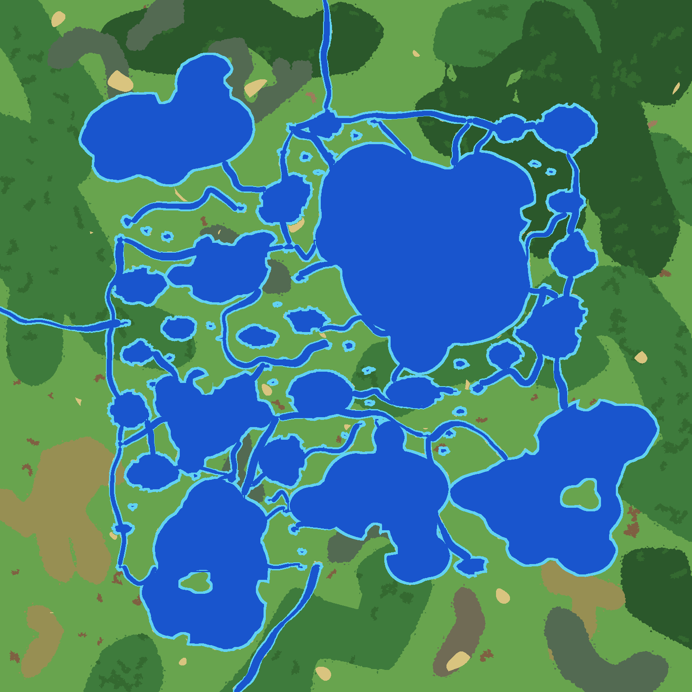
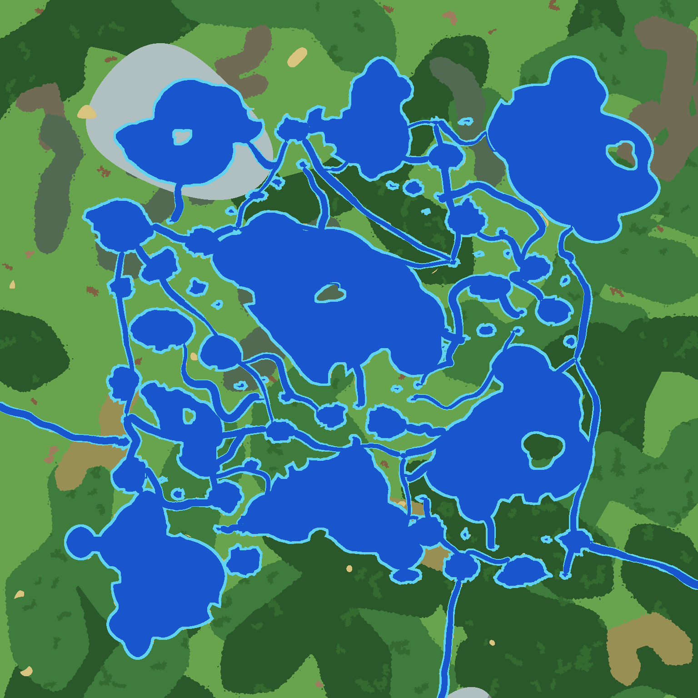
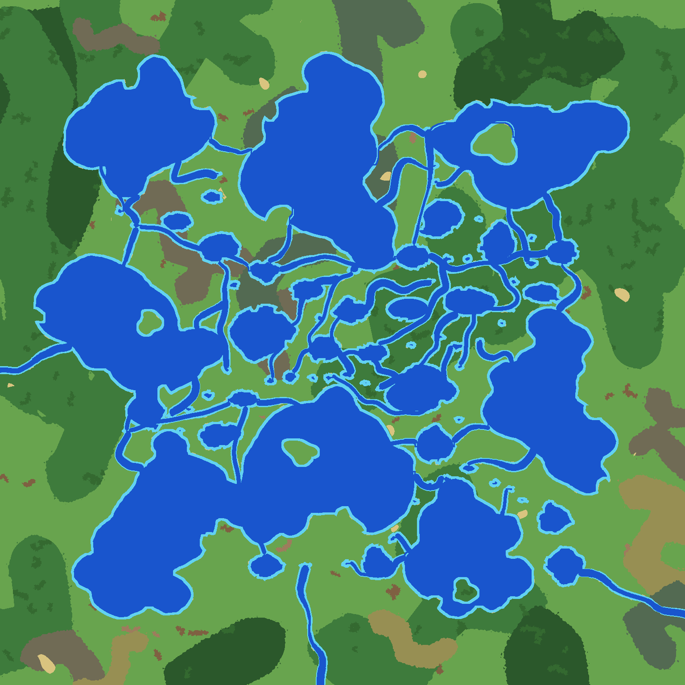
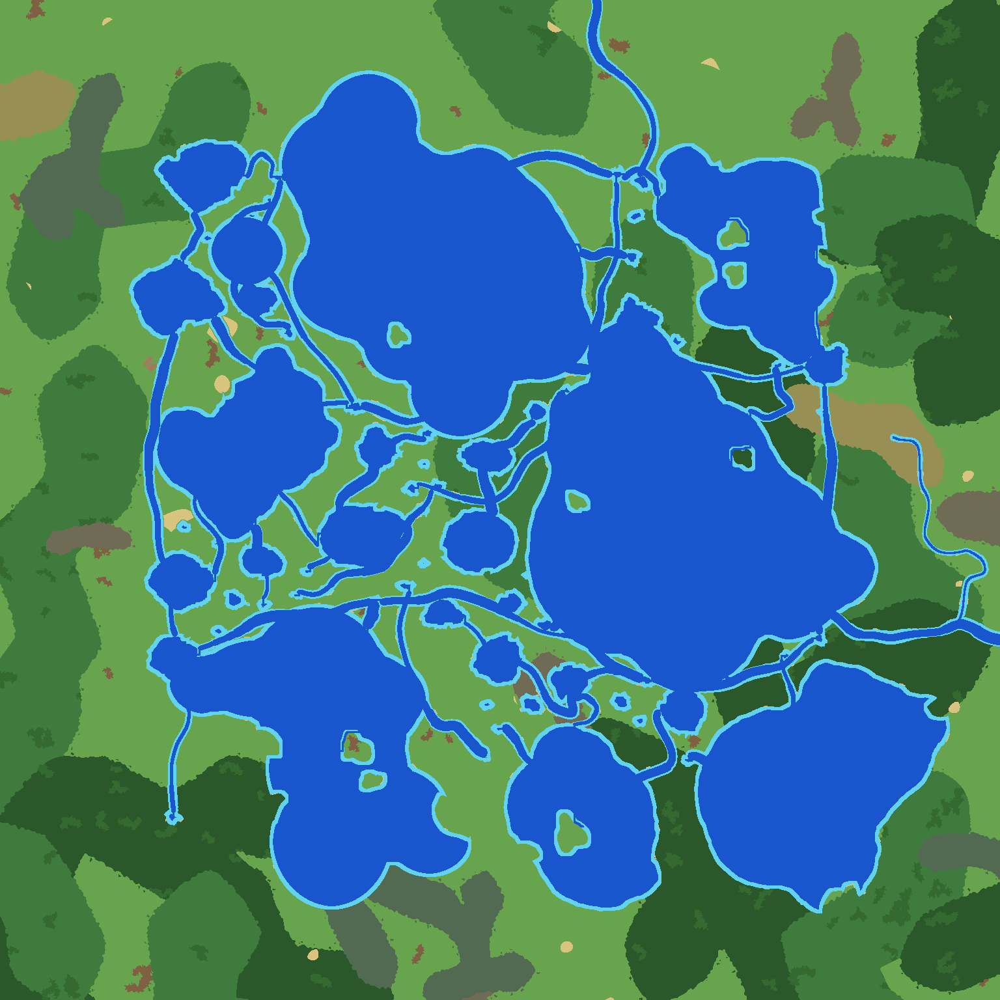
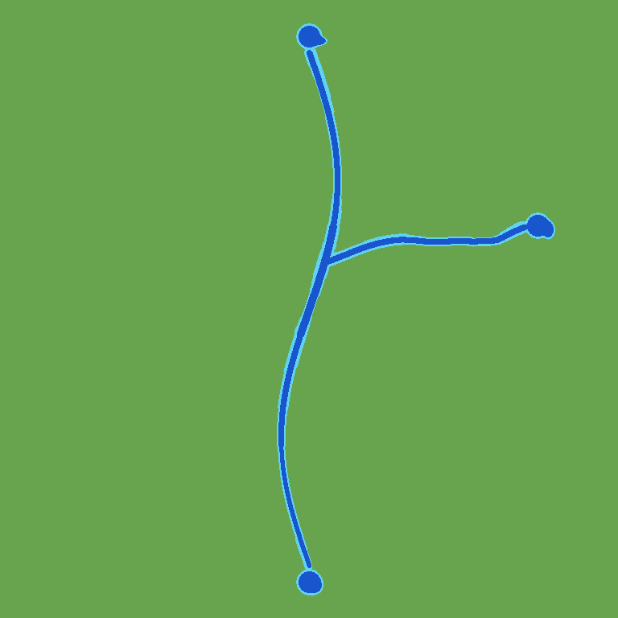

# Y-junction review

Blue: deep water. Cyan: shallow water. All reported passages use the configured square deep-tile footprint, not runtime boat physics. No database writes. The user approved the delivered junction shapes and initial density on 2026-09-30; see ../../verification.md.

## Seed 12345, chance 0 (1536x1536)

- Generation: 1.158314666s
- Go HeapAlloc: 66 MiB; HeapSys: 107 MiB (snapshot, not peak RSS; shared process retains previous allocations)
- Connected lakes: 49/83; water components containing main routes: 3
- Final configured deep footprint and lake land validation: passed
- Statistics: `map[lake_large_count:7 lake_large_placed_islands:2 lake_large_rejected_islands:1 lake_large_requested_islands:3 lake_large_selected:3 lake_medium_count:19 lake_medium_placed_islands:0 lake_medium_rejected_islands:2 lake_medium_requested_islands:2 lake_medium_selected:2 lake_peninsulas:120 lake_shape_fallbacks:1 lake_small_count:57 lake_small_placed_islands:0 lake_small_rejected_islands:7 lake_small_requested_islands:7 lake_small_selected:7 main:36 rejected_tributary_candidates:464 tributaries:0 tributary_budget:21]`

## Seed 12345, chance 0.25 (1536x1536)

- Generation: 1.177679875s
- Go HeapAlloc: 66 MiB; HeapSys: 123 MiB (snapshot, not peak RSS; shared process retains previous allocations)
- Connected lakes: 49/83; water components containing main routes: 3
- Final configured deep footprint and lake land validation: passed
- Statistics: `map[junction_attempts:0 junction_eligible:104 junction_fallbacks:22 junction_index_entries:1532 junction_placed:0 junction_rejected_no_target:22 junction_selected:22 lake_large_count:7 lake_large_placed_islands:2 lake_large_rejected_islands:1 lake_large_requested_islands:3 lake_large_selected:3 lake_medium_count:19 lake_medium_placed_islands:0 lake_medium_rejected_islands:2 lake_medium_requested_islands:2 lake_medium_selected:2 lake_peninsulas:120 lake_shape_fallbacks:1 lake_small_count:57 lake_small_placed_islands:0 lake_small_rejected_islands:7 lake_small_requested_islands:7 lake_small_selected:7 main:36 rejected_tributary_candidates:464 tributaries:0 tributary_budget:21]`

## Seed 12345, chance 1 (1536x1536)

- Generation: 1.208754458s
- Go HeapAlloc: 66 MiB; HeapSys: 122 MiB (snapshot, not peak RSS; shared process retains previous allocations)
- Connected lakes: 49/83; water components containing main routes: 3
- Final configured deep footprint and lake land validation: passed
- Statistics: `map[junction_attempts:0 junction_eligible:104 junction_fallbacks:104 junction_index_entries:1532 junction_placed:0 junction_rejected_no_target:104 junction_selected:104 lake_large_count:7 lake_large_placed_islands:2 lake_large_rejected_islands:1 lake_large_requested_islands:3 lake_large_selected:3 lake_medium_count:19 lake_medium_placed_islands:0 lake_medium_rejected_islands:2 lake_medium_requested_islands:2 lake_medium_selected:2 lake_peninsulas:120 lake_shape_fallbacks:1 lake_small_count:57 lake_small_placed_islands:0 lake_small_rejected_islands:7 lake_small_requested_islands:7 lake_small_selected:7 main:36 rejected_tributary_candidates:464 tributaries:0 tributary_budget:21]`

## Seed 67890, chance 0 (1536x1536)

- Generation: 1.279955125s
- Go HeapAlloc: 41 MiB; HeapSys: 122 MiB (snapshot, not peak RSS; shared process retains previous allocations)
- Connected lakes: 51/91; water components containing main routes: 1
- Final configured deep footprint and lake land validation: passed
- Statistics: `map[lake_large_count:8 lake_large_placed_islands:5 lake_large_rejected_islands:2 lake_large_requested_islands:7 lake_large_selected:6 lake_medium_count:23 lake_medium_placed_islands:0 lake_medium_rejected_islands:2 lake_medium_requested_islands:2 lake_medium_selected:2 lake_peninsulas:132 lake_shape_fallbacks:8 lake_small_count:60 lake_small_placed_islands:0 lake_small_rejected_islands:4 lake_small_requested_islands:4 lake_small_selected:4 main:37 rejected_tributary_candidates:512 tributaries:0 tributary_budget:22]`

## Seed 67890, chance 0.25 (1536x1536)

- Generation: 1.292736667s
- Go HeapAlloc: 45 MiB; HeapSys: 122 MiB (snapshot, not peak RSS; shared process retains previous allocations)
- Connected lakes: 51/91; water components containing main routes: 1
- Final configured deep footprint and lake land validation: passed
- Statistics: `map[junction_attempts:0 junction_eligible:104 junction_fallbacks:29 junction_index_entries:1683 junction_placed:0 junction_rejected_no_target:29 junction_selected:29 lake_large_count:8 lake_large_placed_islands:5 lake_large_rejected_islands:2 lake_large_requested_islands:7 lake_large_selected:6 lake_medium_count:23 lake_medium_placed_islands:0 lake_medium_rejected_islands:2 lake_medium_requested_islands:2 lake_medium_selected:2 lake_peninsulas:132 lake_shape_fallbacks:8 lake_small_count:60 lake_small_placed_islands:0 lake_small_rejected_islands:4 lake_small_requested_islands:4 lake_small_selected:4 main:37 rejected_tributary_candidates:512 tributaries:0 tributary_budget:22]`

## Seed 67890, chance 1 (1536x1536)

- Generation: 1.334324791s
- Go HeapAlloc: 29 MiB; HeapSys: 122 MiB (snapshot, not peak RSS; shared process retains previous allocations)
- Connected lakes: 51/91; water components containing main routes: 1
- Final configured deep footprint and lake land validation: passed
- Statistics: `map[junction_attempts:0 junction_eligible:104 junction_fallbacks:104 junction_index_entries:1683 junction_placed:0 junction_rejected_no_target:104 junction_selected:104 lake_large_count:8 lake_large_placed_islands:5 lake_large_rejected_islands:2 lake_large_requested_islands:7 lake_large_selected:6 lake_medium_count:23 lake_medium_placed_islands:0 lake_medium_rejected_islands:2 lake_medium_requested_islands:2 lake_medium_selected:2 lake_peninsulas:132 lake_shape_fallbacks:8 lake_small_count:60 lake_small_placed_islands:0 lake_small_rejected_islands:4 lake_small_requested_islands:4 lake_small_selected:4 main:37 rejected_tributary_candidates:512 tributaries:0 tributary_budget:22]`

## Seed 314159, chance 0 (1536x1536)

- Generation: 1.210771708s
- Go HeapAlloc: 66 MiB; HeapSys: 122 MiB (snapshot, not peak RSS; shared process retains previous allocations)
- Connected lakes: 51/84; water components containing main routes: 3
- Final configured deep footprint and lake land validation: passed
- Statistics: `map[lake_large_count:8 lake_large_placed_islands:4 lake_large_rejected_islands:6 lake_large_requested_islands:10 lake_large_selected:7 lake_medium_count:23 lake_medium_placed_islands:0 lake_medium_rejected_islands:3 lake_medium_requested_islands:3 lake_medium_selected:3 lake_peninsulas:95 lake_shape_fallbacks:2 lake_small_count:53 lake_small_placed_islands:0 lake_small_rejected_islands:5 lake_small_requested_islands:5 lake_small_selected:5 main:37 rejected_tributary_candidates:432 tributaries:0 tributary_budget:22]`

## Seed 314159, chance 0.25 (1536x1536)

- Generation: 1.22094825s
- Go HeapAlloc: 66 MiB; HeapSys: 122 MiB (snapshot, not peak RSS; shared process retains previous allocations)
- Connected lakes: 51/84; water components containing main routes: 3
- Final configured deep footprint and lake land validation: passed
- Statistics: `map[junction_attempts:0 junction_eligible:104 junction_fallbacks:28 junction_index_entries:1486 junction_placed:0 junction_rejected_no_target:28 junction_selected:28 lake_large_count:8 lake_large_placed_islands:4 lake_large_rejected_islands:6 lake_large_requested_islands:10 lake_large_selected:7 lake_medium_count:23 lake_medium_placed_islands:0 lake_medium_rejected_islands:3 lake_medium_requested_islands:3 lake_medium_selected:3 lake_peninsulas:95 lake_shape_fallbacks:2 lake_small_count:53 lake_small_placed_islands:0 lake_small_rejected_islands:5 lake_small_requested_islands:5 lake_small_selected:5 main:37 rejected_tributary_candidates:432 tributaries:0 tributary_budget:22]`

## Seed 314159, chance 1 (1536x1536)

- Generation: 1.264446417s
- Go HeapAlloc: 66 MiB; HeapSys: 122 MiB (snapshot, not peak RSS; shared process retains previous allocations)
- Connected lakes: 51/84; water components containing main routes: 3
- Final configured deep footprint and lake land validation: passed
- Statistics: `map[junction_attempts:0 junction_eligible:104 junction_fallbacks:104 junction_index_entries:1486 junction_placed:0 junction_rejected_no_target:104 junction_selected:104 lake_large_count:8 lake_large_placed_islands:4 lake_large_rejected_islands:6 lake_large_requested_islands:10 lake_large_selected:7 lake_medium_count:23 lake_medium_placed_islands:0 lake_medium_rejected_islands:3 lake_medium_requested_islands:3 lake_medium_selected:3 lake_peninsulas:95 lake_shape_fallbacks:2 lake_small_count:53 lake_small_placed_islands:0 lake_small_rejected_islands:5 lake_small_requested_islands:5 lake_small_selected:5 main:37 rejected_tributary_candidates:432 tributaries:0 tributary_budget:22]`

## Seed 1564262119, chance 0 (1536x1536)

- Generation: 1.299431s
- Go HeapAlloc: 67 MiB; HeapSys: 134 MiB (snapshot, not peak RSS; shared process retains previous allocations)
- Connected lakes: 46/73; water components containing main routes: 1
- Final configured deep footprint and lake land validation: passed
- Statistics: `map[lake_large_count:7 lake_large_placed_islands:8 lake_large_rejected_islands:2 lake_large_requested_islands:10 lake_large_selected:6 lake_medium_count:16 lake_medium_placed_islands:0 lake_medium_rejected_islands:2 lake_medium_requested_islands:2 lake_medium_selected:2 lake_peninsulas:86 lake_shape_fallbacks:3 lake_small_count:50 lake_small_placed_islands:0 lake_small_rejected_islands:8 lake_small_requested_islands:8 lake_small_selected:8 main:34 rejected_tributary_candidates:393 tributaries:1 tributary_budget:20]`

## Seed 1564262119, chance 0.25 (1536x1536)

- Generation: 1.307217583s
- Go HeapAlloc: 40 MiB; HeapSys: 134 MiB (snapshot, not peak RSS; shared process retains previous allocations)
- Connected lakes: 46/73; water components containing main routes: 1
- Final configured deep footprint and lake land validation: passed
- Statistics: `map[junction_attempts:0 junction_eligible:104 junction_fallbacks:25 junction_index_entries:1442 junction_placed:0 junction_rejected_no_target:25 junction_selected:25 lake_large_count:7 lake_large_placed_islands:8 lake_large_rejected_islands:2 lake_large_requested_islands:10 lake_large_selected:6 lake_medium_count:16 lake_medium_placed_islands:0 lake_medium_rejected_islands:2 lake_medium_requested_islands:2 lake_medium_selected:2 lake_peninsulas:86 lake_shape_fallbacks:3 lake_small_count:50 lake_small_placed_islands:0 lake_small_rejected_islands:8 lake_small_requested_islands:8 lake_small_selected:8 main:34 rejected_tributary_candidates:393 tributaries:1 tributary_budget:20]`

## Seed 1564262119, chance 1 (1536x1536)

- Generation: 1.370000542s
- Go HeapAlloc: 67 MiB; HeapSys: 134 MiB (snapshot, not peak RSS; shared process retains previous allocations)
- Connected lakes: 46/73; water components containing main routes: 1
- Final configured deep footprint and lake land validation: passed
- Statistics: `map[junction_attempts:0 junction_eligible:104 junction_fallbacks:104 junction_index_entries:1442 junction_placed:0 junction_rejected_no_target:104 junction_selected:104 lake_large_count:7 lake_large_placed_islands:8 lake_large_rejected_islands:2 lake_large_requested_islands:10 lake_large_selected:6 lake_medium_count:16 lake_medium_placed_islands:0 lake_medium_rejected_islands:2 lake_medium_requested_islands:2 lake_medium_selected:2 lake_peninsulas:86 lake_shape_fallbacks:3 lake_small_count:50 lake_small_placed_islands:0 lake_small_rejected_islands:8 lake_small_requested_islands:8 lake_small_selected:8 main:34 rejected_tributary_candidates:393 tributaries:1 tributary_budget:20]`

## Dense-water rejection fixture

No unsafe Y was carved next to foreign corridors. Statistics: `map[junction_attempts:12 junction_eligible:1 junction_fallbacks:1 junction_index_entries:243 junction_placed:0 junction_rejected_foreign_contact:12 junction_selected:1 main:0 rejected_tributary_candidates:0 tributaries:0 tributary_budget:0]`

