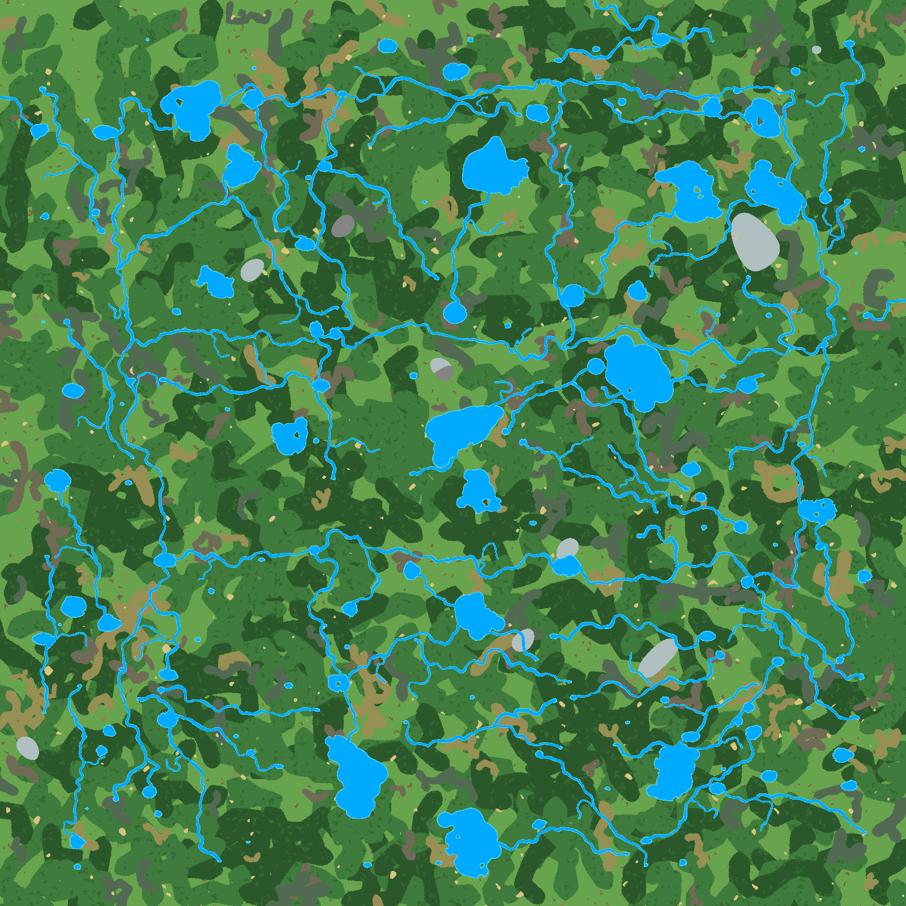
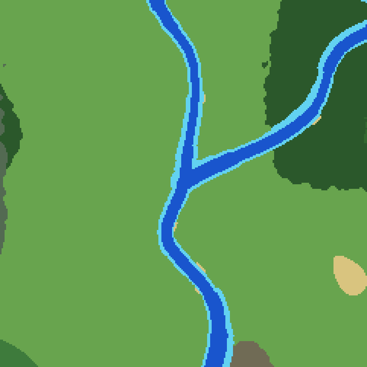
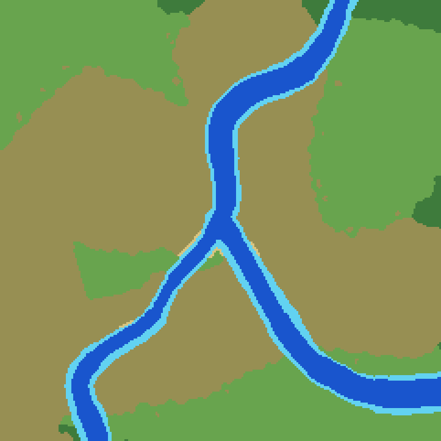
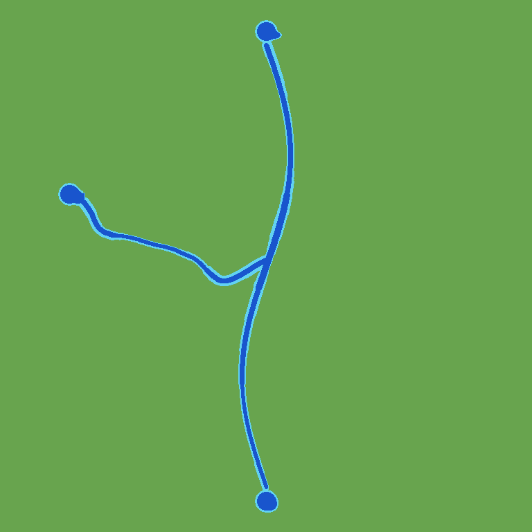
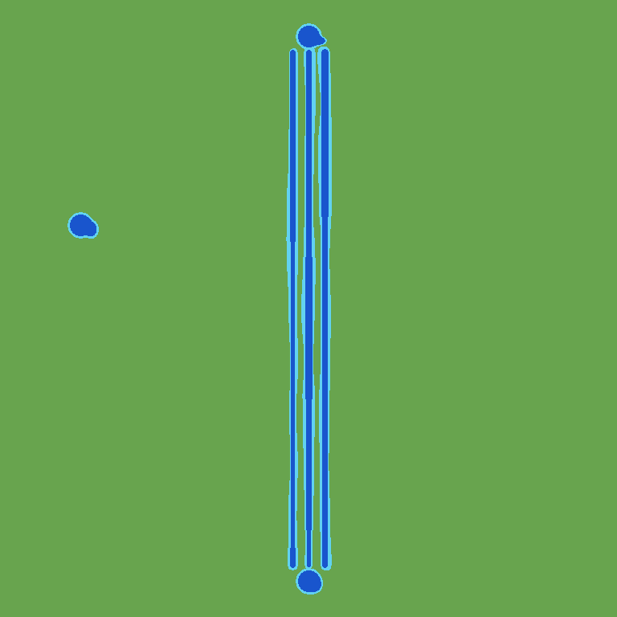

# Проверка Y-соединений

Дата: 2026-09-30. Техническая реализация готова; пользователь подтвердил форму Y и начальную частоту появления. Все 20 задач завершены. Спецификация синхронизирована, изменение архивировано 2026-09-30; коммит не создавался.

## Что изменено

- Две настройки: `junction_chance` (общий default 0, H&H 0.25) и `junction_spacing_tiles` (180 тайлов).
- Дополнительная связь может прийти из озера в середину обычной основной реки. Региональный каркас и явная политика основных выходов к границе сохранены.
- Один seeded выбор на возможность, максимум 16 геометрических кандидатов; неудача возвращает исходный обычный кандидат и его seed без частичных изменений карты.
- Редкие Y отделены от сухопутных притоков; обе разновидности учитывают расстояние друг до друга. Родитель не перепрокладывается.
- Индекс русел разреженный, выбор упорядочен; после построения сеть освобождает временный индекс. Активные расходы учитываются в direct/precompute/preview preflight. Лимит 6 GiB не изменялся.
- Новые контролы preview имеют русские подписи и справку; Save сохраняет нули и комментарии. Дробное расстояние между Y отклоняется и в YAML, и в preview.
- Сравнение `hnh-before.yaml` с текущим H&H показывает только две новые настройки и комментарии: исходный seed, геометрия озёр, острова, биомы и остальные пользовательские значения не изменены.

## Автоматические проверки

- Golden seed 12345/67890 сняты до изменений runtime: совпадают финальные тайлы, классы воды и JSON маршрутов при выключенной вероятности.
- Принудительно неудачные Y дают побайтно тот же результат обычных связей; отдельно проверен откат после исчерпания геометрических кандидатов.
- Проверены обе стороны прямого/изогнутого родителя, точное присоединение, три/пять глубоких тайлов, переменные и постоянные берега, полный исходный профиль ширины.
- Проверены посторонние русла внутри зоны слияния и у источника, удалённый рукав того же родителя, пересечение родителя, другие озёра, самоконтакты и повторный вход в источник.
- Проверены степени/бюджеты, отсутствие фиктивного подключения запасного озера, дубликаты источник/родитель, два разнесённых Y на одном родителе, расстояние до последующих притоков и исключение будущих озёрных входов.
- В fixture из 2000 зарегистрированных основных маршрутов плотные контакты отклоняются за ограниченное число попыток; индекс укладывается в оценку. Это тест предельного количества записей, не обещание вместить любой мир с 2000 длинными реками в 6 GiB.
- На карте 1024×1024 проверены принятые Y: два при фарватере 3 с переменными берегами и три при фарватере 5 с постоянными берегами/Perlin. Fast preview, полный terrain и повтор с 1/4 потоками совпадают. Сохраняются гарантии островов/полуостровов. Повреждение фарватера вызывает диагностику с seed, веткой, родителем и местом слияния.
- Полный Go-suite `go test ./cmd/mapgen/... -count=1`, браузерные тесты `node --test cmd/mapgen/preview/index.test.mjs` (9/9), `go vet ./cmd/mapgen/...`, сборка `/private/tmp/mapgen-y-preview` и `git diff --check` пройдены.
- Первые sandbox-запуски полного Go-suite/vet/build были заблокированы доступом к `~/Library/Caches/go-build`; повтор с разрешённым доступом успешен. Это ограничение среды, не ошибка mapgen.

## Полноразмерная карта H&H

Seed **1564262119**, **6400×6400**, текущие пользовательские настройки. Генерация и PNG работают без базы данных. Проверка полного квадратного глубоководного прохода выполнена на финальных тайлах; это не проверка runtime-физики лодки.

| Вероятность | Подходящих | Выбрано | Создано Y | Обычный fallback | Геом. кандидатов | Подключено озёр | Компонент с основными реками | Генерация |
| --- | --- | --- | --- | --- | --- | --- | --- | --- |
| 0 | — | — | 0 | — | — | 101/200 | 28 | 12.502 с |
| 0.25 | 104 | 22 | 8 | 14 | 197 | 109/200 | 27 | 12.627 с |
| 1 | 104 | 104 | 27 | 77 | 995 | 110/200 | 22 | 13.726 с |

Компоненты считаются по кардинально связной воде; сами маршруты отдельно проходят проверку полного глубокого footprint. Это не обещание единой компоненты всего игрового мира.

При 0.25 снимок Go HeapAlloc — 1125 MiB, HeapSys — 1866 MiB. Это не peak RSS: один процесс последовательно строит варианты и сохраняет резерв предыдущих выделений. Оценка не заменяет предохранитель перед генерацией.

[Все полноразмерные сравнения и причины отказов](review/full/README.md)







## Малые карты и принудительные формы

[Сравнения 0/0.25/1 для seed 12345, 67890, 314159, 1564262119](review/small/README.md).

На уменьшенной карте 1536×1536 сохранены H&H размеры/количество озёр и расстояние 180: все выбранные Y отклонены из-за отсутствия свободных целей. При 0.25 выбраны соответственно 22, 29, 28, 25 из 104 возможностей; при 1 — 104/104. Это намеренно показанный плотный случай, а не принудительная компенсация вероятности. Карты совпадают с обычным fallback; расположение озёр и каркас неизменны. Развилки на менее плотном тестовом мире отдельно покрыты автоматическим тестом и полноразмерным примером.

Галереи включают подходы слева/справа, изогнутого родителя и плотный случай, где опасное соединение не рисуется:





## Повторить

```sh
go test ./cmd/mapgen -run '^TestRiverJunctionReview$' -count=1 -v -args -junction-review-dir /private/tmp/mapgen-y-small
go test ./cmd/mapgen -run '^TestRiverJunctionReview$' -count=1 -v -args -junction-review-dir /private/tmp/mapgen-y-full -junction-review-full
```

## Визуальное одобрение

2026-09-30 пользователь ответил «yes» на вопрос «Подходят форма и текущая частота?». Одобрены показанные Y-соединения и начальная настройка H&H: `junction_chance: 0.25`, `junction_spacing_tiles: 180`. Дополнительная настройка не запрошена; код и preset при фиксации одобрения не изменялись.

Задача 6.4 закрыта. Это пользовательская оценка формы и плотности, отдельная от автоматических проверок фарватера. По запросу пользователя выполнены sync/archive: все 8 требований перенесены в `openspec/specs/mapgen-river-junctions/spec.md`, совпадение с delta проверено до архивации. Проверка основных спецификаций: 18 passed, 0 failed.
